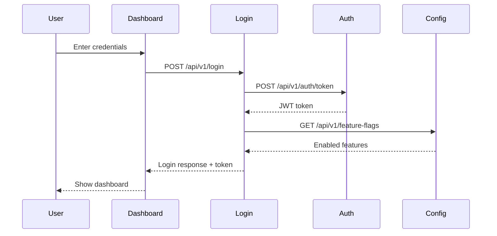

# Real-World Example: 5-Service Banking Application with Kiro

This document shows exactly how the `.kiro/` folder hierarchy works in a real banking application with 5 microservices.

## Table of Contents
1. [Complete Project Structure](#complete-project-structure)
2. [Workspace-Level Configuration](#workspace-level-configuration)
3. [Service 1: Login Service](#service-1-login-service)
4. [Service 2: Authentication Service](#service-2-authentication-service)
5. [Service 3: Channel Configurations Service](#service-3-channel-configurations-service)
6. [Service 4: Dashboard Service](#service-4-dashboard-service)
7. [Service 5: Reports Service](#service-5-reports-service)
8. [Cross-Service Scenarios](#cross-service-scenarios)
9. [Configuration Merge Examples](#configuration-merge-examples)
10. [Hooks in Action](#hooks-in-action)

---

## Complete Project Structure

```
banking-prototype/                                    # Workspace Root
│
├── .kiro/                                            # WORKSPACE-LEVEL CONFIG
│   ├── steering/                                     # Applies to ALL 5 services
│   │   ├── architecture-standards.md                 # Hexagonal Architecture
│   │   ├── spring-boot-standards.md                  # Spring Boot conventions
│   │   ├── security-standards.md                     # Security requirements
│   │   ├── testing-standards.md                      # Testing requirements
│   │   └── react-standards.md                        # Frontend standards
│   │
│   ├── specs/                                        # Workspace-wide features
│   │   └── multi-service-integration/                # Cross-service feature
│   │       ├── .config.kiro
│   │       ├── requirements.md
│   │       ├── design.md
│   │       └── tasks.md
│   │
│   └── hooks/                                        # Workspace-wide automation
│       ├── sequence-diagram-sync.json                # Update sequence diagrams
│       └── test-all-services.json                    # Run all service tests
│
├── common-config/                                    # Shared via Git submodule
│   └── .kiro/
│       ├── steering/
│       │   └── tech-stack.md                         # Corporate standards
│       └── hooks/
│           └── doc-hook.json                         # Documentation automation
│
├── login-service/                                    # SERVICE 1
│   ├── .kiro/
│   │   ├── steering/
│   │   │   └── login-standards.md
│   │   ├── specs/
│   │   │   └── user-login/
│   │   │       ├── .config.kiro
│   │   │       ├── requirements.md
│   │   │       ├── design.md
│   │   │       └── tasks.md
│   │   └── hooks/
│   │       └── validate-credentials.json
│   └── src/
│
├── authentication-service/                           # SERVICE 2
│   ├── .kiro/
│   │   ├── steering/
│   │   │   └── auth-standards.md
│   │   ├── specs/
│   │   │   └── jwt-token-generation/
│   │   │       ├── .config.kiro
│   │   │       ├── requirements.md
│   │   │       ├── design.md
│   │   │       └── tasks.md
│   │   └── hooks/
│   │       └── key-rotation-check.json
│   └── src/
│
├── channel-configurations-service/                   # SERVICE 3
│   ├── .kiro/
│   │   ├── steering/
│   │   │   └── config-standards.md
│   │   ├── specs/
│   │   │   └── feature-flags/
│   │   │       ├── .config.kiro
│   │   │       ├── requirements.md
│   │   │       ├── design.md
│   │   │       └── tasks.md
│   │   └── hooks/
│   │       └── config-validation.json
│   └── src/
│
├── dashboard-service/                                # SERVICE 4
│   ├── .kiro/
│   │   ├── steering/
│   │   │   └── dashboard-standards.md
│   │   ├── specs/
│   │   │   └── user-dashboard/
│   │   │       ├── .config.kiro
│   │   │       ├── requirements.md
│   │   │       ├── design.md
│   │   │       └── tasks.md
│   │   └── hooks/
│   │       └── ui-component-test.json
│   └── src/
│
└── reports-service/                                  # SERVICE 5
    ├── .kiro/
    │   ├── steering/
    │   │   └── reports-standards.md
    │   ├── specs/
    │   │   └── transaction-reports/
    │   │       ├── .config.kiro
    │   │       ├── requirements.md
    │   │       ├── design.md
    │   │       └── tasks.md
    │   └── hooks/
    │       └── report-generation-test.json
    └── src/
```

---
## Workspace-Level Configuration

### File: `banking-prototype/.kiro/steering/architecture-standards.md`

```markdown
# Banking Platform Architecture Standards

## Mandatory Patterns
- All backend services MUST use Hexagonal Architecture (Ports & Adapters)
- Domain logic MUST be isolated from infrastructure concerns
- All services MUST expose OpenAPI/Swagger documentation

## Package Structure
All Java services must follow this structure:

```
com.banking.[service-name]/
  ├── domain/
  │   ├── model/        # Domain entities (POJOs, Records)
  │   ├── ports/        # Interfaces (use cases, output ports)
  │   └── service/      # Business logic implementation
  └── infrastructure/
      ├── adapters/
      │   ├── in/       # REST controllers, message listeners
      │   └── out/      # Database repos, external API clients
      ├── config/       # Spring configuration classes
      └── security/     # Security components (filters, providers)
```

## Naming Conventions
- Services: `[feature]-service` (e.g., login-service, authentication-service)
- Controllers: `[Feature]Controller` (e.g., LoginController, AuthController)
- Use cases: `[Action]UseCase` (e.g., TokenGenerationUseCase, ValidateLoginUseCase)
- DTOs: `[Feature]Request` / `[Feature]Response` (e.g., LoginRequest, TokenResponse)
- Domain services: `[Feature]DomainService` or `[Feature]Service`

## Security Requirements
- All endpoints MUST validate input using `@Valid`
- All services MUST implement GlobalExceptionHandler with `@ControllerAdvice`
- Sensitive data (passwords, tokens, PII) MUST NOT be logged
- All APIs MUST use HTTPS in production
- All inter-service communication MUST use JWT authentication

## Error Handling
- Use custom exceptions that extend RuntimeException
- Return consistent error response format across all services
- Include timestamp, status code, error message, and request path
- Never expose stack traces or internal details to clients
```

---

### File: `banking-prototype/.kiro/steering/spring-boot-standards.md`

```markdown
# Spring Boot Standards

## Dependencies
- Use Spring Boot 3.4.x
- Use Java 21 (LTS)
- Include `spring-boot-starter-validation` for input validation
- Include `springdoc-openapi-starter-webmvc-ui` for API documentation
- Use Lombok for boilerplate reduction

## Configuration
- Use YAML for `application.yml` (NOT properties files)
- Externalize all configuration (no hardcoded values)
- Use Spring profiles: `dev`, `test`, `prod`
- Store secrets in environment variables or secret management service

## REST API Standards
- Base path: `/api/v1/[resource]`
- Use proper HTTP methods:
  - GET: Retrieve resources
  - POST: Create resources
  - PUT: Update entire resource
  - PATCH: Partial update
  - DELETE: Remove resource
- Return proper HTTP status codes:
  - 200: Success
  - 201: Created
  - 204: No Content
  - 400: Bad Request
  - 401: Unauthorized
  - 403: Forbidden
  - 404: Not Found
  - 500: Internal Server Error
- Use `@Valid` for request validation
- Document all endpoints with `@Operation` annotations

## Dependency Injection
- Use constructor injection (NOT field injection with `@Autowired`)
- Mark services with `@Service`, repositories with `@Repository`
- Use `@RequiredArgsConstructor` from Lombok for constructor injection

## Exception Handling
- Implement GlobalExceptionHandler with `@ControllerAdvice`
- Return consistent error response format:

```json
{
  "timestamp": "2026-03-04T10:30:00",
  "status": 400,
  "error": "Bad Request",
  "message": "Validation failed for field 'username'",
  "path": "/api/v1/login"
}
```

## Testing
- Unit tests for domain services (business logic)
- Integration tests for controllers (API endpoints)
- Use `@SpringBootTest` for integration tests
- Use `@WebMvcTest` for controller tests
- Aim for >80% code coverage
```

---

### File: `banking-prototype/.kiro/steering/security-standards.md`

```markdown
# Security Standards

## Authentication & Authorization
- All services MUST validate JWT tokens from authentication-service
- Use Spring Security 6 with OAuth2 Resource Server
- Include JWT claims: userId, bankCode, branchCode, currency, roles
- Token expiration: 1 hour for access tokens

## Input Validation
- Validate ALL user input using Bean Validation (`@Valid`, `@NotNull`, `@Size`, etc.)
- Sanitize input to prevent XSS attacks
- Use parameterized queries to prevent SQL injection
- Validate file uploads (type, size, content)

## Data Protection
- Never log sensitive data:
  - Passwords (plain or hashed)
  - JWT tokens
  - Credit card numbers
  - Personal identification numbers
  - API keys or secrets
- Encrypt sensitive data at rest
- Use HTTPS for all communication
- Implement rate limiting on authentication endpoints

## Error Messages
- Never expose internal system details in error messages
- Use generic messages for authentication failures
  - ✅ "Invalid credentials"
  - ❌ "User not found" or "Password incorrect"
- Log detailed errors server-side for debugging
- Return sanitized errors to clients

## CORS Configuration
- Configure CORS explicitly (don't use `allowedOrigins = "*"` in production)
- Whitelist specific origins
- Allow only necessary HTTP methods
- Set appropriate max age for preflight requests
```

---
### File: `common-config/.kiro/steering/tech-stack.md`

```markdown
# Corporate Microservice Tech Stack Standards

## 1. Core Frameworks
- **Language**: Java 21 (LTS)
- **Framework**: Spring Boot 3.4.x
- **Build Tool**: Maven 3.9+
- **Security**: Spring Security 6 with OAuth2/JWT support
- **Lombok**: Required for all boilerplate reduction

## 2. Data & Persistence
- **Primary Database**: PostgreSQL 15+
- **ORM**: Spring Data JPA with Hibernate
- **Migration**: Flyway (Required for all schema changes)
- **Caching**: Redis (Specifically for Session/Token storage)

## 3. Communication Patterns
- **API Style**: RESTful (Level 3 Maturity / HATEOAS preferred)
- **Serialization**: JSON (Jackson)
- **Internal Messaging**: Kafka (For Event-Driven updates between services)

## 4. Quality & Testing
- **Unit Testing**: JUnit 5 (Jupiter)
- **Mocking**: Mockito 5+
- **Assertions**: AssertJ
- **API Documentation**: SpringDoc OpenAPI (Swagger UI)

## 5. Deployment & DevOps
- **Containerization**: Docker (Multi-stage builds)
- **Orchestration**: Kubernetes-ready (Include Health/Liveness probes)
- **Logging**: SLF4J with Logback (JSON Format for ELK Stack)

## 6. Constraints
- **Discovery**: Do NOT use Spring Cloud Netflix Eureka (Prefer Kubernetes Native Discovery)
- **Injection**: Do NOT use Field-level `@Autowired` (Use Constructor Injection)
- **Models**: All DTOs must be implemented as Java Records

## 7. Architectural Pattern: Hexagonal
- **Core Strategy**: Separation of Business Logic from Infrastructure
- **Dependency Rule**: Dependencies must point inwards toward the Domain
- **Port Types**:
  - **Driving (Inbound)**: API Controllers / REST
  - **Driven (Outbound)**: Repositories / Persistence / External APIs
```

---

### File: `banking-prototype/.kiro/hooks/sequence-diagram-sync.json`

```json
{
  "name": "Sequence Diagram Sync",
  "version": "1.0.0",
  "description": "Update sequence diagrams when controllers or ports change",
  "when": {
    "type": "fileEdited",
    "patterns": ["**/*Controller.java", "**/ports/*.java"]
  },
  "then": {
    "type": "askAgent",
    "prompt": "Analyze all services and update sequence-diagrams/banking-services-flow.md to reflect the changes. Include inter-service calls, domain layer interactions, and error handling flows."
  }
}
```

---

### File: `banking-prototype/.kiro/hooks/test-all-services.json`

```json
{
  "name": "Test All Services",
  "version": "1.0.0",
  "description": "Run tests for all services after agent completes work",
  "when": {
    "type": "agentStop"
  },
  "then": {
    "type": "runCommand",
    "command": "bash test-all-services.sh"
  }
}
```

---
## Service 1: Login Service

### Purpose
Handles user login, session management, and credential validation.

### File: `login-service/.kiro/steering/login-standards.md`

```markdown
# Login Service Standards

## Business Rules
- Maximum 3 failed login attempts before account lockout
- Account lockout duration: 15 minutes
- Session timeout: 30 minutes of inactivity
- Password must meet complexity requirements:
  - Minimum 8 characters
  - At least 1 uppercase letter
  - At least 1 lowercase letter
  - At least 1 number
  - At least 1 special character

## Password Reset
- Reset tokens expire in 15 minutes
- Send reset link via email service
- Log all password reset attempts (successful and failed)
- Rate limit: 3 reset requests per hour per user

## Integration Points
- MUST call authentication-service for JWT token generation
- MUST call channel-configurations-service for feature flags
- MUST publish login events to Kafka for audit logging

## Error Handling
- Return 401 for invalid credentials (generic message)
- Return 423 for locked accounts
- Return 429 for rate limit exceeded
- Never expose whether username or password is incorrect

## Logging
- Log all login attempts (username, IP address, timestamp, result)
- Log account lockouts
- Log password reset requests
- DO NOT log passwords or tokens
```

---

### Scenario: Adding Password Reset Feature

**Developer Request:** "Add password reset functionality to login service"

**Kiro reads these files (in order):**

1. **Workspace-level:**
   - `banking-prototype/.kiro/steering/architecture-standards.md`
   - `banking-prototype/.kiro/steering/spring-boot-standards.md`
   - `banking-prototype/.kiro/steering/security-standards.md`
   - `common-config/.kiro/steering/tech-stack.md`

2. **Service-level:**
   - `login-service/.kiro/steering/login-standards.md`

**What Kiro knows:**

```
From architecture-standards.md:
  ✓ Use Hexagonal Architecture
  ✓ Package structure: domain/ and infrastructure/
  ✓ Naming: PasswordResetController, PasswordResetUseCase

From spring-boot-standards.md:
  ✓ REST endpoint: POST /api/v1/password-reset
  ✓ Use @Valid for validation
  ✓ Return 200 on success, 400 on validation error

From security-standards.md:
  ✓ Validate all input
  ✓ Never log tokens
  ✓ Use generic error messages

From tech-stack.md:
  ✓ Use Java 21
  ✓ DTOs must be Java Records
  ✓ Use Flyway for database migrations

From login-standards.md:
  ✓ Reset tokens expire in 15 minutes
  ✓ Send reset link via email service
  ✓ Rate limit: 3 requests per hour per user
  ✓ Log all reset attempts
```

**Generated Code:**

```java
// Domain Layer
package com.banking.loginservice.domain.model;

public record PasswordResetToken(
    String token,
    String userId,
    LocalDateTime expiresAt,
    boolean used
) {}

// Domain Port
package com.banking.loginservice.domain.ports;

public interface PasswordResetUseCase {
    void requestPasswordReset(String email);
    void resetPassword(String token, String newPassword);
}

// Domain Service
package com.banking.loginservice.domain.service;

@Service
@RequiredArgsConstructor
public class PasswordResetService implements PasswordResetUseCase {
    private final PasswordResetRepository repository;
    private final EmailServicePort emailService;
    private final RateLimiter rateLimiter;
    
    @Override
    public void requestPasswordReset(String email) {
        // Rate limiting: 3 requests per hour
        if (!rateLimiter.allowRequest(email, 3, Duration.ofHours(1))) {
            throw new RateLimitExceededException("Too many reset requests");
        }
        
        // Generate token (expires in 15 minutes)
        String token = generateSecureToken();
        LocalDateTime expiresAt = LocalDateTime.now().plusMinutes(15);
        
        // Save token
        repository.save(new PasswordResetToken(token, email, expiresAt, false));
        
        // Send email
        emailService.sendPasswordResetEmail(email, token);
        
        // Log attempt (no sensitive data)
        log.info("Password reset requested for user: {}", email);
    }
    
    @Override
    public void resetPassword(String token, String newPassword) {
        // Validate token
        PasswordResetToken resetToken = repository.findByToken(token)
            .orElseThrow(() -> new InvalidTokenException("Invalid or expired token"));
        
        if (resetToken.used() || resetToken.expiresAt().isBefore(LocalDateTime.now())) {
            throw new InvalidTokenException("Invalid or expired token");
        }
        
        // Reset password logic...
        
        // Mark token as used
        repository.markAsUsed(token);
        
        log.info("Password reset successful for user: {}", resetToken.userId());
    }
}

// Infrastructure Layer - Controller
package com.banking.loginservice.infrastructure.adapters.in;

@RestController
@RequestMapping("/api/v1/password-reset")
@RequiredArgsConstructor
public class PasswordResetController {
    private final PasswordResetUseCase passwordResetUseCase;
    
    @PostMapping("/request")
    @Operation(summary = "Request password reset", description = "Send password reset email")
    public ResponseEntity<Void> requestReset(@Valid @RequestBody PasswordResetRequest request) {
        passwordResetUseCase.requestPasswordReset(request.email());
        return ResponseEntity.ok().build();
    }
    
    @PostMapping("/reset")
    @Operation(summary = "Reset password", description = "Reset password using token")
    public ResponseEntity<Void> resetPassword(@Valid @RequestBody ResetPasswordRequest request) {
        passwordResetUseCase.resetPassword(request.token(), request.newPassword());
        return ResponseEntity.ok().build();
    }
}

// DTOs (Java Records as per tech-stack.md)
package com.banking.loginservice.infrastructure.adapters.in.dto;

public record PasswordResetRequest(
    @NotBlank @Email String email
) {}

public record ResetPasswordRequest(
    @NotBlank String token,
    @NotBlank @Size(min = 8) String newPassword
) {}
```

**Result:**
- Follows Hexagonal Architecture (workspace standard)
- Uses Java Records for DTOs (tech-stack standard)
- Implements rate limiting (login-service standard)
- 15-minute token expiration (login-service standard)
- Proper logging without sensitive data (security standard)
- REST endpoint at `/api/v1/password-reset` (spring-boot standard)

---
## Service 2: Authentication Service

### Purpose
Generates and validates JWT tokens, manages signing keys, handles token refresh.

### File: `authentication-service/.kiro/steering/auth-standards.md`

```markdown
# Authentication Service Standards

## JWT Token Requirements
- Use RSA-256 signing algorithm (asymmetric encryption)
- Private keys stored in `src/main/resources/keys/private_key.pem`
- Public keys stored in `src/main/resources/keys/public_key.pem`
- Access token expiration: 1 hour
- Refresh token expiration: 7 days
- Token must include claims:
  - `userId`: User identifier
  - `bankCode`: Bank code for multi-tenancy
  - `branchCode`: Branch code for multi-tenancy
  - `currency`: Default currency for user
  - `roles`: User roles (array)
  - `iat`: Issued at timestamp
  - `exp`: Expiration timestamp

## Key Management
- Rotate signing keys every 90 days
- Support multiple active keys for zero-downtime rotation
- Expose public keys via JWKS endpoint: `/api/v1/auth/.well-known/jwks.json`
- Never expose private keys via API

## Token Validation
- Verify signature using public key
- Check expiration timestamp
- Validate issuer claim
- Validate audience claim
- Check token is not in revocation list (Redis)

## Error Handling
- Return 401 for invalid credentials
- Return 401 for expired tokens
- Return 403 for insufficient permissions
- Never expose internal error details

## Testing Requirements
- All token generation logic MUST have unit tests
- Test coverage MUST be > 90%
- Include property-based tests for token validation
- Test key rotation scenarios
- Test token expiration edge cases

## Performance
- Cache public keys in memory (refresh every 5 minutes)
- Use Redis for token revocation list
- Token generation should complete in < 100ms
- Token validation should complete in < 50ms
```

---

### File: `authentication-service/.kiro/hooks/key-rotation-check.json`

```json
{
  "name": "Key Rotation Check",
  "version": "1.0.0",
  "description": "Check if JWT signing keys need rotation after code changes",
  "when": {
    "type": "fileEdited",
    "patterns": ["**/security/KeyLoader.java", "**/security/JwtTokenProvider.java"]
  },
  "then": {
    "type": "runCommand",
    "command": "java -cp target/classes com.banking.authservice.util.KeyRotationChecker"
  }
}
```

---

### Scenario: Adding Token Refresh Endpoint

**Developer Request:** "Add JWT token refresh endpoint"

**Kiro reads these files (in order):**

1. **Workspace-level:**
   - `banking-prototype/.kiro/steering/architecture-standards.md`
   - `banking-prototype/.kiro/steering/spring-boot-standards.md`
   - `banking-prototype/.kiro/steering/security-standards.md`
   - `common-config/.kiro/steering/tech-stack.md`

2. **Service-level:**
   - `authentication-service/.kiro/steering/auth-standards.md`

**What Kiro knows:**

```
From workspace standards:
  ✓ Hexagonal Architecture
  ✓ REST conventions
  ✓ Security requirements

From auth-standards.md:
  ✓ Use RSA-256 signing
  ✓ Access token: 1 hour expiration
  ✓ Refresh token: 7 days expiration
  ✓ Include specific claims (userId, bankCode, etc.)
  ✓ Check token revocation list in Redis
  ✓ Test coverage > 90%
  ✓ Token generation < 100ms
```

**Generated Code:**

```java
// Domain Model
package com.banking.authservice.domain.model;

public record TokenPair(
    String accessToken,
    String refreshToken,
    long expiresIn
) {}

// Domain Port
package com.banking.authservice.domain.ports;

public interface TokenRefreshUseCase {
    TokenPair refreshAccessToken(String refreshToken);
}

// Domain Service
package com.banking.authservice.domain.service;

@Service
@RequiredArgsConstructor
public class TokenRefreshService implements TokenRefreshUseCase {
    private final JwtTokenProvider tokenProvider;
    private final TokenRevocationService revocationService;
    
    @Override
    public TokenPair refreshAccessToken(String refreshToken) {
        // Validate refresh token
        if (!tokenProvider.validateToken(refreshToken)) {
            throw new InvalidTokenException("Invalid refresh token");
        }
        
        // Check if token is revoked
        if (revocationService.isRevoked(refreshToken)) {
            throw new RevokedTokenException("Token has been revoked");
        }
        
        // Extract claims from refresh token
        TokenPayload payload = tokenProvider.extractPayload(refreshToken);
        
        // Generate new access token (1 hour expiration)
        String newAccessToken = tokenProvider.generateAccessToken(payload);
        
        // Generate new refresh token (7 days expiration)
        String newRefreshToken = tokenProvider.generateRefreshToken(payload);
        
        // Revoke old refresh token
        revocationService.revokeToken(refreshToken);
        
        return new TokenPair(newAccessToken, newRefreshToken, 3600);
    }
}

// Infrastructure - Controller
package com.banking.authservice.infrastructure.adapters.in;

@RestController
@RequestMapping("/api/v1/auth")
@RequiredArgsConstructor
public class TokenRefreshController {
    private final TokenRefreshUseCase tokenRefreshUseCase;
    
    @PostMapping("/refresh")
    @Operation(
        summary = "Refresh access token",
        description = "Generate new access token using refresh token"
    )
    public ResponseEntity<TokenResponse> refreshToken(
        @Valid @RequestBody TokenRefreshRequest request
    ) {
        TokenPair tokens = tokenRefreshUseCase.refreshAccessToken(request.refreshToken());
        
        return ResponseEntity.ok(new TokenResponse(
            tokens.accessToken(),
            tokens.refreshToken(),
            "Bearer",
            tokens.expiresIn()
        ));
    }
}

// DTOs
package com.banking.authservice.infrastructure.adapters.in.dto;

public record TokenRefreshRequest(
    @NotBlank String refreshToken
) {}

public record TokenResponse(
    String accessToken,
    String refreshToken,
    String tokenType,
    long expiresIn
) {}

// JWT Token Provider
package com.banking.authservice.infrastructure.security;

@Component
@RequiredArgsConstructor
public class JwtTokenProvider implements TokenProviderOutputPort {
    private final KeyLoader keyLoader;
    
    @Value("${jwt.access-token-expiration:3600}")
    private long accessTokenExpiration; // 1 hour
    
    @Value("${jwt.refresh-token-expiration:604800}")
    private long refreshTokenExpiration; // 7 days
    
    public String generateAccessToken(TokenPayload payload) {
        return Jwts.builder()
            .setSubject(payload.userId())
            .claim("bankCode", payload.bankCode())
            .claim("branchCode", payload.branchCode())
            .claim("currency", payload.currency())
            .claim("roles", payload.roles())
            .setIssuedAt(new Date())
            .setExpiration(new Date(System.currentTimeMillis() + accessTokenExpiration * 1000))
            .signWith(keyLoader.getPrivateKey(), SignatureAlgorithm.RS256)
            .compact();
    }
    
    public String generateRefreshToken(TokenPayload payload) {
        return Jwts.builder()
            .setSubject(payload.userId())
            .claim("type", "refresh")
            .setIssuedAt(new Date())
            .setExpiration(new Date(System.currentTimeMillis() + refreshTokenExpiration * 1000))
            .signWith(keyLoader.getPrivateKey(), SignatureAlgorithm.RS256)
            .compact();
    }
    
    public boolean validateToken(String token) {
        try {
            Jwts.parserBuilder()
                .setSigningKey(keyLoader.getPublicKey())
                .build()
                .parseClaimsJws(token);
            return true;
        } catch (JwtException | IllegalArgumentException e) {
            return false;
        }
    }
}
```

**Result:**
- Uses RSA-256 signing (auth-service standard)
- Access token: 1 hour, Refresh token: 7 days (auth-service standard)
- Includes all required claims (auth-service standard)
- Checks token revocation in Redis (auth-service standard)
- Follows Hexagonal Architecture (workspace standard)
- Uses Java Records for DTOs (tech-stack standard)

---
## Service 3: Channel Configurations Service

### Purpose
Manages feature flags, ACL (Access Control Lists), and channel-specific configurations.

### File: `channel-configurations-service/.kiro/steering/config-standards.md`

```markdown
# Channel Configurations Service Standards

## Multi-Tenancy
- All configurations MUST support multi-tenancy via `bankCode` and `branchCode`
- Configuration keys format: `{bankCode}:{branchCode}:{configType}:{configKey}`
- Support wildcard configurations: `*:*:feature-flags:mobile-app-enabled`

## Feature Flags
- Feature flags MUST have:
  - Unique identifier
  - Display name
  - Description
  - Enabled/disabled status
  - Target channels (WEB, MOBILE, ATM, BRANCH)
  - Effective date range (start/end)
  - Priority (for conflict resolution)
- Support gradual rollout (percentage-based)
- Support user-specific overrides

## ACL Management
- ACL entries MUST have:
  - Resource identifier
  - User/Role identifier
  - Permissions (READ, WRITE, DELETE, ADMIN)
  - Effective date range
  - Audit trail (created by, modified by, timestamps)
- Support hierarchical permissions (parent-child relationships)
- Support permission inheritance

## Caching Strategy
- Cache all configurations in Redis
- Cache TTL: 5 minutes for frequently changing configs
- Cache TTL: 1 hour for static configs
- Implement cache invalidation on configuration updates
- Use pub/sub for distributed cache invalidation

## Audit Requirements
- Log ALL configuration changes:
  - What changed (before/after values)
  - Who made the change (userId)
  - When it changed (timestamp)
  - Why it changed (reason/comment)
- Store audit logs for 7 years (compliance requirement)
- Provide audit trail API endpoint

## Validation
- Validate configuration schema before saving
- Validate date ranges (start < end)
- Validate channel values against enum
- Validate bankCode and branchCode exist
- Prevent circular dependencies in hierarchical configs

## Rollback Capability
- Support configuration versioning
- Allow rollback to previous version
- Maintain last 10 versions per configuration
- Rollback MUST trigger cache invalidation
```

---

### Scenario: Adding ACL Management Feature

**Developer Request:** "Add ACL (Access Control List) management endpoints"

**Kiro reads these files:**

1. **Workspace-level:**
   - `architecture-standards.md`, `spring-boot-standards.md`, `security-standards.md`, `tech-stack.md`

2. **Service-level:**
   - `channel-configurations-service/.kiro/steering/config-standards.md`

**What Kiro knows:**

```
From config-standards.md:
  ✓ Multi-tenancy support (bankCode, branchCode)
  ✓ ACL entries structure (resource, user/role, permissions, dates, audit)
  ✓ Support hierarchical permissions
  ✓ Cache in Redis (5 minutes TTL)
  ✓ Log all changes with audit trail
  ✓ Validate before saving
  ✓ Support versioning and rollback
```

**Generated Code:**

```java
// Domain Model
package com.banking.channelconfig.domain.model;

public record AclConfig(
    String id,
    String bankCode,
    String branchCode,
    String resourceId,
    String principalId,  // User or Role ID
    PrincipalType principalType,  // USER or ROLE
    Set<Permission> permissions,
    LocalDateTime effectiveFrom,
    LocalDateTime effectiveTo,
    AuditInfo auditInfo
) {}

public enum Permission {
    READ, WRITE, DELETE, ADMIN
}

public enum PrincipalType {
    USER, ROLE
}

public record AuditInfo(
    String createdBy,
    LocalDateTime createdAt,
    String modifiedBy,
    LocalDateTime modifiedAt,
    String reason
) {}

// Domain Port
package com.banking.channelconfig.domain.ports;

public interface AclManagementUseCase {
    AclConfig createAcl(AclConfig config);
    AclConfig updateAcl(String id, AclConfig config);
    void deleteAcl(String id);
    AclConfig getAcl(String id);
    List<AclConfig> getAclsByResource(String resourceId);
    boolean hasPermission(String principalId, String resourceId, Permission permission);
}

// Domain Service
package com.banking.channelconfig.domain.service;

@Service
@RequiredArgsConstructor
public class AclManagementService implements AclManagementUseCase {
    private final AclRepository repository;
    private final AclCacheService cacheService;
    private final AuditLogService auditService;
    private final AclValidator validator;
    
    @Override
    public AclConfig createAcl(AclConfig config) {
        // Validate configuration
        validator.validate(config);
        
        // Validate date range
        if (config.effectiveFrom().isAfter(config.effectiveTo())) {
            throw new InvalidConfigException("Effective from must be before effective to");
        }
        
        // Validate bankCode and branchCode exist
        validator.validateTenancy(config.bankCode(), config.branchCode());
        
        // Save to database
        AclConfig saved = repository.save(config);
        
        // Invalidate cache
        cacheService.invalidate(config.resourceId());
        
        // Audit log
        auditService.logCreate(saved, "ACL created");
        
        return saved;
    }
    
    @Override
    public AclConfig updateAcl(String id, AclConfig config) {
        // Get existing config
        AclConfig existing = repository.findById(id)
            .orElseThrow(() -> new ConfigNotFoundException("ACL not found"));
        
        // Validate new configuration
        validator.validate(config);
        
        // Save new version
        AclConfig updated = repository.save(config);
        
        // Invalidate cache
        cacheService.invalidate(config.resourceId());
        
        // Audit log (before and after)
        auditService.logUpdate(existing, updated, "ACL updated");
        
        return updated;
    }
    
    @Override
    public boolean hasPermission(String principalId, String resourceId, Permission permission) {
        // Check cache first
        Boolean cached = cacheService.getPermission(principalId, resourceId, permission);
        if (cached != null) {
            return cached;
        }
        
        // Query database
        List<AclConfig> acls = repository.findByPrincipalAndResource(principalId, resourceId);
        
        // Check if any ACL grants the permission
        boolean hasPermission = acls.stream()
            .filter(acl -> isEffective(acl))
            .anyMatch(acl -> acl.permissions().contains(permission) || 
                            acl.permissions().contains(Permission.ADMIN));
        
        // Cache result (5 minutes TTL)
        cacheService.cachePermission(principalId, resourceId, permission, hasPermission, Duration.ofMinutes(5));
        
        return hasPermission;
    }
    
    private boolean isEffective(AclConfig acl) {
        LocalDateTime now = LocalDateTime.now();
        return !now.isBefore(acl.effectiveFrom()) && !now.isAfter(acl.effectiveTo());
    }
}

// Infrastructure - Controller
package com.banking.channelconfig.infrastructure.adapters.in;

@RestController
@RequestMapping("/api/v1/acl")
@RequiredArgsConstructor
public class AclController {
    private final AclManagementUseCase aclManagementUseCase;
    
    @PostMapping
    @Operation(summary = "Create ACL", description = "Create new access control list entry")
    public ResponseEntity<AclResponse> createAcl(@Valid @RequestBody AclRequest request) {
        AclConfig config = mapToConfig(request);
        AclConfig created = aclManagementUseCase.createAcl(config);
        return ResponseEntity.status(HttpStatus.CREATED).body(mapToResponse(created));
    }
    
    @PutMapping("/{id}")
    @Operation(summary = "Update ACL", description = "Update existing ACL entry")
    public ResponseEntity<AclResponse> updateAcl(
        @PathVariable String id,
        @Valid @RequestBody AclRequest request
    ) {
        AclConfig config = mapToConfig(request);
        AclConfig updated = aclManagementUseCase.updateAcl(id, config);
        return ResponseEntity.ok(mapToResponse(updated));
    }
    
    @GetMapping("/check")
    @Operation(summary = "Check permission", description = "Check if principal has permission on resource")
    public ResponseEntity<PermissionCheckResponse> checkPermission(
        @RequestParam String principalId,
        @RequestParam String resourceId,
        @RequestParam Permission permission
    ) {
        boolean hasPermission = aclManagementUseCase.hasPermission(principalId, resourceId, permission);
        return ResponseEntity.ok(new PermissionCheckResponse(hasPermission));
    }
}

// DTOs
package com.banking.channelconfig.infrastructure.adapters.in.dto;

public record AclRequest(
    @NotBlank String bankCode,
    @NotBlank String branchCode,
    @NotBlank String resourceId,
    @NotBlank String principalId,
    @NotNull PrincipalType principalType,
    @NotEmpty Set<Permission> permissions,
    @NotNull LocalDateTime effectiveFrom,
    @NotNull LocalDateTime effectiveTo,
    String reason
) {}

public record AclResponse(
    String id,
    String bankCode,
    String branchCode,
    String resourceId,
    String principalId,
    PrincipalType principalType,
    Set<Permission> permissions,
    LocalDateTime effectiveFrom,
    LocalDateTime effectiveTo,
    AuditInfo auditInfo
) {}

public record PermissionCheckResponse(
    boolean hasPermission
) {}
```

**Result:**
- Multi-tenancy support with bankCode/branchCode (config-service standard)
- Complete audit trail (config-service standard)
- Redis caching with 5-minute TTL (config-service standard)
- Date range validation (config-service standard)
- Hierarchical permissions with ADMIN override (config-service standard)
- Follows Hexagonal Architecture (workspace standard)
- Uses Java Records for DTOs (tech-stack standard)

---
## Service 4: Dashboard Service

### Purpose
Frontend micro-frontend (MFE) that displays user dashboard with widgets.

### File: `dashboard-service/.kiro/steering/dashboard-standards.md`

```markdown
# Dashboard Service Standards

## Architecture
- Use Module Federation for micro-frontend architecture
- Each widget MUST be lazy-loaded
- Support dynamic widget loading based on user permissions
- Implement error boundaries for each widget

## Widget Requirements
- All widgets MUST implement standard interface:
  - `load()`: Initialize widget
  - `refresh()`: Refresh widget data
  - `destroy()`: Cleanup on unmount
- Widget refresh interval: 30 seconds (configurable per widget)
- Support manual refresh via button
- Show loading state during data fetch
- Show error state on failure

## Responsive Design
- Support breakpoints:
  - Mobile: < 768px (1 column)
  - Tablet: 768px - 1024px (2 columns)
  - Desktop: > 1024px (3 columns)
- Widgets MUST be draggable and resizable (desktop only)
- Save widget layout preferences per user

## Performance
- Lazy load widgets (only load visible widgets)
- Implement virtual scrolling for long lists
- Cache widget data in localStorage (max 5 minutes)
- Debounce search inputs (300ms)
- Throttle scroll events (100ms)

## State Management
- Use React Context for global state
- Use local state for widget-specific data
- Persist user preferences in localStorage
- Sync preferences with backend on change

## Error Handling
- Implement error boundary for each widget
- Show user-friendly error messages
- Provide retry mechanism
- Log errors to monitoring service

## Accessibility
- All widgets MUST be keyboard navigable
- Use semantic HTML
- Include ARIA labels
- Support screen readers
- Minimum contrast ratio: 4.5:1

## Testing
- Unit tests for all components
- Integration tests for widget loading
- E2E tests for critical user flows
- Visual regression tests for UI changes
```

---

### File: `dashboard-service/.kiro/hooks/ui-component-test.json`

```json
{
  "name": "UI Component Test",
  "version": "1.0.0",
  "description": "Run component tests when React components change",
  "when": {
    "type": "fileEdited",
    "patterns": ["**/components/**/*.jsx", "**/components/**/*.tsx"]
  },
  "then": {
    "type": "runCommand",
    "command": "npm run test:components"
  }
}
```

---

### Scenario: Adding Transaction History Widget

**Developer Request:** "Add transaction history widget to dashboard"

**Kiro reads these files:**

1. **Workspace-level:**
   - `banking-prototype/.kiro/steering/react-standards.md`
   - `banking-prototype/.kiro/steering/security-standards.md`

2. **Service-level:**
   - `dashboard-service/.kiro/steering/dashboard-standards.md`

**What Kiro knows:**

```
From react-standards.md:
  ✓ Use functional components with hooks
  ✓ Professional banking colors (blue, not purple)
  ✓ Use fetch API for HTTP requests
  ✓ Handle loading and error states

From dashboard-standards.md:
  ✓ Lazy load widgets
  ✓ Implement error boundary
  ✓ 30-second refresh interval
  ✓ Support responsive design (mobile/tablet/desktop)
  ✓ Cache data in localStorage (5 minutes)
  ✓ Implement standard widget interface (load, refresh, destroy)
  ✓ Keyboard navigable with ARIA labels
```

**Generated Code:**

```jsx
// Widget Component
// File: src/widgets/TransactionHistoryWidget.jsx

import React, { useState, useEffect, useCallback } from 'react';
import { useAuth } from '../context/AuthContext';
import './TransactionHistoryWidget.css';

const TransactionHistoryWidget = () => {
  const [transactions, setTransactions] = useState([]);
  const [loading, setLoading] = useState(true);
  const [error, setError] = useState(null);
  const { token } = useAuth();
  
  // Cache key for localStorage
  const CACHE_KEY = 'transaction_history_cache';
  const CACHE_DURATION = 5 * 60 * 1000; // 5 minutes
  
  // Load transactions
  const loadTransactions = useCallback(async () => {
    try {
      setLoading(true);
      setError(null);
      
      // Check cache first
      const cached = getCachedData();
      if (cached) {
        setTransactions(cached);
        setLoading(false);
        return;
      }
      
      // Fetch from API
      const response = await fetch('/api/v1/transactions', {
        headers: {
          'Authorization': `Bearer ${token}`,
          'Content-Type': 'application/json'
        }
      });
      
      if (!response.ok) {
        throw new Error('Failed to load transactions');
      }
      
      const data = await response.json();
      setTransactions(data);
      
      // Cache data
      cacheData(data);
      
    } catch (err) {
      setError(err.message);
    } finally {
      setLoading(false);
    }
  }, [token]);
  
  // Get cached data from localStorage
  const getCachedData = () => {
    try {
      const cached = localStorage.getItem(CACHE_KEY);
      if (!cached) return null;
      
      const { data, timestamp } = JSON.parse(cached);
      const now = Date.now();
      
      // Check if cache is still valid (5 minutes)
      if (now - timestamp < CACHE_DURATION) {
        return data;
      }
      
      // Cache expired
      localStorage.removeItem(CACHE_KEY);
      return null;
    } catch {
      return null;
    }
  };
  
  // Cache data in localStorage
  const cacheData = (data) => {
    try {
      localStorage.setItem(CACHE_KEY, JSON.stringify({
        data,
        timestamp: Date.now()
      }));
    } catch {
      // Ignore cache errors
    }
  };
  
  // Refresh widget data
  const refresh = useCallback(() => {
    // Clear cache and reload
    localStorage.removeItem(CACHE_KEY);
    loadTransactions();
  }, [loadTransactions]);
  
  // Initial load
  useEffect(() => {
    loadTransactions();
    
    // Auto-refresh every 30 seconds
    const interval = setInterval(loadTransactions, 30000);
    
    // Cleanup on unmount
    return () => {
      clearInterval(interval);
    };
  }, [loadTransactions]);
  
  // Loading state
  if (loading) {
    return (
      <div className="widget transaction-history-widget" role="region" aria-label="Transaction History">
        <div className="widget-header">
          <h3>Transaction History</h3>
        </div>
        <div className="widget-body">
          <div className="loading-spinner" aria-live="polite">Loading transactions...</div>
        </div>
      </div>
    );
  }
  
  // Error state
  if (error) {
    return (
      <div className="widget transaction-history-widget" role="region" aria-label="Transaction History">
        <div className="widget-header">
          <h3>Transaction History</h3>
        </div>
        <div className="widget-body">
          <div className="error-message" role="alert">
            <p>{error}</p>
            <button onClick={refresh} className="retry-button">
              Retry
            </button>
          </div>
        </div>
      </div>
    );
  }
  
  // Success state
  return (
    <div className="widget transaction-history-widget" role="region" aria-label="Transaction History">
      <div className="widget-header">
        <h3>Transaction History</h3>
        <button 
          onClick={refresh} 
          className="refresh-button"
          aria-label="Refresh transactions"
        >
          ↻
        </button>
      </div>
      <div className="widget-body">
        {transactions.length === 0 ? (
          <p className="no-data">No transactions found</p>
        ) : (
          <ul className="transaction-list" role="list">
            {transactions.map((transaction) => (
              <li 
                key={transaction.id} 
                className="transaction-item"
                role="listitem"
                tabIndex="0"
              >
                <div className="transaction-details">
                  <span className="transaction-description">{transaction.description}</span>
                  <span className="transaction-date">{formatDate(transaction.date)}</span>
                </div>
                <div className={`transaction-amount ${transaction.amount < 0 ? 'debit' : 'credit'}`}>
                  {formatCurrency(transaction.amount)}
                </div>
              </li>
            ))}
          </ul>
        )}
      </div>
    </div>
  );
};

// Helper functions
const formatDate = (dateString) => {
  const date = new Date(dateString);
  return date.toLocaleDateString('en-US', { 
    month: 'short', 
    day: 'numeric', 
    year: 'numeric' 
  });
};

const formatCurrency = (amount) => {
  return new Intl.NumberFormat('en-US', {
    style: 'currency',
    currency: 'USD'
  }).format(amount);
};

export default TransactionHistoryWidget;
```

```css
/* File: src/widgets/TransactionHistoryWidget.css */

.transaction-history-widget {
  background: #ffffff;
  border-radius: 0.5rem;
  box-shadow: 0 2px 4px rgba(0, 0, 0, 0.1);
  padding: 1rem;
  min-height: 300px;
}

.widget-header {
  display: flex;
  justify-content: space-between;
  align-items: center;
  margin-bottom: 1rem;
  padding-bottom: 0.5rem;
  border-bottom: 1px solid #e5e7eb;
}

.widget-header h3 {
  margin: 0;
  font-size: 1.125rem;
  font-weight: 600;
  color: #1f2937; /* Dark gray from react-standards.md */
}

.refresh-button {
  background: #2563eb; /* Blue from react-standards.md */
  color: white;
  border: none;
  border-radius: 0.25rem;
  padding: 0.5rem;
  cursor: pointer;
  font-size: 1.25rem;
  transition: background 0.2s;
}

.refresh-button:hover {
  background: #1d4ed8;
}

.refresh-button:focus {
  outline: 2px solid #2563eb;
  outline-offset: 2px;
}

.loading-spinner {
  text-align: center;
  padding: 2rem;
  color: #6b7280;
}

.error-message {
  text-align: center;
  padding: 2rem;
  color: #ef4444; /* Error red from react-standards.md */
}

.retry-button {
  background: #2563eb;
  color: white;
  border: none;
  border-radius: 0.25rem;
  padding: 0.5rem 1rem;
  cursor: pointer;
  margin-top: 1rem;
}

.transaction-list {
  list-style: none;
  padding: 0;
  margin: 0;
}

.transaction-item {
  display: flex;
  justify-content: space-between;
  align-items: center;
  padding: 0.75rem;
  border-bottom: 1px solid #f3f4f6;
  cursor: pointer;
  transition: background 0.2s;
}

.transaction-item:hover,
.transaction-item:focus {
  background: #f5f7fa; /* Light gray from react-standards.md */
  outline: none;
}

.transaction-details {
  display: flex;
  flex-direction: column;
  gap: 0.25rem;
}

.transaction-description {
  font-weight: 500;
  color: #1f2937;
}

.transaction-date {
  font-size: 0.875rem;
  color: #6b7280;
}

.transaction-amount {
  font-weight: 600;
  font-size: 1rem;
}

.transaction-amount.debit {
  color: #ef4444; /* Red for debits */
}

.transaction-amount.credit {
  color: #10b981; /* Green for credits */
}

.no-data {
  text-align: center;
  padding: 2rem;
  color: #6b7280;
}

/* Responsive design - Mobile */
@media (max-width: 768px) {
  .transaction-item {
    flex-direction: column;
    align-items: flex-start;
    gap: 0.5rem;
  }
  
  .transaction-amount {
    align-self: flex-end;
  }
}
```

```jsx
// Error Boundary
// File: src/components/WidgetErrorBoundary.jsx

import React from 'react';

class WidgetErrorBoundary extends React.Component {
  constructor(props) {
    super(props);
    this.state = { hasError: false, error: null };
  }
  
  static getDerivedStateFromError(error) {
    return { hasError: true, error };
  }
  
  componentDidCatch(error, errorInfo) {
    // Log to monitoring service
    console.error('Widget error:', error, errorInfo);
  }
  
  render() {
    if (this.state.hasError) {
      return (
        <div className="widget-error" role="alert">
          <h3>Widget Error</h3>
          <p>This widget encountered an error and could not be displayed.</p>
          <button onClick={() => this.setState({ hasError: false })}>
            Try Again
          </button>
        </div>
      );
    }
    
    return this.props.children;
  }
}

export default WidgetErrorBoundary;
```

```jsx
// Lazy Loading
// File: src/Dashboard.jsx

import React, { Suspense, lazy } from 'react';
import WidgetErrorBoundary from './components/WidgetErrorBoundary';

// Lazy load widgets
const TransactionHistoryWidget = lazy(() => import('./widgets/TransactionHistoryWidget'));
const AccountBalanceWidget = lazy(() => import('./widgets/AccountBalanceWidget'));

const Dashboard = () => {
  return (
    <div className="dashboard">
      <div className="widget-grid">
        <WidgetErrorBoundary>
          <Suspense fallback={<div>Loading widget...</div>}>
            <TransactionHistoryWidget />
          </Suspense>
        </WidgetErrorBoundary>
        
        <WidgetErrorBoundary>
          <Suspense fallback={<div>Loading widget...</div>}>
            <AccountBalanceWidget />
          </Suspense>
        </WidgetErrorBoundary>
      </div>
    </div>
  );
};

export default Dashboard;
```

**Result:**
- Lazy loaded widget (dashboard-service standard)
- Error boundary implemented (dashboard-service standard)
- 30-second auto-refresh (dashboard-service standard)
- localStorage caching with 5-minute TTL (dashboard-service standard)
- Responsive design (dashboard-service standard)
- Keyboard navigable with ARIA labels (dashboard-service standard)
- Professional banking colors (react-standards.md)
- Loading and error states (react-standards.md)

---
## Service 5: Reports Service

### Purpose
Generates financial reports in multiple formats (PDF, Excel, CSV).

### File: `reports-service/.kiro/steering/reports-standards.md`

```markdown
# Reports Service Standards

## Report Formats
- Support multiple output formats:
  - PDF: Use iText library
  - Excel: Use Apache POI library
  - CSV: Use OpenCSV library
- All reports MUST include:
  - Report title
  - Generation timestamp
  - Bank and branch information
  - Page numbers (for PDF)
  - Data source and filters applied

## Async Report Generation
- Reports with > 1000 records MUST be generated asynchronously
- Maximum report generation time: 5 minutes
- Implement timeout handling
- Send email notification when report is ready
- Provide download link valid for 24 hours

## Report Storage
- Store generated reports in S3 bucket
- Retention period: 90 days
- File naming: `{reportType}_{bankCode}_{branchCode}_{timestamp}.{format}`
- Implement automatic cleanup of expired reports

## Performance
- Implement pagination for large datasets (max 10,000 records per page)
- Use streaming for large file generation
- Implement connection pooling for database queries
- Cache frequently requested reports (1 hour TTL)

## Report Types
- Transaction Report: All transactions for date range
- Balance Report: Account balances snapshot
- Audit Report: All system activities
- Compliance Report: Regulatory compliance data
- Custom Report: User-defined queries

## Security
- Validate user has permission to access report data
- Mask sensitive data in reports (PII, account numbers)
- Audit all report generation requests
- Implement rate limiting (10 reports per hour per user)

## Email Notifications
- Send email when async report is ready
- Include download link (expires in 24 hours)
- Include report metadata (type, date range, record count)
- Support multiple recipients

## Error Handling
- Retry failed report generation (max 3 attempts)
- Log all errors with context
- Send error notification to user
- Provide meaningful error messages
```

---

### Scenario: Adding Monthly Transaction Report

**Developer Request:** "Add monthly transaction report generation with PDF and Excel formats"

**Kiro reads these files:**

1. **Workspace-level:**
   - `architecture-standards.md`, `spring-boot-standards.md`, `security-standards.md`, `tech-stack.md`

2. **Service-level:**
   - `reports-service/.kiro/steering/reports-standards.md`

**What Kiro knows:**

```
From reports-standards.md:
  ✓ Support PDF (iText) and Excel (Apache POI)
  ✓ Async generation for > 1000 records
  ✓ 5-minute timeout
  ✓ Store in S3 (90-day retention)
  ✓ Email notification when ready
  ✓ Pagination (max 10,000 records per page)
  ✓ Rate limiting (10 reports per hour)
  ✓ Mask sensitive data
  ✓ Audit all requests
```

**Generated Code:**

```java
// Domain Model
package com.banking.reportsservice.domain.model;

public record ReportRequest(
    String reportType,
    String bankCode,
    String branchCode,
    LocalDate startDate,
    LocalDate endDate,
    ReportFormat format,
    String requestedBy
) {}

public enum ReportFormat {
    PDF, EXCEL, CSV
}

public record ReportMetadata(
    String reportId,
    String reportType,
    ReportFormat format,
    ReportStatus status,
    String downloadUrl,
    LocalDateTime generatedAt,
    LocalDateTime expiresAt,
    long recordCount
) {}

public enum ReportStatus {
    PENDING, PROCESSING, COMPLETED, FAILED
}

// Domain Port
package com.banking.reportsservice.domain.ports;

public interface ReportGenerationUseCase {
    ReportMetadata generateReport(ReportRequest request);
    ReportMetadata getReportStatus(String reportId);
    byte[] downloadReport(String reportId);
}

// Domain Service
package com.banking.reportsservice.domain.service;

@Service
@RequiredArgsConstructor
public class TransactionReportService implements ReportGenerationUseCase {
    private final TransactionRepository transactionRepository;
    private final ReportStorageService storageService;
    private final EmailNotificationService emailService;
    private final RateLimiter rateLimiter;
    private final ReportAuditService auditService;
    
    @Override
    public ReportMetadata generateReport(ReportRequest request) {
        // Rate limiting: 10 reports per hour per user
        if (!rateLimiter.allowRequest(request.requestedBy(), 10, Duration.ofHours(1))) {
            throw new RateLimitExceededException("Too many report requests");
        }
        
        // Audit request
        auditService.logReportRequest(request);
        
        // Check record count
        long recordCount = transactionRepository.countByDateRange(
            request.bankCode(),
            request.branchCode(),
            request.startDate(),
            request.endDate()
        );
        
        // Generate report ID
        String reportId = UUID.randomUUID().toString();
        
        // If > 1000 records, generate asynchronously
        if (recordCount > 1000) {
            return generateAsync(reportId, request, recordCount);
        } else {
            return generateSync(reportId, request, recordCount);
        }
    }
    
    private ReportMetadata generateAsync(String reportId, ReportRequest request, long recordCount) {
        // Create pending metadata
        ReportMetadata metadata = new ReportMetadata(
            reportId,
            request.reportType(),
            request.format(),
            ReportStatus.PENDING,
            null,
            LocalDateTime.now(),
            LocalDateTime.now().plusHours(24),
            recordCount
        );
        
        // Submit to async processing
        CompletableFuture.runAsync(() -> {
            try {
                processReportAsync(reportId, request, recordCount);
            } catch (Exception e) {
                handleReportFailure(reportId, request, e);
            }
        });
        
        return metadata;
    }
    
    private void processReportAsync(String reportId, ReportRequest request, long recordCount) {
        try {
            // Update status to PROCESSING
            updateReportStatus(reportId, ReportStatus.PROCESSING);
            
            // Generate report with timeout (5 minutes)
            byte[] reportData = generateReportWithTimeout(request, Duration.ofMinutes(5));
            
            // Store in S3 (90-day retention)
            String fileName = String.format("%s_%s_%s_%s.%s",
                request.reportType(),
                request.bankCode(),
                request.branchCode(),
                LocalDateTime.now().format(DateTimeFormatter.ofPattern("yyyyMMdd_HHmmss")),
                request.format().name().toLowerCase()
            );
            
            String downloadUrl = storageService.store(fileName, reportData, Duration.ofDays(90));
            
            // Update status to COMPLETED
            ReportMetadata completed = new ReportMetadata(
                reportId,
                request.reportType(),
                request.format(),
                ReportStatus.COMPLETED,
                downloadUrl,
                LocalDateTime.now(),
                LocalDateTime.now().plusHours(24),
                recordCount
            );
            
            updateReportMetadata(completed);
            
            // Send email notification
            emailService.sendReportReadyNotification(
                request.requestedBy(),
                completed
            );
            
        } catch (TimeoutException e) {
            throw new ReportGenerationException("Report generation timed out after 5 minutes");
        }
    }
    
    private byte[] generateReportWithTimeout(ReportRequest request, Duration timeout) 
            throws TimeoutException {
        
        CompletableFuture<byte[]> future = CompletableFuture.supplyAsync(() -> {
            return switch (request.format()) {
                case PDF -> generatePdfReport(request);
                case EXCEL -> generateExcelReport(request);
                case CSV -> generateCsvReport(request);
            };
        });
        
        try {
            return future.get(timeout.toMillis(), TimeUnit.MILLISECONDS);
        } catch (java.util.concurrent.TimeoutException e) {
            future.cancel(true);
            throw new TimeoutException("Report generation timeout");
        } catch (Exception e) {
            throw new ReportGenerationException("Failed to generate report", e);
        }
    }
    
    private byte[] generatePdfReport(ReportRequest request) {
        // Fetch transactions with pagination
        List<Transaction> transactions = fetchTransactionsWithPagination(
            request.bankCode(),
            request.branchCode(),
            request.startDate(),
            request.endDate()
        );
        
        // Generate PDF using iText
        try (ByteArrayOutputStream baos = new ByteArrayOutputStream()) {
            PdfWriter writer = new PdfWriter(baos);
            PdfDocument pdf = new PdfDocument(writer);
            Document document = new Document(pdf);
            
            // Add title
            document.add(new Paragraph("Monthly Transaction Report")
                .setFontSize(20)
                .setBold());
            
            // Add metadata
            document.add(new Paragraph(String.format("Bank: %s | Branch: %s", 
                request.bankCode(), request.branchCode())));
            document.add(new Paragraph(String.format("Period: %s to %s", 
                request.startDate(), request.endDate())));
            document.add(new Paragraph(String.format("Generated: %s", 
                LocalDateTime.now().format(DateTimeFormatter.ISO_LOCAL_DATE_TIME))));
            document.add(new Paragraph("\n"));
            
            // Add table
            Table table = new Table(5);
            table.addHeaderCell("Date");
            table.addHeaderCell("Description");
            table.addHeaderCell("Account");
            table.addHeaderCell("Amount");
            table.addHeaderCell("Balance");
            
            for (Transaction tx : transactions) {
                table.addCell(tx.date().toString());
                table.addCell(tx.description());
                table.addCell(maskAccountNumber(tx.accountNumber())); // Mask sensitive data
                table.addCell(String.format("$%.2f", tx.amount()));
                table.addCell(String.format("$%.2f", tx.balance()));
            }
            
            document.add(table);
            
            // Add page numbers
            int totalPages = pdf.getNumberOfPages();
            for (int i = 1; i <= totalPages; i++) {
                document.showTextAligned(
                    new Paragraph(String.format("Page %d of %d", i, totalPages)),
                    559, 20, i, TextAlignment.RIGHT, VerticalAlignment.BOTTOM, 0
                );
            }
            
            document.close();
            return baos.toByteArray();
            
        } catch (Exception e) {
            throw new ReportGenerationException("Failed to generate PDF report", e);
        }
    }
    
    private byte[] generateExcelReport(ReportRequest request) {
        // Fetch transactions
        List<Transaction> transactions = fetchTransactionsWithPagination(
            request.bankCode(),
            request.branchCode(),
            request.startDate(),
            request.endDate()
        );
        
        // Generate Excel using Apache POI
        try (Workbook workbook = new XSSFWorkbook();
             ByteArrayOutputStream baos = new ByteArrayOutputStream()) {
            
            Sheet sheet = workbook.createSheet("Transactions");
            
            // Create header row
            Row headerRow = sheet.createRow(0);
            headerRow.createCell(0).setCellValue("Date");
            headerRow.createCell(1).setCellValue("Description");
            headerRow.createCell(2).setCellValue("Account");
            headerRow.createCell(3).setCellValue("Amount");
            headerRow.createCell(4).setCellValue("Balance");
            
            // Add data rows
            int rowNum = 1;
            for (Transaction tx : transactions) {
                Row row = sheet.createRow(rowNum++);
                row.createCell(0).setCellValue(tx.date().toString());
                row.createCell(1).setCellValue(tx.description());
                row.createCell(2).setCellValue(maskAccountNumber(tx.accountNumber()));
                row.createCell(3).setCellValue(tx.amount());
                row.createCell(4).setCellValue(tx.balance());
            }
            
            // Auto-size columns
            for (int i = 0; i < 5; i++) {
                sheet.autoSizeColumn(i);
            }
            
            workbook.write(baos);
            return baos.toByteArray();
            
        } catch (Exception e) {
            throw new ReportGenerationException("Failed to generate Excel report", e);
        }
    }
    
    // Mask account number (show only last 4 digits)
    private String maskAccountNumber(String accountNumber) {
        if (accountNumber == null || accountNumber.length() < 4) {
            return "****";
        }
        return "****" + accountNumber.substring(accountNumber.length() - 4);
    }
    
    // Fetch transactions with pagination (max 10,000 per page)
    private List<Transaction> fetchTransactionsWithPagination(
            String bankCode, String branchCode, LocalDate startDate, LocalDate endDate) {
        
        List<Transaction> allTransactions = new ArrayList<>();
        int pageSize = 10000;
        int page = 0;
        
        while (true) {
            List<Transaction> pageTransactions = transactionRepository.findByDateRange(
                bankCode, branchCode, startDate, endDate, page, pageSize
            );
            
            if (pageTransactions.isEmpty()) {
                break;
            }
            
            allTransactions.addAll(pageTransactions);
            page++;
        }
        
        return allTransactions;
    }
}

// Infrastructure - Controller
package com.banking.reportsservice.infrastructure.adapters.in;

@RestController
@RequestMapping("/api/v1/reports")
@RequiredArgsConstructor
public class ReportController {
    private final ReportGenerationUseCase reportGenerationUseCase;
    
    @PostMapping("/generate")
    @Operation(summary = "Generate report", description = "Generate transaction report")
    public ResponseEntity<ReportMetadataResponse> generateReport(
        @Valid @RequestBody ReportGenerationRequest request
    ) {
        ReportRequest reportRequest = mapToReportRequest(request);
        ReportMetadata metadata = reportGenerationUseCase.generateReport(reportRequest);
        return ResponseEntity.accepted().body(mapToResponse(metadata));
    }
    
    @GetMapping("/{reportId}/status")
    @Operation(summary = "Get report status", description = "Check report generation status")
    public ResponseEntity<ReportMetadataResponse> getReportStatus(@PathVariable String reportId) {
        ReportMetadata metadata = reportGenerationUseCase.getReportStatus(reportId);
        return ResponseEntity.ok(mapToResponse(metadata));
    }
    
    @GetMapping("/{reportId}/download")
    @Operation(summary = "Download report", description = "Download generated report")
    public ResponseEntity<byte[]> downloadReport(@PathVariable String reportId) {
        byte[] reportData = reportGenerationUseCase.downloadReport(reportId);
        
        HttpHeaders headers = new HttpHeaders();
        headers.setContentType(MediaType.APPLICATION_OCTET_STREAM);
        headers.setContentDispositionFormData("attachment", "report.pdf");
        
        return ResponseEntity.ok()
            .headers(headers)
            .body(reportData);
    }
}
```

**Result:**
- Supports PDF (iText) and Excel (Apache POI) (reports-service standard)
- Async generation for > 1000 records (reports-service standard)
- 5-minute timeout (reports-service standard)
- S3 storage with 90-day retention (reports-service standard)
- Email notification (reports-service standard)
- Pagination with max 10,000 records (reports-service standard)
- Rate limiting: 10 reports per hour (reports-service standard)
- Masks sensitive data (account numbers) (reports-service standard)
- Audit logging (reports-service standard)
- Follows Hexagonal Architecture (workspace standard)
- Uses Java Records for DTOs (tech-stack standard)

---
## Cross-Service Scenarios

### Scenario 1: Complete User Login Flow

**User Action:** User logs in through the dashboard

**Services Involved:** Dashboard → Login → Authentication → Channel Configurations

**What Kiro knows when building this flow:**

```
Dashboard Service:
  ✓ Use fetch API for HTTP requests
  ✓ Handle loading and error states
  ✓ Professional banking colors
  ✓ Keyboard navigable

Login Service:
  ✓ Maximum 3 failed attempts before lockout
  ✓ Call authentication-service for JWT
  ✓ Call channel-configurations-service for feature flags
  ✓ Return 401 for invalid credentials

Authentication Service:
  ✓ Generate JWT with RSA-256
  ✓ Include claims: userId, bankCode, branchCode, currency, roles
  ✓ Access token: 1 hour expiration

Channel Configurations Service:
  ✓ Multi-tenancy support
  ✓ Cache feature flags in Redis (5 minutes)
  ✓ Return enabled features for user's channel
```

**Result:** All services work together seamlessly because they follow the same workspace-level standards (Hexagonal Architecture, REST conventions, security requirements) while maintaining their service-specific rules.

---

### Scenario 2: Generating Authenticated Report

**User Action:** User requests monthly transaction report

**Services Involved:** Dashboard → Reports → Authentication (token validation)

**What Kiro knows:**

```
Dashboard Service:
  ✓ Send JWT token in Authorization header
  ✓ Show loading state during report generation
  ✓ Handle async report generation (show status updates)

Reports Service:
  ✓ Validate JWT token (call authentication-service)
  ✓ Check user has permission to access report data
  ✓ Generate async if > 1000 records
  ✓ Send email when ready
  ✓ Store in S3 with 90-day retention

Authentication Service:
  ✓ Validate token signature
  ✓ Check expiration
  ✓ Return user claims (userId, roles, etc.)
```

**Result:** Secure, performant report generation with proper authentication and user experience.

---
## Configuration Merge Examples

### Example 1: Indentation Conflict

```
Workspace-level (spring-boot-standards.md):
  • Use 2 spaces for indentation

Service-level (authentication-service/.kiro/steering/auth-standards.md):
  • Use 4 spaces for indentation

RESULT when working on authentication-service:
  ✓ Use 4 spaces (service-level wins - higher priority)

RESULT when working on login-service (no service-level override):
  ✓ Use 2 spaces (workspace-level applies)

RESULT when working on reports-service (no service-level override):
  ✓ Use 2 spaces (workspace-level applies)
```

---

### Example 2: Additive Merge (No Conflict)

```
Workspace-level (architecture-standards.md):
  • Use Hexagonal Architecture
  • Expose OpenAPI documentation
  • Implement GlobalExceptionHandler

Service-level (authentication-service/.kiro/steering/auth-standards.md):
  • Use RSA-256 signing
  • Token expiration: 1 hour
  • Test coverage > 90%

RESULT when working on authentication-service:
  ✓ Use Hexagonal Architecture (from workspace)
  ✓ Expose OpenAPI documentation (from workspace)
  ✓ Implement GlobalExceptionHandler (from workspace)
  ✓ Use RSA-256 signing (from service)
  ✓ Token expiration: 1 hour (from service)
  ✓ Test coverage > 90% (from service)

All rules apply - no conflicts, additive merge
```

---

### Example 3: Technology Stack Addition

```
Common-config (tech-stack.md):
  • Primary Database: PostgreSQL 15+
  • Caching: Redis

Service-level (reports-service/.kiro/steering/reports-standards.md):
  • Use MongoDB for report metadata storage
  • Store reports in S3

RESULT when working on reports-service:
  ✓ PostgreSQL for transactional data (from common-config)
  ✓ Redis for caching (from common-config)
  ✓ MongoDB for report metadata (service-specific addition)
  ✓ S3 for report storage (service-specific addition)

Service adds new technologies without removing workspace requirements
```

---

### Example 4: Error Handling Override

```
Workspace-level (security-standards.md):
  • Return generic error messages
  • Never expose internal details

Service-level (login-service/.kiro/steering/login-standards.md):
  • Return 401 for invalid credentials (generic message)
  • Return 423 for locked accounts (specific message)
  • Return 429 for rate limit exceeded (specific message)

RESULT when working on login-service:
  ✓ Generic messages for authentication failures (from workspace)
  ✓ Specific status codes for different scenarios (from service)
  ✓ Never expose internal details (from workspace)

Service adds specificity while maintaining workspace security principles
```

---

### Example 5: Testing Requirements Escalation

```
Workspace-level (testing-standards.md):
  • Aim for >80% code coverage
  • Unit tests for domain services
  • Integration tests for controllers

Service-level (authentication-service/.kiro/steering/auth-standards.md):
  • Test coverage MUST be >90% (stricter than workspace)
  • Include property-based tests for token validation
  • Test key rotation scenarios

RESULT when working on authentication-service:
  ✓ Test coverage >90% (service-level is stricter, overrides workspace)
  ✓ Unit tests for domain services (from workspace)
  ✓ Integration tests for controllers (from workspace)
  ✓ Property-based tests (from service)
  ✓ Key rotation tests (from service)

Service escalates requirements beyond workspace minimum
```

---
## Hooks in Action

### Workspace-Level Hook: Sequence Diagram Sync

**File:** `banking-prototype/.kiro/hooks/sequence-diagram-sync.json`

**Trigger:** Any controller or port file edited in ANY service

**Behavior:**

```
Developer edits: login-service/src/main/java/.../LoginController.java
  ↓
Hook triggers
  ↓
Kiro analyzes ALL services:
  • login-service controllers and ports
  • authentication-service controllers and ports
  • channel-configurations-service controllers and ports
  • dashboard-service components
  • reports-service controllers and ports
  ↓
Kiro updates: sequence-diagrams/banking-services-flow.md
  • Shows inter-service calls
  • Shows domain layer interactions
  • Shows error handling flows
  ↓
Result: Sequence diagram always reflects current architecture
```

**Example Update:**



---

### Service-Level Hook: Key Rotation Check (Authentication Service)

**File:** `authentication-service/.kiro/hooks/key-rotation-check.json`

**Trigger:** KeyLoader.java or JwtTokenProvider.java edited

**Behavior:**

```
Developer edits: authentication-service/.../security/KeyLoader.java
  ↓
Hook triggers (ONLY for authentication-service)
  ↓
Runs: java -cp target/classes com.banking.authservice.util.KeyRotationChecker
  ↓
Checks:
  • Are keys older than 90 days?
  • Are multiple keys configured for rotation?
  • Is JWKS endpoint accessible?
  ↓
Output:
  ✓ Keys are current (45 days old)
  ✓ Rotation configuration valid
  ⚠ Next rotation due in 45 days
```

**Does NOT trigger when:**
- Editing login-service files
- Editing reports-service files
- Editing any other service

---

### Service-Level Hook: UI Component Test (Dashboard Service)

**File:** `dashboard-service/.kiro/hooks/ui-component-test.json`

**Trigger:** Any React component file edited

**Behavior:**

```
Developer edits: dashboard-service/src/widgets/TransactionHistoryWidget.jsx
  ↓
Hook triggers (ONLY for dashboard-service)
  ↓
Runs: npm run test:components
  ↓
Tests:
  • Component renders correctly
  • Loading state displays
  • Error state displays
  • Data fetching works
  • User interactions work
  ↓
Output:
  ✓ TransactionHistoryWidget.test.jsx (5 tests passed)
  ✓ Coverage: 95%
```

---

### Workspace-Level Hook: Test All Services

**File:** `banking-prototype/.kiro/hooks/test-all-services.json`

**Trigger:** Agent completes any work

**Behavior:**

```
Kiro completes feature implementation
  ↓
Hook triggers
  ↓
Runs: bash test-all-services.sh
  ↓
Executes:
  • cd login-service && mvn test
  • cd authentication-service && mvn test
  • cd channel-configurations-service && mvn test
  • cd dashboard-service && npm test
  • cd reports-service && mvn test
  ↓
Output:
  ✓ login-service: 45 tests passed
  ✓ authentication-service: 67 tests passed
  ✓ channel-configurations-service: 38 tests passed
  ✓ dashboard-service: 52 tests passed
  ✓ reports-service: 41 tests passed
  ✓ Total: 243 tests passed
```

---

## Summary: How It All Works Together

### When Working on Login Service

**Kiro reads (in priority order):**

1. **User-level** (if exists): `~/.kiro/steering/personal-preferences.md`
2. **Workspace-level:**
   - `banking-prototype/.kiro/steering/architecture-standards.md`
   - `banking-prototype/.kiro/steering/spring-boot-standards.md`
   - `banking-prototype/.kiro/steering/security-standards.md`
   - `banking-prototype/.kiro/steering/testing-standards.md`
3. **Common-config:** `common-config/.kiro/steering/tech-stack.md`
4. **Service-level:** `login-service/.kiro/steering/login-standards.md`

**Hooks that apply:**
- ✓ Workspace: `sequence-diagram-sync.json` (when controllers change)
- ✓ Workspace: `test-all-services.json` (when agent completes)
- ✓ Service: `validate-credentials.json` (login-specific)
- ✗ Service: `key-rotation-check.json` (auth-service only)
- ✗ Service: `ui-component-test.json` (dashboard-service only)

**Result:**
- Follows all workspace standards (architecture, security, Spring Boot)
- Follows corporate tech stack (Java 21, PostgreSQL, Redis)
- Follows login-specific rules (rate limiting, password reset, lockout)
- Triggers workspace-wide hooks (sequence diagram, test all)
- Triggers login-specific hooks (credential validation)

---

### When Working on Authentication Service

**Kiro reads (in priority order):**

1. User-level (if exists)
2. Workspace-level (architecture, spring-boot, security, testing)
3. Common-config (tech-stack)
4. **Service-level:** `authentication-service/.kiro/steering/auth-standards.md`

**Hooks that apply:**
- ✓ Workspace: `sequence-diagram-sync.json`
- ✓ Workspace: `test-all-services.json`
- ✓ **Service: `key-rotation-check.json` (auth-specific)**
- ✗ Service: `validate-credentials.json` (login-service only)
- ✗ Service: `ui-component-test.json` (dashboard-service only)

**Result:**
- Follows all workspace standards
- Follows corporate tech stack
- Follows auth-specific rules (JWT, RSA-256, key rotation, >90% coverage)
- Triggers workspace-wide hooks
- Triggers auth-specific hooks (key rotation check)

---

### When Working on Dashboard Service

**Kiro reads (in priority order):**

1. User-level (if exists)
2. **Workspace-level:**
   - `banking-prototype/.kiro/steering/react-standards.md` (frontend)
   - `banking-prototype/.kiro/steering/security-standards.md`
3. **Service-level:** `dashboard-service/.kiro/steering/dashboard-standards.md`

**Hooks that apply:**
- ✓ Workspace: `test-all-services.json`
- ✓ **Service: `ui-component-test.json` (dashboard-specific)**
- ✗ Workspace: `sequence-diagram-sync.json` (no controllers in frontend)
- ✗ Service: `key-rotation-check.json` (auth-service only)
- ✗ Service: `validate-credentials.json` (login-service only)

**Result:**
- Follows frontend-specific workspace standards (React, colors, accessibility)
- Follows dashboard-specific rules (widgets, lazy loading, MFE, responsive)
- Triggers workspace-wide hooks (test all)
- Triggers dashboard-specific hooks (UI component tests)

---

## Key Takeaways

1. **Consistency Across Services**
   - All 5 services share workspace-level standards
   - Ensures uniform architecture, security, and conventions
   - New developers can navigate any service immediately

2. **Service-Specific Flexibility**
   - Each service has unique requirements
   - Service-level standards override workspace-level when needed
   - Supports specialized functionality per service

3. **Minimal Configuration**
   - Only create service-level steering files when needed
   - Many services work fine with just workspace-level standards
   - Start simple, add complexity only when necessary

4. **Scalability**
   - Easy to add new services (inherit workspace standards automatically)
   - Easy to update standards (change workspace files, all services benefit)
   - Easy to maintain (standards are documented and enforced)

5. **Automation**
   - Workspace-level hooks apply to all services
   - Service-level hooks apply only to specific services
   - Hooks trigger automatically based on events

6. **Git Submodule for Shared Config**
   - `common-config/` can be shared across multiple repositories
   - Corporate standards apply to all projects
   - Update once, benefit everywhere

---

## Quick Reference Table

| Service | Workspace Standards | Service Standards | Unique Features |
|---------|-------------------|------------------|-----------------|
| **Login** | Architecture, Spring Boot, Security | Password reset, rate limiting, lockout | Credential validation |
| **Authentication** | Architecture, Spring Boot, Security | JWT, RSA-256, key rotation, >90% coverage | Token generation & validation |
| **Channel Config** | Architecture, Spring Boot, Security | Multi-tenancy, audit, caching, versioning | Feature flags, ACL |
| **Dashboard** | React, Security | Widgets, lazy loading, MFE, responsive | Frontend micro-frontend |
| **Reports** | Architecture, Spring Boot, Security | PDF/Excel, async, S3, email notifications | Report generation |

---

**End of Real-World Example**
