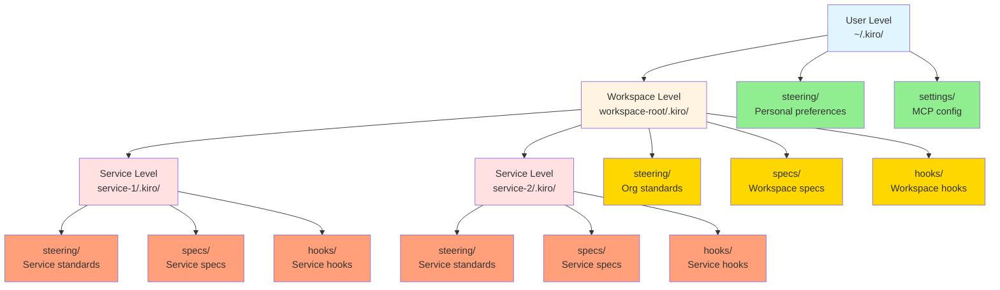
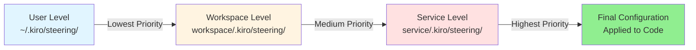
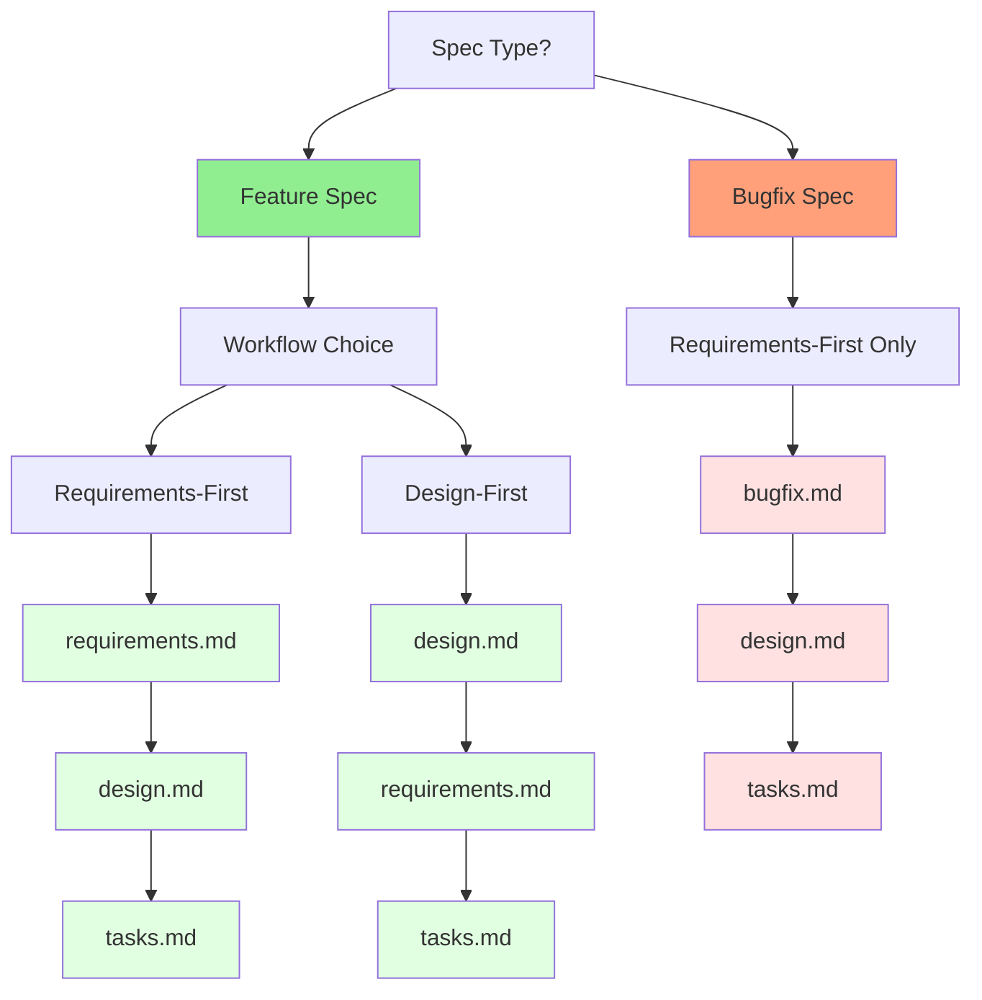
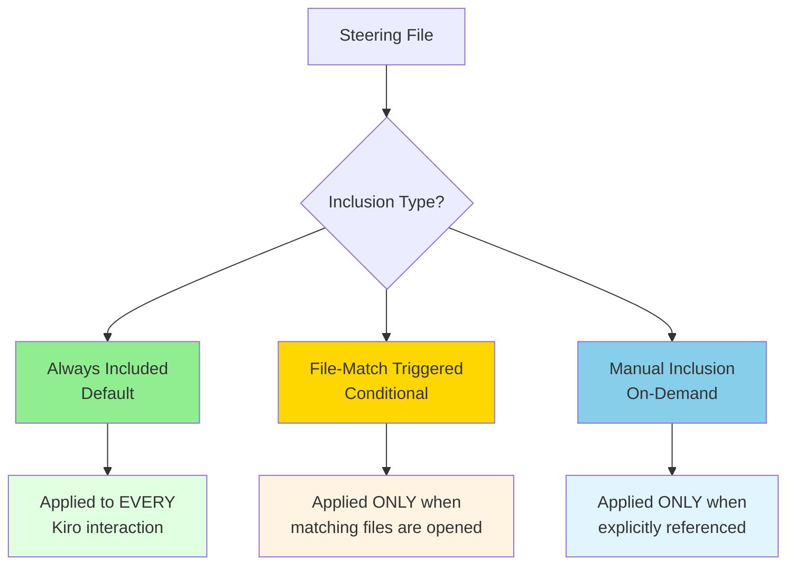

# Kiro Folder Structure & Hierarchy Guide

## Table of Contents
1. [Complete Directory Structure](#1-complete-directory-structure)
2. [Hierarchy & Scope](#2-hierarchy--scope)
3. [File Purpose & Creation Timing](#3-file-purpose--creation-timing)
4. [Multi-Level Hierarchy](#4-multi-level-hierarchy)
5. [Reading Priority & Merge Behavior](#5-reading-priority--merge-behavior)
6. [Specs Structure](#6-specs-structure)
7. [Steering File Types](#7-steering-file-types)
8. [Hooks Structure](#8-hooks-structure)
9. [Complete Hierarchy with Priorities](#9-complete-hierarchy-with-priorities)
10. [Real-World Example](#10-real-world-example)

---

## 1. Complete Directory Structure

```
workspace-root/                           # Your project workspace
├── .kiro/                                # Workspace-level Kiro configuration
│   ├── steering/                         # Organizational standards (optional)
│   │   ├── architecture-standards.md     # Architecture patterns
│   │   ├── spring-boot-standards.md      # Spring Boot conventions
│   │   ├── react-standards.md            # React/Frontend conventions
│   │   ├── security-standards.md         # Security requirements
│   │   └── testing-standards.md          # Testing requirements
│   │
│   ├── specs/                            # Feature specifications (optional)
│   │   ├── feature-1/                    # Feature-specific directory
│   │   │   ├── .config.kiro              # Workflow configuration
│   │   │   ├── requirements.md           # What to build
│   │   │   ├── design.md                 # How to build it
│   │   │   └── tasks.md                  # Step-by-step plan
│   │   │
│   │   └── bugfix-1/                     # Bugfix-specific directory
│   │       ├── .config.kiro              # Workflow configuration
│   │       ├── bugfix.md                 # Bug analysis & requirements
│   │       ├── design.md                 # Fix design
│   │       └── tasks.md                  # Implementation tasks
│   │
│   └── hooks/                            # Automation hooks (optional)
│       ├── lint-on-save.json             # File event hook
│       ├── test-on-commit.json           # Git event hook
│       └── doc-sync.json                 # Documentation hook
│
├── service-1/                            # Individual microservice
│   ├── .kiro/                            # Service-level Kiro configuration
│   │   ├── steering/                     # Service-specific standards (optional)
│   │   │   └── service-1-standards.md    # Service-specific rules
│   │   │
│   │   ├── specs/                        # Service-specific specs (optional)
│   │   │   └── feature-x/
│   │   │       ├── .config.kiro
│   │   │       ├── requirements.md
│   │   │       ├── design.md
│   │   │       └── tasks.md
│   │   │
│   │   └── hooks/                        # Service-specific hooks (optional)
│   │       └── service-1-hook.json
│   │
│   └── src/                              # Source code
│
├── service-2/                            # Another microservice
│   ├── .kiro/                            # Service-level Kiro configuration
│   └── src/
│
└── ~/.kiro/                              # User-level Kiro configuration (global)
    ├── steering/                         # User-specific standards (optional)
    │   └── personal-preferences.md       # Personal coding preferences
    │
    └── settings/                         # User settings
        └── mcp.json                      # MCP server configuration
```

**Key Points:**
- All `.kiro/` folders are **completely optional**
- Kiro works perfectly fine without any `.kiro/` folder
- Create folders only when you need the specific functionality
- Hierarchy: User-level → Workspace-level → Service-level

---
## 2. Hierarchy & Scope



**Scope Explanation:**

| Level | Location | Scope | Use Case |
|-------|----------|-------|----------|
| **User** | `~/.kiro/` | All workspaces for this user | Personal preferences, global MCP servers |
| **Workspace** | `workspace-root/.kiro/` | All services in this workspace | Organization-wide standards |
| **Service** | `service-name/.kiro/` | Only this service | Service-specific rules |

**Merge Behavior:**
- Settings from all levels are merged
- More specific levels override general levels
- Service-level > Workspace-level > User-level

---
## 3. File Purpose & Creation Timing

```
┌─────────────────────────────────────────────────────────────────────┐
│ FOLDER: .kiro/steering/                                             │
├─────────────────────────────────────────────────────────────────────┤
│ PURPOSE:                                                            │
│   • Enforce organizational standards and best practices             │
│   • Maintain consistency across all services                        │
│   • Document architectural patterns and conventions                 │
│                                                                     │
│ WHEN CREATED:                                                       │
│   • When you want Kiro to follow specific patterns                 │
│   • When you need consistency across multiple services             │
│   • When onboarding new developers                                 │
│                                                                     │
│ OPTIONAL: Yes - Kiro works without steering files                  │
│                                                                     │
│ EXAMPLES:                                                           │
│   • architecture-standards.md (Hexagonal Architecture rules)        │
│   • spring-boot-standards.md (Spring Boot conventions)              │
│   • security-standards.md (Security requirements)                   │
└─────────────────────────────────────────────────────────────────────┘

┌─────────────────────────────────────────────────────────────────────┐
│ FOLDER: .kiro/specs/                                                │
├─────────────────────────────────────────────────────────────────────┤
│ PURPOSE:                                                            │
│   • Document feature requirements and design                        │
│   • Create implementation roadmap                                   │
│   • Track progress through tasks                                    │
│                                                                     │
│ WHEN CREATED:                                                       │
│   • When starting a new feature (spec-driven workflow)              │
│   • When fixing a bug (bugfix workflow)                             │
│   • Created on-demand by Kiro                                       │
│                                                                     │
│ OPTIONAL: Yes - You can code without specs                         │
│                                                                     │
│ STRUCTURE:                                                          │
│   specs/                                                            │
│   ├── feature-name/                                                 │
│   │   ├── .config.kiro (workflow config)                           │
│   │   ├── requirements.md (what to build)                          │
│   │   ├── design.md (how to build)                                 │
│   │   └── tasks.md (implementation plan)                           │
│   └── bugfix-name/                                                  │
│       ├── .config.kiro                                              │
│       ├── bugfix.md (bug analysis)                                  │
│       ├── design.md (fix design)                                    │
│       └── tasks.md (fix tasks)                                      │
└─────────────────────────────────────────────────────────────────────┘

┌─────────────────────────────────────────────────────────────────────┐
│ FOLDER: .kiro/hooks/                                                │
├─────────────────────────────────────────────────────────────────────┤
│ PURPOSE:                                                            │
│   • Automate repetitive tasks                                       │
│   • Trigger actions on specific events                              │
│   • Maintain documentation automatically                            │
│                                                                     │
│ WHEN CREATED:                                                       │
│   • When you want automation (lint on save, test on commit)        │
│   • When you need consistent workflows                             │
│   • Created manually or via Kiro                                    │
│                                                                     │
│ OPTIONAL: Yes - Hooks are for automation only                      │
│                                                                     │
│ EVENT TYPES:                                                        │
│   • fileEdited, fileCreated, fileDeleted                           │
│   • promptSubmit, agentStop                                         │
│   • preToolUse, postToolUse                                         │
│   • preTaskExecution, postTaskExecution                             │
│   • userTriggered                                                   │
│                                                                     │
│ ACTIONS:                                                            │
│   • askAgent (send message to Kiro)                                │
│   • runCommand (execute shell command)                             │
└─────────────────────────────────────────────────────────────────────┘

┌─────────────────────────────────────────────────────────────────────┐
│ FILE: .config.kiro                                                  │
├─────────────────────────────────────────────────────────────────────┤
│ PURPOSE:                                                            │
│   • Store spec workflow configuration                               │
│   • Track spec type (feature vs bugfix)                            │
│   • Track workflow type (requirements-first vs design-first)        │
│                                                                     │
│ WHEN CREATED:                                                       │
│   • Automatically when starting a new spec                          │
│   • One per feature/bugfix directory                                │
│                                                                     │
│ CONTENT EXAMPLE:                                                    │
│   {                                                                 │
│     "specType": "feature",                                          │
│     "workflowType": "requirements-first",                           │
│     "featureName": "user-authentication"                            │
│   }                                                                 │
└─────────────────────────────────────────────────────────────────────┘

---
## 4. Multi-Level Hierarchy (Workspace vs Service)

```
┌─────────────────────────────────────────────────────────────────────┐
│ SCENARIO: Multi-Service Banking Application                        │
└─────────────────────────────────────────────────────────────────────┘

banking-prototype/                        # Workspace root
├── .kiro/                                # WORKSPACE-LEVEL
│   └── steering/
│       ├── architecture-standards.md     # Applies to ALL services
│       ├── spring-boot-standards.md      # Applies to ALL services
│       └── security-standards.md         # Applies to ALL services
│
├── authentication-service/               # Service 1
│   ├── .kiro/                            # SERVICE-LEVEL
│   │   ├── steering/
│   │   │   └── auth-standards.md         # Only for auth service
│   │   └── specs/
│   │       └── jwt-token-generation/
│   │           ├── .config.kiro
│   │           ├── requirements.md
│   │           ├── design.md
│   │           └── tasks.md
│   └── src/
│
├── login-service/                        # Service 2
│   ├── .kiro/                            # SERVICE-LEVEL
│   │   ├── steering/
│   │   │   └── login-standards.md        # Only for login service
│   │   └── specs/
│   │       └── user-login/
│   │           ├── .config.kiro
│   │           ├── requirements.md
│   │           ├── design.md
│   │           └── tasks.md
│   └── src/
│
└── channel-configurations-service/       # Service 3
    ├── .kiro/                            # SERVICE-LEVEL
    │   └── specs/
    │       └── feature-flags/
    │           ├── .config.kiro
    │           ├── requirements.md
    │           ├── design.md
    │           └── tasks.md
    └── src/

┌─────────────────────────────────────────────────────────────────────┐
│ WHEN KIRO WORKS ON authentication-service:                         │
├─────────────────────────────────────────────────────────────────────┤
│ Kiro reads (in order):                                              │
│   1. banking-prototype/.kiro/steering/architecture-standards.md     │
│   2. banking-prototype/.kiro/steering/spring-boot-standards.md      │
│   3. banking-prototype/.kiro/steering/security-standards.md         │
│   4. authentication-service/.kiro/steering/auth-standards.md        │
│                                                                     │
│ Result: Auth service follows ALL workspace standards PLUS its own  │
└─────────────────────────────────────────────────────────────────────┘

┌─────────────────────────────────────────────────────────────────────┐
│ WHEN KIRO WORKS ON login-service:                                  │
├─────────────────────────────────────────────────────────────────────┤
│ Kiro reads (in order):                                              │
│   1. banking-prototype/.kiro/steering/architecture-standards.md     │
│   2. banking-prototype/.kiro/steering/spring-boot-standards.md      │
│   3. banking-prototype/.kiro/steering/security-standards.md         │
│   4. login-service/.kiro/steering/login-standards.md                │
│                                                                     │
│ Result: Login service follows ALL workspace standards PLUS its own │
└─────────────────────────────────────────────────────────────────────┘

---
## 5. Reading Priority & Merge Behavior



**Priority Rules:**

| Priority | Level | Location | Overrides |
|----------|-------|----------|-----------|
| 1 (Lowest) | User | `~/.kiro/steering/` | Nothing |
| 2 (Medium) | Workspace | `workspace-root/.kiro/steering/` | User-level |
| 3 (Highest) | Service | `service-name/.kiro/steering/` | Workspace & User |

**Example Scenario:**

```
User-level (~/.kiro/steering/personal-preferences.md):
  • Prefer tabs over spaces

Workspace-level (banking-prototype/.kiro/steering/architecture-standards.md):
  • Use Hexagonal Architecture
  • Use 2 spaces for indentation (OVERRIDES user preference)

Service-level (authentication-service/.kiro/steering/auth-standards.md):
  • Use RSA-256 for JWT signing
  • Use 4 spaces for indentation (OVERRIDES workspace preference)

RESULT when working on authentication-service:
  ✓ Hexagonal Architecture (from workspace)
  ✓ RSA-256 signing (from service)
  ✓ 4 spaces indentation (from service, overrides workspace)
```

**Merge Behavior:**

```
┌─────────────────────────────────────────────────────────────────────┐
│ ADDITIVE MERGE (Non-conflicting settings)                          │
├─────────────────────────────────────────────────────────────────────┤
│ Workspace: Use Hexagonal Architecture                              │
│ Service:   Use RSA-256 signing                                      │
│                                                                     │
│ RESULT: Both rules apply                                            │
│   • Hexagonal Architecture ✓                                        │
│   • RSA-256 signing ✓                                               │
└─────────────────────────────────────────────────────────────────────┘

┌─────────────────────────────────────────────────────────────────────┐
│ OVERRIDE MERGE (Conflicting settings)                              │
├─────────────────────────────────────────────────────────────────────┤
│ Workspace: Use 2 spaces for indentation                            │
│ Service:   Use 4 spaces for indentation                            │
│                                                                     │
│ RESULT: Service-level wins (higher priority)                       │
│   • Use 4 spaces ✓                                                  │
└─────────────────────────────────────────────────────────────────────┘

---
## 6. Specs Structure (Feature vs Bugfix)



### Feature Spec Structure

```
.kiro/specs/user-authentication/          # Feature directory
├── .config.kiro                          # Workflow configuration
│   {
│     "specType": "feature",
│     "workflowType": "requirements-first",
│     "featureName": "user-authentication"
│   }
│
├── requirements.md                       # What to build
│   • User stories
│   • Acceptance criteria
│   • Correctness properties
│   • Edge cases
│
├── design.md                             # How to build it
│   • Architecture
│   • API specifications
│   • Database schema
│   • Security design
│
└── tasks.md                              # Implementation plan
    • Task 1: Create domain models
    • Task 2: Implement business logic
    • Task 3: Create API layer
    • Task 4: Add tests
```

### Bugfix Spec Structure

```
.kiro/specs/login-crash-fix/              # Bugfix directory
├── .config.kiro                          # Workflow configuration
│   {
│     "specType": "bugfix",
│     "workflowType": "requirements-first",
│     "featureName": "login-crash-fix"
│   }
│
├── bugfix.md                             # Bug analysis (replaces requirements.md)
│   • Bug description
│   • Bug condition C(X)
│   • Root cause analysis
│   • Reproduction steps
│   • Expected vs actual behavior
│
├── design.md                             # Fix design
│   • Fix approach
│   • Code changes needed
│   • Preservation check (ensure fix doesn't break other features)
│
└── tasks.md                              # Fix implementation
    • Task 1: Write bug condition exploration test
    • Task 2: Implement fix
    • Task 3: Verify preservation
```

**Key Differences:**

| Aspect | Feature Spec | Bugfix Spec |
|--------|--------------|-------------|
| **First Document** | `requirements.md` | `bugfix.md` |
| **Focus** | What to build | What's broken and why |
| **Workflow Options** | Requirements-first OR Design-first | Requirements-first ONLY |
| **Methodology** | User stories, acceptance criteria | Bug condition C(X), root cause |
| **Testing** | Property-based tests for correctness | Exploration test to confirm bug exists |

---
## 7. Steering File Types & Inclusion Rules



### Type 1: Always Included (Default)

**When to use:** Standards that apply to ALL code in ALL situations

**Front-matter:**
```markdown
---
inclusion: always
---
# OR no front-matter (always is default)

# Your standards here
```

**Example:**
```markdown
# Architecture Standards

## Mandatory Patterns
- All services MUST use Hexagonal Architecture
- Domain logic MUST be isolated from infrastructure
- All services MUST expose OpenAPI documentation
```

**Behavior:**
- Kiro reads this file for EVERY feature, EVERY task, EVERY interaction
- Applied globally across all services
- Cannot be disabled

---

### Type 2: File-Match Triggered (Conditional)

**When to use:** Standards that apply ONLY when working with specific file types

**Front-matter:**
```markdown
---
inclusion: fileMatch
fileMatchPattern: '**/*Controller.java'
---

# Controller-specific standards
```

**Example:**
```markdown
---
inclusion: fileMatch
fileMatchPattern: '**/*Controller.java'
---

# REST Controller Standards

## Required Annotations
- All controllers MUST use @RestController
- All endpoints MUST have @Operation annotations
- All requests MUST be validated with @Valid

## Naming Conventions
- Controllers MUST end with "Controller"
- Methods MUST be named after HTTP verbs (getUser, createUser, etc.)
```

**Behavior:**
- Kiro reads this file ONLY when a matching file is opened or created
- Pattern uses glob syntax (`**/*.java`, `*Controller.java`, etc.)
- Multiple patterns can be specified

**Common Patterns:**
```markdown
fileMatchPattern: '**/*Controller.java'     # All controllers
fileMatchPattern: '**/*Service.java'        # All services
fileMatchPattern: '**/*.tsx'                # All React components
fileMatchPattern: '**/test/**/*.java'       # All test files
```

---

### Type 3: Manual Inclusion (On-Demand)

**When to use:** Advanced patterns or specialized scenarios that don't apply by default

**Front-matter:**
```markdown
---
inclusion: manual
---

# Advanced patterns for specific scenarios
```

**Example:**
```markdown
---
inclusion: manual
---

# Advanced Caching Patterns

## Redis Caching Strategy
- Use Redis for distributed caching
- Cache keys: `cache:{service}:{resource}:{id}`
- TTL: 5 minutes for frequently changing data
- TTL: 1 hour for static data

## Cache Invalidation
- Invalidate on write operations
- Use pub/sub for distributed invalidation
```

**Behavior:**
- Kiro does NOT read this file automatically
- Must be explicitly referenced in chat: `#advanced-caching-patterns.md`
- Useful for specialized knowledge that's not always needed

---

### Inclusion Type Comparison

| Type | When Applied | Use Case | Example |
|------|--------------|----------|---------|
| **Always** | Every interaction | Global standards | Architecture patterns, security rules |
| **File-Match** | When specific files opened | File-type specific rules | Controller standards, React component rules |
| **Manual** | When explicitly referenced | Specialized knowledge | Advanced patterns, migration guides |

---
