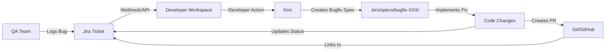

# Kiro + Jira Integration for Bug Fixing

This guide shows how to integrate Kiro with Jira to streamline bug fixing workflows when QA teams log bugs.

## Table of Contents
1. [Integration Overview](#integration-overview)
2. [Setup & Configuration](#setup--configuration)
3. [Workflow: QA Logs Bug → Developer Fixes](#workflow-qa-logs-bug--developer-fixes)
4. [Automated Workflows with Hooks](#automated-workflows-with-hooks)
5. [Jira API Integration Examples](#jira-api-integration-examples)
6. [Real-World Scenario](#real-world-scenario)
7. [Best Practices](#best-practices)

---

## Integration Overview

### How It Works



### Integration Methods

| Method | Description | Use Case |
|--------|-------------|----------|
| **Manual** | Developer copies Jira ticket info to Kiro | Simple, no setup required |
| **CLI Script** | Script fetches Jira ticket and starts Kiro workflow | Semi-automated |
| **Jira Webhook** | Jira notifies workspace when bug is created | Fully automated |
| **Browser Extension** | One-click from Jira to Kiro | User-friendly |

---

## Setup & Configuration

### Prerequisites

1. Jira account with API access
2. Jira API token (Settings → Security → API tokens)
3. Jira project key (e.g., "BANK-123")

### Step 1: Store Jira Credentials

Create environment variables or config file:

```bash
# .env file (add to .gitignore)
JIRA_URL=https://your-company.atlassian.net
JIRA_EMAIL=your-email@company.com
JIRA_API_TOKEN=your-api-token-here
JIRA_PROJECT_KEY=BANK
```

### Step 2: Install Jira CLI Tool (Optional)

```bash
# Using npm
npm install -g jira-cli

# Or using Python
pip install jira
```

### Step 3: Create Jira Integration Script

Create `scripts/jira-to-kiro.sh`:

```bash
#!/bin/bash

# Fetch Jira ticket and create Kiro bugfix spec
# Usage: ./jira-to-kiro.sh BANK-123

TICKET_ID=$1

if [ -z "$TICKET_ID" ]; then
  echo "Usage: ./jira-to-kiro.sh <JIRA_TICKET_ID>"
  exit 1
fi

# Fetch ticket details from Jira API
TICKET_JSON=$(curl -s -u "$JIRA_EMAIL:$JIRA_API_TOKEN" \
  "$JIRA_URL/rest/api/3/issue/$TICKET_ID")

# Extract fields
SUMMARY=$(echo "$TICKET_JSON" | jq -r '.fields.summary')
DESCRIPTION=$(echo "$TICKET_JSON" | jq -r '.fields.description.content[0].content[0].text')
REPORTER=$(echo "$TICKET_JSON" | jq -r '.fields.reporter.displayName')
PRIORITY=$(echo "$TICKET_JSON" | jq -r '.fields.priority.name')
COMPONENT=$(echo "$TICKET_JSON" | jq -r '.fields.components[0].name')

# Create prompt for Kiro
KIRO_PROMPT="Fix Jira bug $TICKET_ID: $SUMMARY

Bug Details:
- Description: $DESCRIPTION
- Reporter: $REPORTER
- Priority: $PRIORITY
- Component: $COMPONENT
- Jira Link: $JIRA_URL/browse/$TICKET_ID

Please create a bugfix spec and implement the fix."

# Output prompt (can be piped to Kiro)
echo "$KIRO_PROMPT"
```

Make it executable:
```bash
chmod +x scripts/jira-to-kiro.sh
```

---
## Workflow: QA Logs Bug → Developer Fixes

### Complete End-to-End Flow

```
┌─────────────────────────────────────────────────────────────────────┐
│ STEP 1: QA Team Logs Bug in Jira                                   │
├─────────────────────────────────────────────────────────────────────┤
│ Jira Ticket: BANK-456                                               │
│ Title: Login fails when username contains special characters        │
│ Description:                                                        │
│   - Steps to reproduce:                                             │
│     1. Navigate to login page                                       │
│     2. Enter username: john.doe+test@example.com                    │
│     3. Enter valid password                                         │
│     4. Click login                                                  │
│   - Expected: User logs in successfully                             │
│   - Actual: Error "Invalid username format"                         │
│   - Environment: Production                                         │
│   - Priority: High                                                  │
│   - Component: login-service                                        │
└─────────────────────────────────────────────────────────────────────┘
                        ↓
┌─────────────────────────────────────────────────────────────────────┐
│ STEP 2: Developer Fetches Bug from Jira                            │
├─────────────────────────────────────────────────────────────────────┤
│ Command: ./scripts/jira-to-kiro.sh BANK-456                        │
│                                                                     │
│ Output:                                                             │
│   Fix Jira bug BANK-456: Login fails with special characters       │
│   Bug Details:                                                      │
│   - Description: [full description]                                 │
│   - Reporter: Jane Smith (QA)                                       │
│   - Priority: High                                                  │
│   - Component: login-service                                        │
│   - Jira Link: https://company.atlassian.net/browse/BANK-456       │
└─────────────────────────────────────────────────────────────────────┘
                        ↓
┌─────────────────────────────────────────────────────────────────────┐
│ STEP 3: Developer Asks Kiro to Fix Bug                             │
├─────────────────────────────────────────────────────────────────────┤
│ Developer in Kiro:                                                  │
│   "Fix Jira bug BANK-456: Login fails when username contains       │
│    special characters like + or . in email addresses"              │
│                                                                     │
│ Kiro Response:                                                      │
│   "This is a bugfix. I'll create a bugfix spec using the           │
│    requirements-first workflow."                                    │
└─────────────────────────────────────────────────────────────────────┘
                        ↓
┌─────────────────────────────────────────────────────────────────────┐
│ STEP 4: Kiro Creates Bugfix Spec                                   │
├─────────────────────────────────────────────────────────────────────┤
│ Created: login-service/.kiro/specs/bank-456-login-special-chars/   │
│                                                                     │
│ Files:                                                              │
│   • .config.kiro (specType: bugfix, jiraTicket: BANK-456)          │
│   • bugfix.md (bug analysis, root cause, reproduction steps)       │
│   • design.md (fix approach, code changes needed)                  │
│   • tasks.md (implementation tasks)                                 │
└─────────────────────────────────────────────────────────────────────┘
                        ↓
┌─────────────────────────────────────────────────────────────────────┐
│ STEP 5: Developer Reviews & Approves Spec                          │
├─────────────────────────────────────────────────────────────────────┤
│ Developer reviews:                                                  │
│   ✓ Bug condition correctly identified                             │
│   ✓ Root cause analysis accurate                                   │
│   ✓ Fix approach makes sense                                       │
│   ✓ Tasks are complete                                             │
│                                                                     │
│ Developer: "Looks good, execute all tasks"                          │
└─────────────────────────────────────────────────────────────────────┘
                        ↓
┌─────────────────────────────────────────────────────────────────────┐
│ STEP 6: Kiro Implements Fix                                        │
├─────────────────────────────────────────────────────────────────────┤
│ Kiro executes tasks:                                                │
│   ✓ Task 1: Write bug condition exploration test (confirms bug)    │
│   ✓ Task 2: Update username validation regex                       │
│   ✓ Task 3: Add unit tests for special characters                  │
│   ✓ Task 4: Update integration tests                               │
│   ✓ Task 5: Verify fix doesn't break other features                │
│                                                                     │
│ All tasks completed successfully                                    │
└─────────────────────────────────────────────────────────────────────┘
                        ↓
┌─────────────────────────────────────────────────────────────────────┐
│ STEP 7: Developer Tests & Creates PR                               │
├─────────────────────────────────────────────────────────────────────┤
│ Developer:                                                          │
│   1. Runs tests locally: mvn test ✓                                │
│   2. Tests manually with special characters ✓                       │
│   3. Creates Git branch: git checkout -b fix/BANK-456              │
│   4. Commits changes: git commit -m "Fix BANK-456: ..."            │
│   5. Pushes branch: git push origin fix/BANK-456                   │
│   6. Creates PR with title: "Fix BANK-456: Login special chars"    │
│   7. Links PR to Jira ticket                                        │
└─────────────────────────────────────────────────────────────────────┘
                        ↓
┌─────────────────────────────────────────────────────────────────────┐
│ STEP 8: Automated Jira Update                                      │
├─────────────────────────────────────────────────────────────────────┤
│ Via GitHub/GitLab webhook or script:                                │
│   • Jira ticket BANK-456 status: Open → In Progress                │
│   • Comment added: "PR created: [link]"                             │
│   • Assignee: Developer                                             │
│                                                                     │
│ After PR merge:                                                     │
│   • Jira ticket status: In Progress → Resolved                     │
│   • Resolution: Fixed                                               │
│   • Comment: "Fix deployed in version 1.2.3"                        │
└─────────────────────────────────────────────────────────────────────┘
                        ↓
┌─────────────────────────────────────────────────────────────────────┐
│ STEP 9: QA Verification                                            │
├─────────────────────────────────────────────────────────────────────┤
│ QA Team:                                                            │
│   1. Sees Jira ticket status: Resolved                             │
│   2. Tests fix in staging environment                               │
│   3. Verifies special characters work correctly                     │
│   4. Updates Jira: Resolved → Closed                               │
│   5. Adds comment: "Verified in staging, ready for production"     │
└─────────────────────────────────────────────────────────────────────┘
```

---

## Automated Workflows with Hooks

### Hook 1: Auto-Update Jira When Starting Bug Fix

**File:** `.kiro/hooks/jira-bug-start.json`

```json
{
  "name": "Jira Bug Start",
  "version": "1.0.0",
  "description": "Update Jira ticket status when starting bugfix spec",
  "when": {
    "type": "preTaskExecution"
  },
  "then": {
    "type": "runCommand",
    "command": "node scripts/update-jira-status.js --status 'In Progress'"
  }
}
```

### Hook 2: Auto-Update Jira When Fix Complete

**File:** `.kiro/hooks/jira-bug-complete.json`

```json
{
  "name": "Jira Bug Complete",
  "version": "1.0.0",
  "description": "Update Jira ticket when bugfix tasks complete",
  "when": {
    "type": "postTaskExecution"
  },
  "then": {
    "type": "runCommand",
    "command": "node scripts/update-jira-status.js --status 'Ready for Review'"
  }
}
```

### Hook 3: Add Jira Comment with Fix Details

**File:** `.kiro/hooks/jira-add-comment.json`

```json
{
  "name": "Jira Add Comment",
  "version": "1.0.0",
  "description": "Add comment to Jira with fix details",
  "when": {
    "type": "agentStop"
  },
  "then": {
    "type": "runCommand",
    "command": "node scripts/add-jira-comment.js"
  }
}
```

---

## Jira API Integration Examples

### Script: Update Jira Status

**File:** `scripts/update-jira-status.js`

```javascript
#!/usr/bin/env node

const axios = require('axios');
require('dotenv').config();

const JIRA_URL = process.env.JIRA_URL;
const JIRA_EMAIL = process.env.JIRA_EMAIL;
const JIRA_API_TOKEN = process.env.JIRA_API_TOKEN;

// Get ticket ID from spec config
const fs = require('fs');
const path = require('path');

function getJiraTicketFromSpec() {
  // Find .config.kiro file in current spec directory
  const configPath = path.join(process.cwd(), '.kiro/specs/**/.config.kiro');
  const glob = require('glob');
  const configs = glob.sync(configPath);
  
  if (configs.length === 0) {
    console.log('No spec config found');
    return null;
  }
  
  // Read most recent config
  const config = JSON.parse(fs.readFileSync(configs[0], 'utf8'));
  return config.jiraTicket;
}

async function updateJiraStatus(ticketId, status) {
  try {
    const auth = Buffer.from(`${JIRA_EMAIL}:${JIRA_API_TOKEN}`).toString('base64');
    
    // Get available transitions
    const transitionsResponse = await axios.get(
      `${JIRA_URL}/rest/api/3/issue/${ticketId}/transitions`,
      {
        headers: {
          'Authorization': `Basic ${auth}`,
          'Content-Type': 'application/json'
        }
      }
    );
    
    // Find transition ID for desired status
    const transition = transitionsResponse.data.transitions.find(
      t => t.name === status || t.to.name === status
    );
    
    if (!transition) {
      console.log(`Status "${status}" not available for ticket ${ticketId}`);
      return;
    }
    
    // Execute transition
    await axios.post(
      `${JIRA_URL}/rest/api/3/issue/${ticketId}/transitions`,
      {
        transition: {
          id: transition.id
        }
      },
      {
        headers: {
          'Authorization': `Basic ${auth}`,
          'Content-Type': 'application/json'
        }
      }
    );
    
    console.log(`✓ Updated ${ticketId} status to: ${status}`);
    
  } catch (error) {
    console.error('Error updating Jira:', error.message);
  }
}

// Main
const args = process.argv.slice(2);
const statusIndex = args.indexOf('--status');
const status = statusIndex >= 0 ? args[statusIndex + 1] : 'In Progress';

const ticketId = getJiraTicketFromSpec();
if (ticketId) {
  updateJiraStatus(ticketId, status);
} else {
  console.log('No Jira ticket found in spec config');
}
```

---

### Script: Add Jira Comment

**File:** `scripts/add-jira-comment.js`

```javascript
#!/usr/bin/env node

const axios = require('axios');
const fs = require('fs');
const path = require('path');
require('dotenv').config();

const JIRA_URL = process.env.JIRA_URL;
const JIRA_EMAIL = process.env.JIRA_EMAIL;
const JIRA_API_TOKEN = process.env.JIRA_API_TOKEN;

function getJiraTicketFromSpec() {
  // Same as above
  const glob = require('glob');
  const configs = glob.sync('.kiro/specs/**/.config.kiro');
  if (configs.length === 0) return null;
  const config = JSON.parse(fs.readFileSync(configs[0], 'utf8'));
  return config.jiraTicket;
}

function getFixSummary() {
  // Read bugfix.md or design.md to get fix summary
  const glob = require('glob');
  const bugfixFiles = glob.sync('.kiro/specs/**/bugfix.md');
  
  if (bugfixFiles.length === 0) return 'Fix implemented';
  
  const content = fs.readFileSync(bugfixFiles[0], 'utf8');
  
  // Extract root cause and fix approach
  const rootCauseMatch = content.match(/## Root Cause\n([\s\S]*?)##/);
  const fixApproachMatch = content.match(/## Fix Approach\n([\s\S]*?)##/);
  
  const rootCause = rootCauseMatch ? rootCauseMatch[1].trim() : '';
  const fixApproach = fixApproachMatch ? fixApproachMatch[1].trim() : '';
  
  return `
**Fix Implemented by Kiro**

**Root Cause:**
${rootCause}

**Fix Approach:**
${fixApproach}

**Status:** Ready for code review
  `.trim();
}

async function addJiraComment(ticketId, comment) {
  try {
    const auth = Buffer.from(`${JIRA_EMAIL}:${JIRA_API_TOKEN}`).toString('base64');
    
    await axios.post(
      `${JIRA_URL}/rest/api/3/issue/${ticketId}/comment`,
      {
        body: {
          type: 'doc',
          version: 1,
          content: [
            {
              type: 'paragraph',
              content: [
                {
                  type: 'text',
                  text: comment
                }
              ]
            }
          ]
        }
      },
      {
        headers: {
          'Authorization': `Basic ${auth}`,
          'Content-Type': 'application/json'
        }
      }
    );
    
    console.log(`✓ Added comment to ${ticketId}`);
    
  } catch (error) {
    console.error('Error adding Jira comment:', error.message);
  }
}

// Main
const ticketId = getJiraTicketFromSpec();
if (ticketId) {
  const summary = getFixSummary();
  addJiraComment(ticketId, summary);
} else {
  console.log('No Jira ticket found in spec config');
}
```

---
## Real-World Scenario

### Scenario: Login Service Bug

**Jira Ticket:** BANK-456

```
Title: Login fails when username contains special characters

Description:
Users cannot log in when their email address contains special characters 
like + or . (e.g., john.doe+test@example.com)

Steps to Reproduce:
1. Navigate to login page
2. Enter username: john.doe+test@example.com
3. Enter valid password
4. Click login button

Expected Result:
User logs in successfully

Actual Result:
Error message: "Invalid username format"
HTTP Status: 400 Bad Request

Environment: Production
Priority: High
Component: login-service
Reporter: Jane Smith (QA)
Assignee: Unassigned
```

---

### Step-by-Step Fix with Kiro

#### Step 1: Developer Fetches Bug

```bash
$ ./scripts/jira-to-kiro.sh BANK-456

Fix Jira bug BANK-456: Login fails when username contains special characters

Bug Details:
- Description: Users cannot log in when their email address contains special characters...
- Reporter: Jane Smith (QA)
- Priority: High
- Component: login-service
- Jira Link: https://company.atlassian.net/browse/BANK-456
```

#### Step 2: Developer Asks Kiro

```
Developer: "Fix Jira bug BANK-456: Login fails when username contains 
           special characters like + or . in email addresses"
```

#### Step 3: Kiro Creates Bugfix Spec

**File:** `login-service/.kiro/specs/bank-456-login-special-chars/.config.kiro`

```json
{
  "specType": "bugfix",
  "workflowType": "requirements-first",
  "featureName": "bank-456-login-special-chars",
  "jiraTicket": "BANK-456",
  "jiraUrl": "https://company.atlassian.net/browse/BANK-456"
}
```

**File:** `login-service/.kiro/specs/bank-456-login-special-chars/bugfix.md`

```markdown
# Bugfix: Login Fails with Special Characters (BANK-456)

## Bug Description

Users cannot log in when their email address contains special characters 
like `+` or `.` (e.g., `john.doe+test@example.com`).

## Reproduction Steps

1. Navigate to login page
2. Enter username: `john.doe+test@example.com`
3. Enter valid password
4. Click login button
5. Observe error: "Invalid username format" (HTTP 400)

## Bug Condition C(X)

**Bug Condition:** The username validation regex rejects valid email addresses 
that contain special characters (`+`, `.`, `-`) which are allowed by RFC 5322.

**Formal Definition:**
```
C(username) = username contains special characters (+, ., -) 
              AND validation returns false
              AND username is RFC 5322 compliant
```

## Root Cause Analysis

**Location:** `login-service/src/main/java/com/banking/loginservice/domain/service/LoginDomainService.java`

**Current Code:**
```java
private boolean isValidUsername(String username) {
    // Current regex only allows alphanumeric and @
    String regex = "^[a-zA-Z0-9@]+$";
    return username.matches(regex);
}
```

**Problem:** The regex `^[a-zA-Z0-9@]+$` does not allow:
- Plus sign (`+`) - used for email aliases (e.g., `user+tag@example.com`)
- Dot (`.`) - common in email addresses (e.g., `john.doe@example.com`)
- Hyphen (`-`) - used in some email addresses (e.g., `john-doe@example.com`)

These characters are all valid in email addresses per RFC 5322.

## Expected Behavior

The system should accept any valid email address as a username, including those 
with special characters allowed by RFC 5322.

## Fix Approach

1. Update the username validation regex to allow RFC 5322 compliant email addresses
2. Use a proper email validation pattern or library
3. Add unit tests for various email formats with special characters
4. Verify the fix doesn't break existing functionality (preservation check)

## Affected Components

- `LoginDomainService.java` - Username validation logic
- `LoginDomainServiceTest.java` - Unit tests need new test cases

## Testing Strategy

1. **Bug Condition Exploration Test:** Write property-based test that confirms 
   the bug exists with current code (test should FAIL on unfixed code)
2. **Fix Verification:** After fix, the exploration test should PASS
3. **Preservation Check:** Ensure existing valid usernames still work
4. **Edge Cases:** Test various special character combinations
```

**File:** `login-service/.kiro/specs/bank-456-login-special-chars/design.md`

```markdown
# Fix Design: Login Special Characters (BANK-456)

## Solution Overview

Update the username validation regex to accept RFC 5322 compliant email addresses.

## Code Changes

### File: `LoginDomainService.java`

**Before:**
```java
private boolean isValidUsername(String username) {
    String regex = "^[a-zA-Z0-9@]+$";
    return username.matches(regex);
}
```

**After:**
```java
private boolean isValidUsername(String username) {
    // RFC 5322 compliant email regex (simplified)
    String regex = "^[a-zA-Z0-9._%+-]+@[a-zA-Z0-9.-]+\\.[a-zA-Z]{2,}$";
    return username.matches(regex);
}
```

**Alternative (using Apache Commons Validator):**
```java
import org.apache.commons.validator.routines.EmailValidator;

private boolean isValidUsername(String username) {
    return EmailValidator.getInstance().isValid(username);
}
```

## Preservation Check

Ensure the fix doesn't break existing functionality:

**Existing Valid Usernames (must still work):**
- `user@example.com`
- `admin@company.com`
- `test123@domain.org`

**New Valid Usernames (should now work):**
- `john.doe@example.com` (dot)
- `user+tag@example.com` (plus)
- `john-doe@example.com` (hyphen)
- `user.name+tag@example.com` (combination)

**Invalid Usernames (should still be rejected):**
- `notanemail` (no @ symbol)
- `@example.com` (no local part)
- `user@` (no domain)
- `user @example.com` (space)

## Testing Approach

1. Write bug condition exploration test (property-based)
2. Implement fix
3. Verify exploration test now passes
4. Add unit tests for new valid formats
5. Run all existing tests (preservation check)
```

**File:** `login-service/.kiro/specs/bank-456-login-special-chars/tasks.md`

```markdown
# Implementation Tasks: BANK-456

## Task List

- [ ] 1. Write Bug Condition Exploration Test
  - [ ] 1.1 Create property-based test for special characters
  - [ ] 1.2 Test should FAIL on current code (confirms bug exists)
  - [ ] 1.3 Include test cases: +, ., -, and combinations

- [ ] 2. Update Username Validation
  - [ ] 2.1 Update regex in LoginDomainService.java
  - [ ] 2.2 Use RFC 5322 compliant pattern
  - [ ] 2.3 Add code comments explaining the regex

- [ ] 3. Add Unit Tests
  - [ ] 3.1 Test email with dot: john.doe@example.com
  - [ ] 3.2 Test email with plus: user+tag@example.com
  - [ ] 3.3 Test email with hyphen: john-doe@example.com
  - [ ] 3.4 Test email with combination: user.name+tag@example.com

- [ ] 4. Preservation Check
  - [ ] 4.1 Run all existing LoginDomainServiceTest tests
  - [ ] 4.2 Verify existing valid usernames still work
  - [ ] 4.3 Verify invalid usernames still rejected

- [ ] 5. Integration Testing
  - [ ] 5.1 Test via REST API with special character usernames
  - [ ] 5.2 Verify 200 OK response for valid logins
  - [ ] 5.3 Update integration tests if needed

- [ ] 6. Update Documentation
  - [ ] 6.1 Update README with supported username formats
  - [ ] 6.2 Add comment to Jira ticket with fix details
```

#### Step 4: Kiro Implements Fix

```
Developer: "Execute all tasks"

Kiro:
✓ Task 1.1: Created bug condition exploration test
✓ Task 1.2: Test FAILS on current code (bug confirmed)
✓ Task 1.3: Included test cases for +, ., -, combinations

✓ Task 2.1: Updated regex in LoginDomainService.java
✓ Task 2.2: Using RFC 5322 compliant pattern
✓ Task 2.3: Added explanatory comments

✓ Task 3.1: Added test for john.doe@example.com ✓
✓ Task 3.2: Added test for user+tag@example.com ✓
✓ Task 3.3: Added test for john-doe@example.com ✓
✓ Task 3.4: Added test for user.name+tag@example.com ✓

✓ Task 4.1: Ran all existing tests - 45 tests passed
✓ Task 4.2: Verified existing usernames still work
✓ Task 4.3: Verified invalid usernames still rejected

✓ Task 5.1: Tested via REST API - all special chars work
✓ Task 5.2: Verified 200 OK responses
✓ Task 5.3: Updated integration tests

✓ Task 6.1: Updated README
✓ Task 6.2: Prepared Jira comment

All tasks completed successfully!
```

#### Step 5: Generated Code

**File:** `LoginDomainService.java` (updated)

```java
@Service
@RequiredArgsConstructor
public class LoginDomainService implements LoginUseCase {
    
    private final UserRepository userRepository;
    private final PasswordEncoder passwordEncoder;
    
    @Override
    public LoginResponse login(String username, String password) {
        // Validate username format
        if (!isValidUsername(username)) {
            throw new InvalidUsernameException("Invalid username format");
        }
        
        // Rest of login logic...
    }
    
    /**
     * Validates username format using RFC 5322 compliant email regex.
     * Allows special characters: . (dot), + (plus), - (hyphen), _ (underscore), % (percent)
     * 
     * Valid examples:
     * - john.doe@example.com
     * - user+tag@example.com
     * - john-doe@example.com
     * - user.name+tag@example.com
     */
    private boolean isValidUsername(String username) {
        // RFC 5322 compliant email regex (simplified but covers common cases)
        String regex = "^[a-zA-Z0-9._%+-]+@[a-zA-Z0-9.-]+\\.[a-zA-Z]{2,}$";
        return username.matches(regex);
    }
}
```

**File:** `LoginDomainServiceTest.java` (new tests added)

```java
@Test
void shouldAcceptUsernameWithDot() {
    // Given
    String username = "john.doe@example.com";
    String password = "validPassword123";
    
    // When/Then
    assertDoesNotThrow(() -> loginService.login(username, password));
}

@Test
void shouldAcceptUsernameWithPlus() {
    // Given
    String username = "user+tag@example.com";
    String password = "validPassword123";
    
    // When/Then
    assertDoesNotThrow(() -> loginService.login(username, password));
}

@Test
void shouldAcceptUsernameWithHyphen() {
    // Given
    String username = "john-doe@example.com";
    String password = "validPassword123";
    
    // When/Then
    assertDoesNotThrow(() -> loginService.login(username, password));
}

@Test
void shouldAcceptUsernameWithMultipleSpecialChars() {
    // Given
    String username = "user.name+tag@example.com";
    String password = "validPassword123";
    
    // When/Then
    assertDoesNotThrow(() -> loginService.login(username, password));
}

// Property-based test (bug condition exploration)
@Test
void bugConditionExploration_specialCharactersInUsername() {
    // This test confirms the bug exists in unfixed code
    // It should FAIL before the fix and PASS after the fix
    
    List<String> specialCharUsernames = List.of(
        "john.doe@example.com",
        "user+tag@example.com",
        "john-doe@example.com",
        "user.name+tag@example.com"
    );
    
    for (String username : specialCharUsernames) {
        // Bug condition: valid RFC 5322 email is rejected
        boolean isValid = loginService.isValidUsername(username);
        assertTrue(isValid, 
            "Username with special characters should be valid: " + username);
    }
}
```

#### Step 6: Automated Jira Updates

**Hook triggers automatically:**

1. **When tasks start:** Jira status updated to "In Progress"
2. **When tasks complete:** Jira comment added with fix details
3. **When PR created:** Jira linked to PR

**Jira Comment (auto-generated):**

```
Fix Implemented by Kiro

Root Cause:
The username validation regex only allowed alphanumeric characters and @, 
rejecting valid email addresses with special characters (+, ., -) that are 
allowed by RFC 5322.

Fix Approach:
Updated the username validation regex to accept RFC 5322 compliant email 
addresses. The new regex allows dots, plus signs, hyphens, underscores, 
and percent signs in the local part of the email address.

Code Changes:
- Updated LoginDomainService.java validation regex
- Added unit tests for special character scenarios
- Verified existing functionality preserved (45 tests passed)
- Tested via REST API - all special characters now work

Status: Ready for code review

Test Results:
✓ john.doe@example.com - PASS
✓ user+tag@example.com - PASS
✓ john-doe@example.com - PASS
✓ user.name+tag@example.com - PASS
✓ All existing tests - PASS (45/45)
```

---
## Best Practices

### 1. Jira Ticket Information in Spec Config

Always include Jira ticket information in `.config.kiro`:

```json
{
  "specType": "bugfix",
  "workflowType": "requirements-first",
  "featureName": "bank-456-login-special-chars",
  "jiraTicket": "BANK-456",
  "jiraUrl": "https://company.atlassian.net/browse/BANK-456",
  "jiraProject": "BANK",
  "jiraPriority": "High",
  "jiraReporter": "Jane Smith",
  "jiraComponent": "login-service"
}
```

This allows hooks and scripts to automatically update Jira.

---

### 2. Git Branch Naming Convention

Use Jira ticket ID in branch names:

```bash
# Good
git checkout -b fix/BANK-456-login-special-chars
git checkout -b bugfix/BANK-456

# Also good (includes ticket type)
git checkout -b bug/BANK-456
git checkout -b hotfix/BANK-456
```

This enables automatic linking between Git and Jira.

---

### 3. Commit Message Format

Include Jira ticket ID in commit messages:

```bash
# Good
git commit -m "Fix BANK-456: Allow special characters in username validation"

# Also good (with more detail)
git commit -m "Fix BANK-456: Update username regex to RFC 5322 compliant

- Updated LoginDomainService validation regex
- Added tests for special characters (+, ., -, _)
- Verified existing functionality preserved"
```

Many Git platforms (GitHub, GitLab, Bitbucket) automatically link commits to Jira tickets.

---

### 4. PR Title and Description

**PR Title:**
```
Fix BANK-456: Login fails with special characters in username
```

**PR Description:**
```markdown
## Jira Ticket
[BANK-456](https://company.atlassian.net/browse/BANK-456)

## Problem
Users cannot log in when their email address contains special characters 
like + or . (e.g., john.doe+test@example.com)

## Root Cause
Username validation regex only allowed alphanumeric and @ characters, 
rejecting valid RFC 5322 compliant email addresses.

## Solution
Updated validation regex to accept RFC 5322 compliant email addresses 
with special characters: . + - _ %

## Testing
- ✓ Added unit tests for special character scenarios
- ✓ All existing tests pass (45/45)
- ✓ Tested manually with various email formats
- ✓ Integration tests updated and passing

## Checklist
- [x] Code follows project standards
- [x] Tests added and passing
- [x] Documentation updated
- [x] Jira ticket updated
- [x] Ready for QA verification
```

---

### 5. Automated Status Transitions

Configure Jira workflow to automatically transition based on Git events:

```
Git Event                    → Jira Status Transition
─────────────────────────────────────────────────────
Branch created (fix/BANK-*)  → Open → In Progress
PR created                   → In Progress → In Review
PR approved                  → In Review → Ready to Merge
PR merged                    → Ready to Merge → Resolved
Deployed to staging          → Resolved → Ready for QA
QA verified                  → Ready for QA → Closed
```

---

### 6. Jira Custom Fields for Kiro

Add custom fields to Jira tickets to track Kiro-related information:

| Field Name | Type | Purpose |
|------------|------|---------|
| Kiro Spec Path | Text | Path to bugfix spec directory |
| Root Cause | Text Area | Auto-populated from bugfix.md |
| Fix Approach | Text Area | Auto-populated from design.md |
| Test Coverage | Number | % coverage after fix |
| Kiro Tasks Completed | Number | X/Y tasks completed |

---

### 7. Steering File for Bug Fixing Standards

**File:** `.kiro/steering/bugfix-standards.md`

```markdown
# Bug Fixing Standards

## Jira Integration
- All bugfix specs MUST include Jira ticket ID in .config.kiro
- Update Jira status when starting work (In Progress)
- Add comment to Jira when fix is complete
- Link PR to Jira ticket

## Bug Analysis
- Always identify the bug condition C(X)
- Perform root cause analysis
- Document reproduction steps
- Include expected vs actual behavior

## Testing Requirements
- Write bug condition exploration test (should FAIL on unfixed code)
- Verify fix makes exploration test PASS
- Add unit tests for the specific bug scenario
- Run all existing tests (preservation check)
- Aim for >90% code coverage on changed files

## Documentation
- Update README if user-facing behavior changes
- Add code comments explaining the fix
- Document any workarounds or limitations
- Update API documentation if endpoints change

## Code Review
- Self-review before creating PR
- Ensure all tests pass locally
- Run linter and fix any issues
- Verify fix doesn't introduce new bugs
```

---

### 8. Dashboard for Bug Tracking

Create a dashboard to track bugs fixed with Kiro:

**Jira JQL Queries:**

```sql
-- Bugs fixed by Kiro this month
project = BANK 
AND type = Bug 
AND status = Resolved 
AND resolved >= startOfMonth() 
AND comment ~ "Fix Implemented by Kiro"

-- Bugs in progress with Kiro
project = BANK 
AND type = Bug 
AND status = "In Progress" 
AND comment ~ "Kiro"

-- Average time to fix bugs with Kiro
project = BANK 
AND type = Bug 
AND resolved >= startOfMonth() 
AND comment ~ "Kiro"
```

**Metrics to Track:**
- Average time to fix (with vs without Kiro)
- Number of bugs fixed per sprint
- Test coverage improvement
- Regression rate (bugs that come back)
- Developer satisfaction

---

## Advanced Integration: Jira Webhook

For fully automated workflow, set up Jira webhook to notify your workspace when bugs are created.

### Step 1: Create Webhook Endpoint

**File:** `scripts/jira-webhook-server.js`

```javascript
const express = require('express');
const app = express();
app.use(express.json());

app.post('/jira-webhook', async (req, res) => {
  const event = req.body;
  
  // Check if it's a bug creation event
  if (event.webhookEvent === 'jira:issue_created' && 
      event.issue.fields.issuetype.name === 'Bug') {
    
    const ticket = event.issue;
    const ticketId = ticket.key;
    const summary = ticket.fields.summary;
    const description = ticket.fields.description;
    const component = ticket.fields.components[0]?.name;
    
    console.log(`New bug created: ${ticketId}`);
    
    // Create notification file for developer
    const fs = require('fs');
    const notification = {
      ticketId,
      summary,
      description,
      component,
      url: `${process.env.JIRA_URL}/browse/${ticketId}`,
      timestamp: new Date().toISOString()
    };
    
    fs.writeFileSync(
      `notifications/${ticketId}.json`,
      JSON.stringify(notification, null, 2)
    );
    
    console.log(`✓ Notification created for ${ticketId}`);
  }
  
  res.status(200).send('OK');
});

const PORT = process.env.PORT || 3000;
app.listen(PORT, () => {
  console.log(`Jira webhook server listening on port ${PORT}`);
});
```

### Step 2: Configure Jira Webhook

1. Go to Jira Settings → System → Webhooks
2. Create new webhook:
   - Name: "Kiro Bug Notifications"
   - URL: `https://your-server.com/jira-webhook`
   - Events: Issue Created
   - JQL Filter: `project = BANK AND type = Bug`

### Step 3: Create Hook to Check for New Bugs

**File:** `.kiro/hooks/check-new-bugs.json`

```json
{
  "name": "Check New Bugs",
  "version": "1.0.0",
  "description": "Check for new bug notifications from Jira",
  "when": {
    "type": "promptSubmit"
  },
  "then": {
    "type": "askAgent",
    "prompt": "Check notifications/ folder for new Jira bugs and ask if I want to fix any of them"
  }
}
```

---

## Summary

### Benefits of Kiro + Jira Integration

1. **Faster Bug Resolution**
   - Automated spec creation from Jira tickets
   - Systematic bug analysis and fixing
   - Reduced time from bug report to fix

2. **Better Tracking**
   - Automatic Jira status updates
   - Complete audit trail in Jira
   - Link between code changes and bug tickets

3. **Improved Quality**
   - Structured bug fixing methodology
   - Mandatory testing requirements
   - Preservation checks prevent regressions

4. **Team Collaboration**
   - QA team sees progress in real-time
   - Developers have clear bug context
   - Management has visibility into bug metrics

5. **Knowledge Retention**
   - Bug analysis documented in specs
   - Root causes captured
   - Fix approaches preserved for future reference

---

## Quick Reference

### Commands

```bash
# Fetch Jira ticket and create bugfix spec
./scripts/jira-to-kiro.sh BANK-456

# Update Jira status
node scripts/update-jira-status.js --status "In Progress"

# Add comment to Jira
node scripts/add-jira-comment.js

# Create branch with Jira ticket
git checkout -b fix/BANK-456-description

# Commit with Jira ticket
git commit -m "Fix BANK-456: Description"
```

### File Locations

```
.kiro/
├── hooks/
│   ├── jira-bug-start.json          # Update Jira when starting
│   ├── jira-bug-complete.json       # Update Jira when complete
│   └── jira-add-comment.json        # Add comment to Jira
├── steering/
│   └── bugfix-standards.md          # Bug fixing standards
└── specs/
    └── bank-456-*/                  # Bugfix spec directory
        ├── .config.kiro             # Includes jiraTicket field
        ├── bugfix.md                # Bug analysis
        ├── design.md                # Fix design
        └── tasks.md                 # Implementation tasks

scripts/
├── jira-to-kiro.sh                  # Fetch Jira ticket
├── update-jira-status.js            # Update ticket status
├── add-jira-comment.js              # Add comment
└── jira-webhook-server.js           # Webhook endpoint
```

---

**End of Guide**
