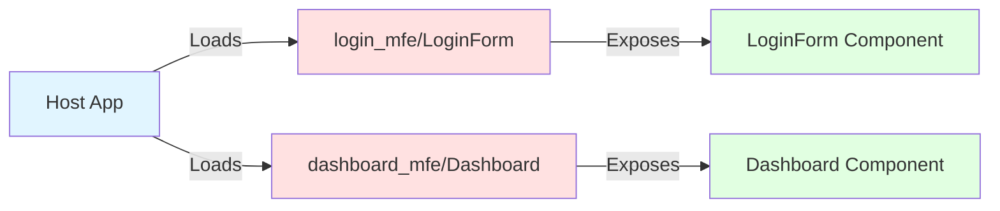
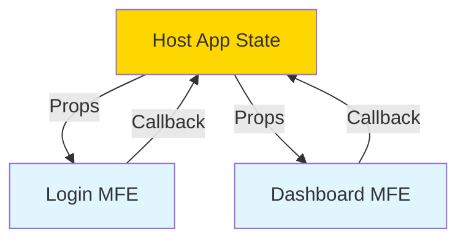
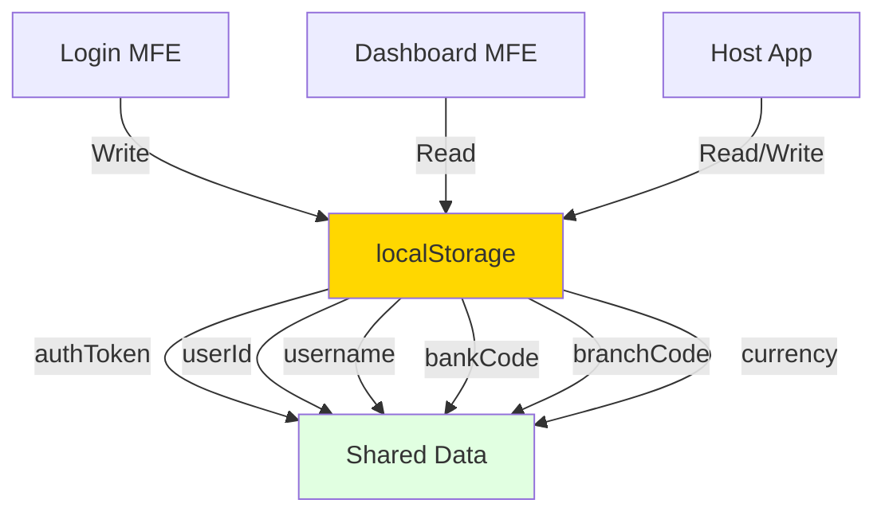
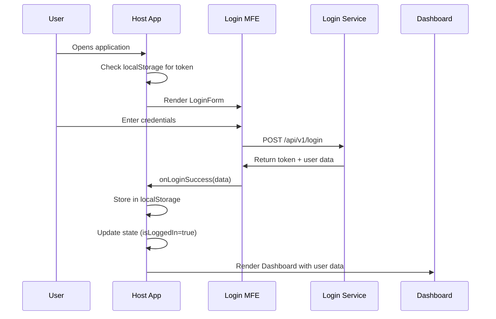
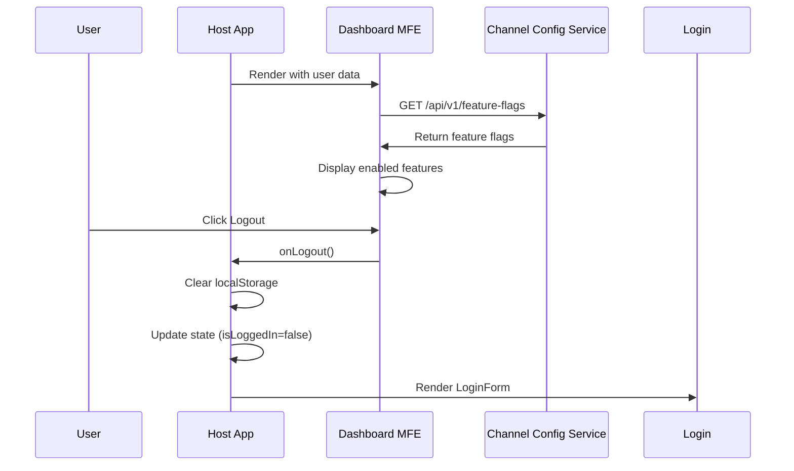

# Micro Frontend (MFE) Communication Guide

## Overview

In your banking application, you have multiple Micro Frontends (MFEs) that need to communicate with each other. This document explains the different communication patterns and how they're implemented.

---

## Current Architecture

```
┌─────────────────────────────────────────────────────────┐
│                    Host App (Port 3000)                 │
│                                                         │
│  • Orchestrates all MFEs                               │
│  • Manages global state (auth, user data)             │
│  • Routes between MFEs                                 │
│  • Shares data via props                               │
└─────────────────────────────────────────────────────────┘
                    ↓                    ↓
        ┌───────────────────┐  ┌───────────────────┐
        │  Login MFE        │  │  Dashboard MFE    │
        │  (Port 3001)      │  │  (Port 3002)      │
        │                   │  │                   │
        │  • Login form     │  │  • User dashboard │
        │  • Validation     │  │  • Feature flags  │
        │  • Auth flow      │  │  • Account info   │
        └───────────────────┘  └───────────────────┘
```

---

## Communication Patterns

### 1. Module Federation (Component Sharing)

**What it is:** Webpack Module Federation allows MFEs to share React components at runtime.

**How it works:**



**Configuration:**

**Host App (webpack.config.js):**
```javascript
new ModuleFederationPlugin({
  name: 'host_app',
  remotes: {
    login_mfe: 'login_mfe@http://localhost:3001/remoteEntry.js',
    dashboard_mfe: 'dashboard_mfe@http://localhost:3002/remoteEntry.js',
  },
  shared: {
    react: { singleton: true },
    'react-dom': { singleton: true },
  },
})
```

**Login MFE (webpack.config.js):**
```javascript
new ModuleFederationPlugin({
  name: 'login_mfe',
  filename: 'remoteEntry.js',
  exposes: {
    './LoginForm': './src/components/LoginForm.jsx',
  },
  shared: {
    react: { singleton: true },
    'react-dom': { singleton: true },
  },
})
```

**Dashboard MFE (webpack.config.js):**
```javascript
new ModuleFederationPlugin({
  name: 'dashboard_mfe',
  filename: 'remoteEntry.js',
  exposes: {
    './Dashboard': './src/components/Dashboard.jsx',
  },
  shared: {
    react: { singleton: true },
    'react-dom': { singleton: true },
  },
})
```

**Usage in Host App:**
```javascript
// Lazy load remote components
const LoginForm = lazy(() => import('login_mfe/LoginForm'));
const Dashboard = lazy(() => import('dashboard_mfe/Dashboard'));
```

---

### 2. Props-Based Communication (Parent → Child)

**What it is:** The Host App passes data to MFEs via React props.

**How it works:**



**Example:**

**Host App → Login MFE:**
```javascript
<LoginForm 
  onLoginSuccess={handleLoginSuccess}  // Callback function
/>
```

**Host App → Dashboard MFE:**
```javascript
<Dashboard 
  user={userData}           // User data object
  token={token}             // Auth token
  onLogout={handleLogout}   // Callback function
  onViewCheques={handleViewCheques}  // Callback function
/>
```

**Data Flow:**
```
Host App State:
├── isLoggedIn: boolean
├── userData: { userId, username, bankCode, branchCode, currency }
├── token: string
└── Functions: handleLoginSuccess, handleLogout, handleViewCheques

         ↓ (passed as props)

Login MFE receives:
└── onLoginSuccess: function

Dashboard MFE receives:
├── user: object
├── token: string
├── onLogout: function
└── onViewCheques: function
```

---

### 3. Callback Functions (Child → Parent)

**What it is:** MFEs communicate back to the Host App using callback functions passed as props.

**How it works:**

**Login MFE calls back to Host:**
```javascript
// In LoginForm.jsx
const handleSubmit = async (e) => {
  e.preventDefault();
  
  // ... login logic ...
  
  const response = await fetch('http://localhost:8081/api/v1/login', {
    method: 'POST',
    headers: { 'Content-Type': 'application/json' },
    body: JSON.stringify({ username, password }),
  });
  
  const data = await response.json();
  
  // Call the callback function passed from Host App
  onLoginSuccess({
    token: data.token,
    userId: data.userId,
    username: data.username,
    bankCode: data.bankCode,
    branchCode: data.branchCode,
    currency: data.currency,
  });
};
```

**Host App receives callback:**
```javascript
// In App.jsx
const handleLoginSuccess = (loginResponse) => {
  console.log('Login successful:', loginResponse);
  
  // Store in localStorage
  localStorage.setItem('authToken', loginResponse.token);
  localStorage.setItem('userId', loginResponse.userId);
  // ... store other data ...
  
  // Update Host App state
  setToken(loginResponse.token);
  setUserData(loginResponse);
  setIsLoggedIn(true);
};
```

**Dashboard MFE calls back to Host:**
```javascript
// In Dashboard.jsx
const handleLogout = () => {
  localStorage.removeItem('authToken');
  localStorage.removeItem('userId');
  
  // Call the callback function passed from Host App
  if (onLogout) {
    onLogout();
  }
};
```

---

### 4. Browser Storage (Shared State)

**What it is:** MFEs share data using browser storage (localStorage/sessionStorage).

**How it works:**



**What's stored:**
```javascript
localStorage:
├── authToken: "eyJhbGciOiJSUzI1NiJ9..."
├── userId: "user123"
├── username: "john.doe"
├── bankCode: "BANK001"
├── branchCode: "BR001"
└── currency: "USD"
```

**Usage:**

**Host App writes:**
```javascript
localStorage.setItem('authToken', loginResponse.token);
localStorage.setItem('userId', loginResponse.userId);
```

**Host App reads:**
```javascript
const storedToken = localStorage.getItem('authToken');
const storedUserId = localStorage.getItem('userId');
```

**Dashboard MFE reads:**
```javascript
const handleLogout = () => {
  localStorage.removeItem('authToken');
  localStorage.removeItem('userId');
};
```

---

### 5. Direct MFE-to-MFE Communication (Not Currently Used)

**What it is:** MFEs can communicate directly without going through the Host App.

**When to use:**
- When two MFEs need to share data frequently
- When the Host App doesn't need to know about the communication
- For loosely coupled MFEs

**Patterns available:**

#### Option A: Custom Events (Browser Event Bus)

```javascript
// MFE 1: Dispatch event
window.dispatchEvent(new CustomEvent('user-updated', {
  detail: { userId: '123', username: 'john' }
}));

// MFE 2: Listen for event
window.addEventListener('user-updated', (event) => {
  console.log('User updated:', event.detail);
});
```

#### Option B: Shared State Library (e.g., Zustand, Redux)

```javascript
// Shared store
import create from 'zustand';

const useStore = create((set) => ({
  user: null,
  setUser: (user) => set({ user }),
}));

// MFE 1: Update store
const { setUser } = useStore();
setUser({ userId: '123', username: 'john' });

// MFE 2: Read from store
const { user } = useStore();
```

#### Option C: Shared Module via Module Federation

```javascript
// Host App exposes shared module
new ModuleFederationPlugin({
  name: 'host_app',
  exposes: {
    './store': './src/store.js',
  },
});

// MFE imports shared module
import { useStore } from 'host_app/store';
```

---

## Current Communication Flow

### Login Flow



### Dashboard Flow



---

## Best Practices

### 1. Keep Host App as Orchestrator
```
✅ DO: Host App manages global state
✅ DO: Host App handles routing between MFEs
✅ DO: Host App passes data via props
❌ DON'T: Let MFEs manage global state
❌ DON'T: Let MFEs route to other MFEs directly
```

### 2. Use Props for Data Flow
```
✅ DO: Pass data from Host → MFE via props
✅ DO: Use callbacks for MFE → Host communication
❌ DON'T: Use global variables
❌ DON'T: Directly access other MFE's state
```

### 3. Minimize Direct MFE-to-MFE Communication
```
✅ DO: Go through Host App when possible
✅ DO: Use custom events for loose coupling
❌ DON'T: Create tight coupling between MFEs
❌ DON'T: Import components directly from other MFEs
```

### 4. Use localStorage Carefully
```
✅ DO: Store authentication tokens
✅ DO: Store user preferences
✅ DO: Clear on logout
❌ DON'T: Store sensitive data unencrypted
❌ DON'T: Store large amounts of data
```

---

## Adding a New MFE

### Step 1: Create the MFE

```bash
mkdir new-mfe
cd new-mfe
npm init -y
npm install react react-dom webpack webpack-cli webpack-dev-server
```

### Step 2: Configure Module Federation

**new-mfe/webpack.config.js:**
```javascript
new ModuleFederationPlugin({
  name: 'new_mfe',
  filename: 'remoteEntry.js',
  exposes: {
    './NewComponent': './src/components/NewComponent.jsx',
  },
  shared: {
    react: { singleton: true },
    'react-dom': { singleton: true },
  },
})
```

### Step 3: Register in Host App

**host-app/webpack.config.js:**
```javascript
new ModuleFederationPlugin({
  name: 'host_app',
  remotes: {
    login_mfe: 'login_mfe@http://localhost:3001/remoteEntry.js',
    dashboard_mfe: 'dashboard_mfe@http://localhost:3002/remoteEntry.js',
    new_mfe: 'new_mfe@http://localhost:3003/remoteEntry.js',  // Add this
  },
  // ... rest of config
})
```

### Step 4: Use in Host App

**host-app/src/App.jsx:**
```javascript
const NewComponent = lazy(() => import('new_mfe/NewComponent'));

// Use it
<NewComponent 
  data={someData}
  onAction={handleAction}
/>
```

---

## Communication Patterns Summary

| Pattern | Use Case | Pros | Cons |
|---------|----------|------|------|
| **Module Federation** | Share components | Runtime loading, independent deployment | Setup complexity |
| **Props** | Parent → Child data | Simple, React-native | One-way only |
| **Callbacks** | Child → Parent events | Simple, type-safe | One-way only |
| **localStorage** | Persist data | Survives refresh | Not reactive |
| **Custom Events** | MFE ↔ MFE | Loose coupling | Hard to debug |
| **Shared Store** | Global state | Reactive, centralized | Tight coupling |

---

## Troubleshooting

### MFE Not Loading

**Problem:** `Uncaught Error: Shared module is not available for eager consumption`

**Solution:** Ensure `eager: false` in shared config:
```javascript
shared: {
  react: {
    singleton: true,
    eager: false,  // Important!
  },
}
```

### Props Not Updating

**Problem:** MFE doesn't re-render when props change

**Solution:** Use `useEffect` to watch props:
```javascript
useEffect(() => {
  console.log('User data changed:', user);
}, [user]);
```

### CORS Errors

**Problem:** `Access to fetch at 'http://localhost:3001' has been blocked by CORS`

**Solution:** Add CORS headers in MFE webpack config:
```javascript
devServer: {
  headers: {
    'Access-Control-Allow-Origin': '*',
  },
}
```

---

## Future Enhancements

### 1. Event Bus for MFE Communication

Create a shared event bus for loose coupling:

```javascript
// event-bus.js
class EventBus {
  constructor() {
    this.events = {};
  }
  
  on(event, callback) {
    if (!this.events[event]) {
      this.events[event] = [];
    }
    this.events[event].push(callback);
  }
  
  emit(event, data) {
    if (this.events[event]) {
      this.events[event].forEach(callback => callback(data));
    }
  }
  
  off(event, callback) {
    if (this.events[event]) {
      this.events[event] = this.events[event].filter(cb => cb !== callback);
    }
  }
}

export const eventBus = new EventBus();
```

### 2. Shared State Management

Use Zustand or Redux for global state:

```javascript
// store.js
import create from 'zustand';

export const useAppStore = create((set) => ({
  user: null,
  token: null,
  setUser: (user) => set({ user }),
  setToken: (token) => set({ token }),
  logout: () => set({ user: null, token: null }),
}));
```

### 3. API Gateway Integration

When you add the API Gateway, update communication:

```javascript
// Instead of direct backend calls
fetch('http://localhost:8081/api/v1/login', ...)

// Use gateway
fetch('http://gateway.com/api/v1/login', {
  credentials: 'include',  // Send cookies
  ...
})
```

---

## Conclusion

Your MFEs communicate through:

1. **Module Federation** - Share components at runtime
2. **Props & Callbacks** - Host App orchestrates data flow
3. **localStorage** - Persist authentication data
4. **Future: Event Bus** - For direct MFE-to-MFE communication

The Host App acts as the orchestrator, managing global state and routing between MFEs. This keeps MFEs loosely coupled and independently deployable.
