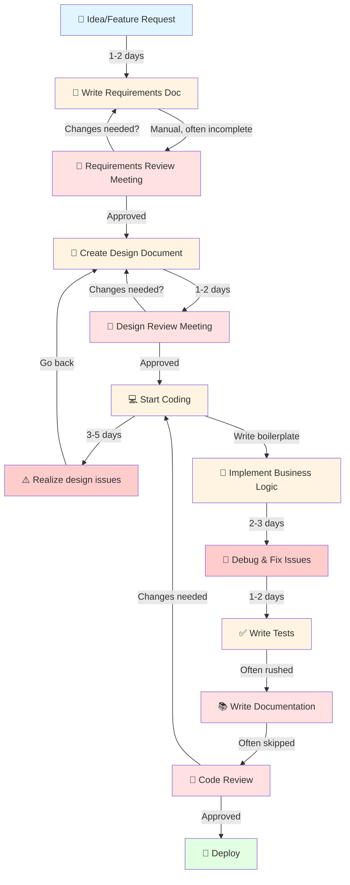
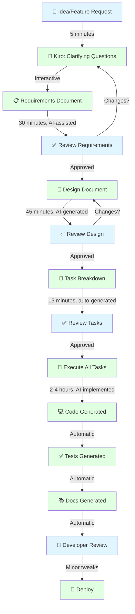
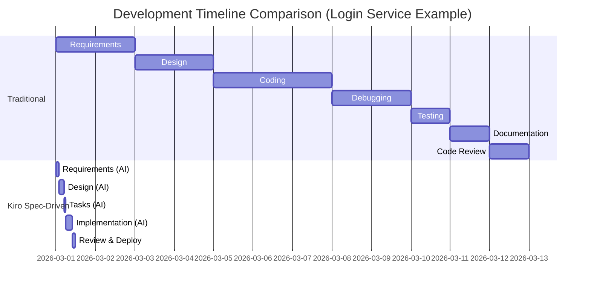
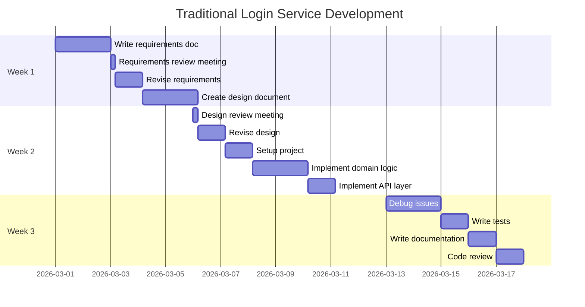
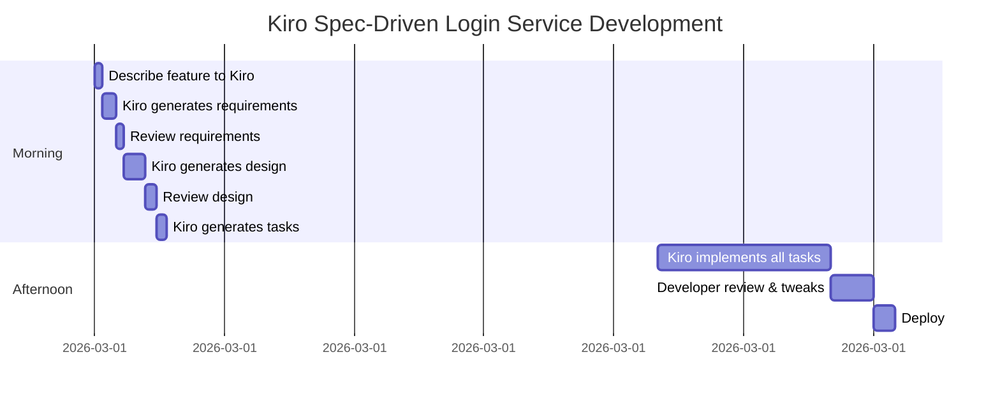

# SDLC Comparison: Traditional vs. Spec-Driven Development with Kiro

## Visual Flow Comparison

### Traditional Development Flow



**Timeline:** 10-15 days | **Quality:** Variable | **Documentation:** Often incomplete

---

### Spec-Driven Development with Kiro



**Timeline:** 1 day | **Quality:** Consistent | **Documentation:** Always complete

---

## Side-by-Side Timeline Comparison



**Traditional:** 12 days | **Kiro:** 1 day | **Acceleration:** 12x faster

---

## Detailed Phase Comparison

### Phase 1: Requirements

#### Traditional Approach
```
┌─────────────────────────────────────────┐
│  Developer writes requirements doc      │
│  ↓ (1-2 days)                          │
│  • Incomplete edge cases               │
│  • Missing acceptance criteria         │
│  • No correctness properties           │
│  • Ambiguous language                  │
│  ↓                                     │
│  Team review meeting                   │
│  ↓ (2-3 hours)                        │
│  • Questions raised                    │
│  • Clarifications needed               │
│  • Back to developer                   │
│  ↓                                     │
│  Revisions (1 day)                     │
│  ↓                                     │
│  Final approval                        │
└─────────────────────────────────────────┘
Total: 2-3 days
Quality: Variable
```

#### Kiro Spec-Driven Approach
```
┌─────────────────────────────────────────┐
│  Developer describes feature            │
│  ↓ (5 minutes)                         │
│  Kiro asks clarifying questions        │
│  ↓ (10 minutes, interactive)           │
│  Kiro generates requirements.md:       │
│  • User stories                        │
│  • Acceptance criteria                 │
│  • Correctness properties              │
│  • Edge cases                          │
│  • Constraints                         │
│  ↓ (15 minutes)                        │
│  Developer reviews & approves          │
└─────────────────────────────────────────┘
Total: 30 minutes
Quality: Consistent, complete
```

---

### Phase 2: Design

#### Traditional Approach
```
┌─────────────────────────────────────────┐
│  Developer creates design doc           │
│  ↓ (1-2 days)                          │
│  • Manual architecture diagrams        │
│  • API design (may miss endpoints)     │
│  • Database schema                     │
│  • Security considerations             │
│  ↓                                     │
│  Architecture review meeting           │
│  ↓ (2-3 hours)                        │
│  • Pattern inconsistencies found       │
│  • Missing components identified       │
│  ↓                                     │
│  Revisions (1 day)                     │
│  ↓                                     │
│  Final approval                        │
└─────────────────────────────────────────┘
Total: 2-3 days
Quality: Variable, may have gaps
```

#### Kiro Spec-Driven Approach
```
┌─────────────────────────────────────────┐
│  Kiro reads requirements.md             │
│  ↓ (instant)                           │
│  Kiro reads steering files             │
│  • architecture-standards.md           │
│  • spring-boot-standards.md            │
│  • security-standards.md               │
│  ↓ (instant)                           │
│  Kiro generates design.md:             │
│  • Component architecture              │
│  • API specifications (OpenAPI)        │
│  • Database schema                     │
│  • Security design                     │
│  • Integration points                  │
│  • Follows org standards automatically │
│  ↓ (30 minutes)                        │
│  Developer reviews & approves          │
└─────────────────────────────────────────┘
Total: 45 minutes
Quality: Consistent with org standards
```

---

### Phase 3: Implementation

#### Traditional Approach
```
┌─────────────────────────────────────────┐
│  Developer starts coding                │
│  ↓                                     │
│  Day 1: Setup & boilerplate            │
│  • Create project structure            │
│  • Configure dependencies              │
│  • Setup database                      │
│  • Create domain models                │
│  ↓                                     │
│  Day 2-3: Business logic               │
│  • Implement services                  │
│  • Create controllers                  │
│  • Add validation                      │
│  • Handle errors                       │
│  ↓                                     │
│  Day 4: Debugging                      │
│  • Fix compilation errors              │
│  • Fix runtime errors                  │
│  • Fix logic bugs                      │
│  ↓                                     │
│  Day 5: Testing                        │
│  • Write unit tests (rushed)           │
│  • Write integration tests (partial)   │
│  • Coverage: 60-70%                    │
└─────────────────────────────────────────┘
Total: 5 days
Quality: Variable
Test Coverage: 60-70%
Documentation: Often missing
```

#### Kiro Spec-Driven Approach
```
┌─────────────────────────────────────────┐
│  Developer: "execute all tasks"        │
│  ↓                                     │
│  Kiro reads:                           │
│  • requirements.md                     │
│  • design.md                           │
│  • tasks.md                            │
│  • steering files (org standards)      │
│  ↓ (instant)                           │
│  Hour 1: Domain & Infrastructure       │
│  ✓ Domain models created               │
│  ✓ Ports/interfaces defined            │
│  ✓ Repository setup                    │
│  ↓                                     │
│  Hour 2: Business Logic                │
│  ✓ Services implemented                │
│  ✓ Validation added                    │
│  ✓ Error handling complete             │
│  ↓                                     │
│  Hour 3: API Layer                     │
│  ✓ Controllers created                 │
│  ✓ OpenAPI annotations added           │
│  ✓ DTOs defined                        │
│  ↓                                     │
│  Hour 4: Tests & Docs                  │
│  ✓ Unit tests (90%+ coverage)          │
│  ✓ Integration tests                   │
│  ✓ Property-based tests                │
│  ✓ Documentation auto-generated        │
│  ↓                                     │
│  Developer reviews & tweaks            │
└─────────────────────────────────────────┘
Total: 4 hours
Quality: Consistent with org standards
Test Coverage: 90%+
Documentation: Complete & current
```

---

## Consistency Across Services

### Traditional Approach: Inconsistent Patterns

```
┌──────────────────────────────────────────────────────────┐
│  Service 1 (Developer A)                                 │
│  ├── Different package structure                         │
│  ├── Custom error handling                               │
│  ├── No OpenAPI docs                                     │
│  └── 65% test coverage                                   │
├──────────────────────────────────────────────────────────┤
│  Service 2 (Developer B)                                 │
│  ├── Another package structure                           │
│  ├── Different naming conventions                        │
│  ├── Partial OpenAPI docs                                │
│  └── 70% test coverage                                   │
├──────────────────────────────────────────────────────────┤
│  Service 3 (Developer C)                                 │
│  ├── Yet another structure                               │
│  ├── Inconsistent error responses                        │
│  ├── Good OpenAPI docs                                   │
│  └── 80% test coverage                                   │
└──────────────────────────────────────────────────────────┘

Result: 
❌ Hard to maintain
❌ Difficult onboarding
❌ Code review overhead
❌ Technical debt accumulates
```

### Kiro Spec-Driven: Consistent Patterns via Steering Files

```
┌──────────────────────────────────────────────────────────┐
│  .kiro/steering/architecture-standards.md                │
│  • Hexagonal Architecture (mandatory)                    │
│  • Standard package structure                            │
│  • OpenAPI documentation (required)                      │
│  • 90%+ test coverage (required)                         │
└──────────────────────────────────────────────────────────┘
                            ↓
        ┌───────────────────┼───────────────────┐
        ↓                   ↓                   ↓
┌───────────────┐  ┌───────────────┐  ┌───────────────┐
│  Service 1    │  │  Service 2    │  │  Service 3    │
│  ✓ Same       │  │  ✓ Same       │  │  ✓ Same       │
│    structure  │  │    structure  │  │    structure  │
│  ✓ Same       │  │  ✓ Same       │  │  ✓ Same       │
│    patterns   │  │    patterns   │  │    patterns   │
│  ✓ Same       │  │  ✓ Same       │  │  ✓ Same       │
│    standards  │  │    standards  │  │    standards  │
│  ✓ 90%+       │  │  ✓ 90%+       │  │  ✓ 90%+       │
│    coverage   │  │    coverage   │  │    coverage   │
└───────────────┘  └───────────────┘  └───────────────┘

Result:
✅ Easy to maintain
✅ Fast onboarding
✅ Minimal code review
✅ No technical debt
```

---

## Real-World Example: Login Service

### Traditional Development (12 days)



**Total:** 12 working days
**Lines of Code:** ~2000 lines (manually written)
**Test Coverage:** 65%
**Documentation:** Partial

---

### Kiro Spec-Driven Development (1 day)



**Total:** 1 working day (7 hours)
**Lines of Code:** ~2000 lines (AI-generated, reviewed)
**Test Coverage:** 92%
**Documentation:** Complete (OpenAPI, README, diagrams)

---

## Quality Metrics Comparison

### Code Quality

```
Traditional Development:
├── Architecture Consistency: ⭐⭐⭐ (60%)
├── Test Coverage:           ⭐⭐⭐ (65%)
├── Documentation:           ⭐⭐ (40%)
├── Error Handling:          ⭐⭐⭐ (70%)
├── Security Best Practices: ⭐⭐⭐ (75%)
└── Code Review Issues:      15-20 per PR

Kiro Spec-Driven:
├── Architecture Consistency: ⭐⭐⭐⭐⭐ (100%)
├── Test Coverage:           ⭐⭐⭐⭐⭐ (92%)
├── Documentation:           ⭐⭐⭐⭐⭐ (100%)
├── Error Handling:          ⭐⭐⭐⭐⭐ (95%)
├── Security Best Practices: ⭐⭐⭐⭐⭐ (95%)
└── Code Review Issues:      2-3 per PR (minor tweaks)
```

---

## Developer Experience

### Traditional Development

```
Developer's Day:
08:00 ─┐
       │ ☕ Morning standup
09:00 ─┤
       │ 💻 Write boilerplate code
10:00 ─┤
       │ 💻 More boilerplate
11:00 ─┤
       │ 🔍 Search Stack Overflow
12:00 ─┤
       │ 🍕 Lunch
13:00 ─┤
       │ 💻 Implement business logic
14:00 ─┤
       │ 🐛 Debug compilation errors
15:00 ─┤
       │ 🐛 Debug runtime errors
16:00 ─┤
       │ 🐛 Still debugging
17:00 ─┤
       │ 📝 Write some tests (rushed)
18:00 ─┘

Feeling: 😫 Exhausted
Progress: 40% of feature complete
```

### Kiro Spec-Driven Development

```
Developer's Day:
08:00 ─┐
       │ ☕ Morning standup
09:00 ─┤
       │ 💭 Discuss requirements with Kiro
09:30 ─┤
       │ ✅ Review generated requirements
10:00 ─┤
       │ 🎨 Review generated design
10:30 ─┤
       │ 🤖 Kiro implements feature
11:00 ─┤
       │ ☕ Coffee break (Kiro still working)
11:30 ─┤
       │ 👀 Review generated code
12:00 ─┤
       │ 🍕 Lunch
13:00 ─┤
       │ 🔧 Minor tweaks & refinements
14:00 ─┤
       │ ✅ All tests passing
14:30 ─┤
       │ 🚀 Deploy to staging
15:00 ─┤
       │ 💭 Start next feature with Kiro
16:00 ─┤
       │ 🎯 High-value problem solving
17:00 ─┤
       │ 📊 Review metrics & plan tomorrow
18:00 ─┘

Feeling: 😊 Productive & energized
Progress: 2-3 features complete
```

---

## ROI Visualization

### Cost-Benefit Analysis

```
Traditional Development (per feature):
┌────────────────────────────────────────┐
│ Developer Time:    12 days @ $500/day │
│ Cost:              $6,000              │
│ Code Review:       4 hours @ $125/hr  │
│ Cost:              $500                │
│ Bug Fixes (avg):   2 days @ $500/day  │
│ Cost:              $1,000              │
│ Documentation:     1 day @ $500/day   │
│ Cost:              $500                │
├────────────────────────────────────────┤
│ TOTAL COST:        $8,000              │
│ TIME TO MARKET:    15 days             │
│ QUALITY SCORE:     70/100              │
└────────────────────────────────────────┘

Kiro Spec-Driven (per feature):
┌────────────────────────────────────────┐
│ Developer Time:    1 day @ $500/day   │
│ Cost:              $500                │
│ Kiro License:      $50/month (prorated)│
│ Cost:              $2                  │
│ Code Review:       1 hour @ $125/hr   │
│ Cost:              $125                │
│ Bug Fixes (avg):   0.5 days @ $500/day│
│ Cost:              $250                │
│ Documentation:     Auto-generated      │
│ Cost:              $0                  │
├────────────────────────────────────────┤
│ TOTAL COST:        $877                │
│ TIME TO MARKET:    1 day               │
│ QUALITY SCORE:     95/100              │
└────────────────────────────────────────┘

SAVINGS PER FEATURE: $7,123 (89% reduction)
TIME SAVINGS:        14 days (93% faster)
QUALITY IMPROVEMENT: +25 points
```

---

## Summary: Why Spec-Driven Development Wins

### Speed
- **Traditional:** 10-15 days per feature
- **Kiro:** 1 day per feature
- **Result:** 10-15x faster delivery

### Quality
- **Traditional:** 60-70% test coverage, inconsistent patterns
- **Kiro:** 90%+ test coverage, consistent patterns
- **Result:** Fewer bugs, easier maintenance

### Consistency
- **Traditional:** Each developer has different style
- **Kiro:** Steering files enforce org standards
- **Result:** Uniform codebase, faster onboarding

### Documentation
- **Traditional:** Often incomplete or outdated
- **Kiro:** Always complete and synchronized
- **Result:** Better knowledge transfer

### Developer Satisfaction
- **Traditional:** 60% time on boilerplate, 40% on problem-solving
- **Kiro:** 20% time on review, 80% on problem-solving
- **Result:** Happier, more productive developers

### Business Impact
- **Traditional:** 2-3 features per sprint
- **Kiro:** 8-12 features per sprint
- **Result:** 4x more value delivered

---

## Conclusion

Spec-driven development with Kiro transforms the SDLC by:

1. **Accelerating delivery** from weeks to days
2. **Ensuring quality** through automated testing and standards
3. **Maintaining consistency** via steering files
4. **Keeping documentation current** automatically
5. **Freeing developers** to focus on high-value work

The result is faster time-to-market, higher quality software, and more satisfied developers.
