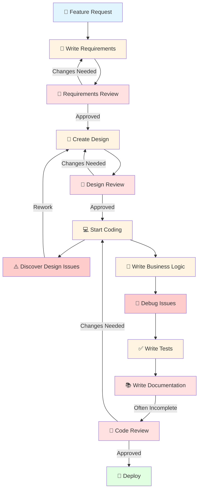
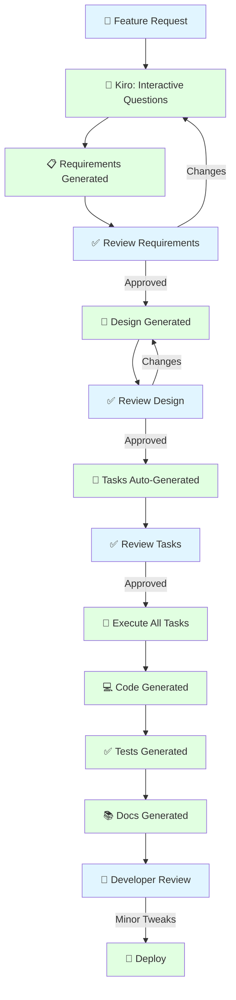
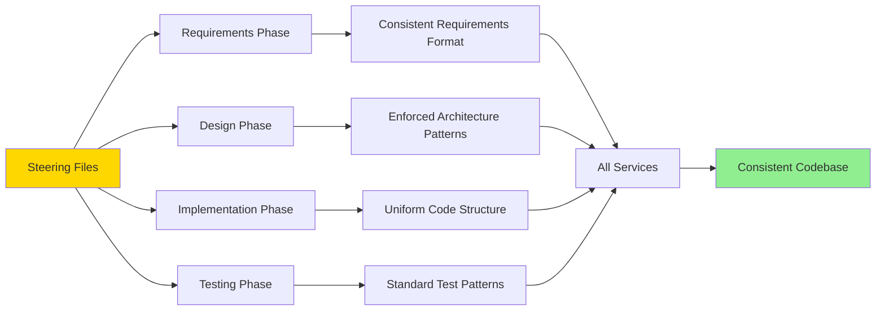

# SDLC Flow Comparison: Traditional vs. Spec-Driven Development

## Traditional Development Flow



**Characteristics:**
- Multiple review cycles and rework loops
- Design issues discovered during coding
- Documentation often incomplete or skipped
- Manual processes at each step
- Inconsistent patterns across developers

---

## Spec-Driven Development with Kiro



**Characteristics:**
- Streamlined process with minimal rework
- Design validated before implementation
- Documentation always complete and synchronized
- AI-assisted at each step
- Consistent patterns enforced via steering files

---

## Detailed Phase Comparison

### Phase 1: Requirements

#### Traditional Approach
```
┌─────────────────────────────────────────┐
│  Developer writes requirements doc      │
│  ↓                                     │
│  • Incomplete edge cases               │
│  • Missing acceptance criteria         │
│  • No correctness properties           │
│  • Ambiguous language                  │
│  ↓                                     │
│  Team review meeting                   │
│  ↓                                     │
│  • Questions raised                    │
│  • Clarifications needed               │
│  • Back to developer                   │
│  ↓                                     │
│  Revisions                             │
│  ↓                                     │
│  Final approval                        │
└─────────────────────────────────────────┘
Quality: Variable
Completeness: Often has gaps
```

#### Kiro Spec-Driven Approach
```
┌─────────────────────────────────────────┐
│  Developer describes feature            │
│  ↓                                     │
│  Kiro asks clarifying questions        │
│  ↓                                     │
│  Kiro generates requirements.md:       │
│  • User stories                        │
│  • Acceptance criteria                 │
│  • Correctness properties              │
│  • Edge cases                          │
│  • Constraints                         │
│  ↓                                     │
│  Developer reviews & approves          │
└─────────────────────────────────────────┘
Quality: Consistent
Completeness: Comprehensive
```

---

### Phase 2: Design

#### Traditional Approach
```
┌─────────────────────────────────────────┐
│  Developer creates design doc           │
│  ↓                                     │
│  • Manual architecture diagrams        │
│  • API design (may miss endpoints)     │
│  • Database schema                     │
│  • Security considerations             │
│  ↓                                     │
│  Architecture review meeting           │
│  ↓                                     │
│  • Pattern inconsistencies found       │
│  • Missing components identified       │
│  ↓                                     │
│  Revisions                             │
│  ↓                                     │
│  Final approval                        │
└─────────────────────────────────────────┘
Quality: Variable
Standards: Inconsistent across developers
```

#### Kiro Spec-Driven Approach
```
┌─────────────────────────────────────────┐
│  Kiro reads requirements.md             │
│  ↓                                     │
│  Kiro reads steering files:            │
│  • architecture-standards.md           │
│  • spring-boot-standards.md            │
│  • security-standards.md               │
│  ↓                                     │
│  Kiro generates design.md:             │
│  • Component architecture              │
│  • API specifications (OpenAPI)        │
│  • Database schema                     │
│  • Security design                     │
│  • Integration points                  │
│  • Follows org standards automatically │
│  ↓                                     │
│  Developer reviews & approves          │
└─────────────────────────────────────────┘
Quality: Consistent
Standards: Enforced automatically
```

---

### Phase 3: Implementation

#### Traditional Approach
```
┌─────────────────────────────────────────┐
│  Developer starts coding                │
│  ↓                                     │
│  Setup & boilerplate                   │
│  • Create project structure            │
│  • Configure dependencies              │
│  • Setup database                      │
│  • Create domain models                │
│  ↓                                     │
│  Business logic                        │
│  • Implement services                  │
│  • Create controllers                  │
│  • Add validation                      │
│  • Handle errors                       │
│  ↓                                     │
│  Debugging                             │
│  • Fix compilation errors              │
│  • Fix runtime errors                  │
│  • Fix logic bugs                      │
│  ↓                                     │
│  Testing                               │
│  • Write unit tests                    │
│  • Write integration tests             │
│  ↓                                     │
│  Documentation                         │
│  • Write README                        │
│  • Document APIs                       │
└─────────────────────────────────────────┘
Test Coverage: Variable (60-80%)
Documentation: Often incomplete
Consistency: Varies by developer
```

#### Kiro Spec-Driven Approach
```
┌─────────────────────────────────────────┐
│  Developer: "execute all tasks"        │
│  ↓                                     │
│  Kiro reads:                           │
│  • requirements.md                     │
│  • design.md                           │
│  • tasks.md                            │
│  • steering files (org standards)      │
│  ↓                                     │
│  Domain & Infrastructure               │
│  ✓ Domain models created               │
│  ✓ Ports/interfaces defined            │
│  ✓ Repository setup                    │
│  ↓                                     │
│  Business Logic                        │
│  ✓ Services implemented                │
│  ✓ Validation added                    │
│  ✓ Error handling complete             │
│  ↓                                     │
│  API Layer                             │
│  ✓ Controllers created                 │
│  ✓ OpenAPI annotations added           │
│  ✓ DTOs defined                        │
│  ↓                                     │
│  Tests & Docs                          │
│  ✓ Unit tests                          │
│  ✓ Integration tests                   │
│  ✓ Property-based tests                │
│  ✓ Documentation auto-generated        │
│  ↓                                     │
│  Developer reviews & tweaks            │
└─────────────────────────────────────────┘
Test Coverage: Consistent (90%+)
Documentation: Complete & current
Consistency: Enforced by steering files
```

---

## Consistency Across Services

### Traditional Approach: Inconsistent Patterns

```
┌──────────────────────────────────────────────────────────┐
│  Service 1 (Developer A)                                 │
│  ├── Different package structure                         │
│  ├── Custom error handling                               │
│  ├── No OpenAPI docs                                     │
│  └── Variable test coverage                              │
├──────────────────────────────────────────────────────────┤
│  Service 2 (Developer B)                                 │
│  ├── Another package structure                           │
│  ├── Different naming conventions                        │
│  ├── Partial OpenAPI docs                                │
│  └── Different test patterns                             │
├──────────────────────────────────────────────────────────┤
│  Service 3 (Developer C)                                 │
│  ├── Yet another structure                               │
│  ├── Inconsistent error responses                        │
│  ├── Good OpenAPI docs                                   │
│  └── Different coding style                              │
└──────────────────────────────────────────────────────────┘

Result: 
❌ Hard to maintain
❌ Difficult onboarding
❌ Code review overhead
❌ Technical debt accumulates
```

### Kiro Spec-Driven: Consistent Patterns via Steering Files

```
┌──────────────────────────────────────────────────────────┐
│  .kiro/steering/architecture-standards.md                │
│  • Hexagonal Architecture (mandatory)                    │
│  • Standard package structure                            │
│  • OpenAPI documentation (required)                      │
│  • Consistent test patterns                              │
└──────────────────────────────────────────────────────────┘
                            ↓
        ┌───────────────────┼───────────────────┐
        ↓                   ↓                   ↓
┌───────────────┐  ┌───────────────┐  ┌───────────────┐
│  Service 1    │  │  Service 2    │  │  Service 3    │
│  ✓ Same       │  │  ✓ Same       │  │  ✓ Same       │
│    structure  │  │    structure  │  │    structure  │
│  ✓ Same       │  │  ✓ Same       │  │  ✓ Same       │
│    patterns   │  │    patterns   │  │    patterns   │
│  ✓ Same       │  │  ✓ Same       │  │  ✓ Same       │
│    standards  │  │    standards  │  │    standards  │
│  ✓ Consistent │  │  ✓ Consistent │  │  ✓ Consistent │
│    quality    │  │    quality    │  │    quality    │
└───────────────┘  └───────────────┘  └───────────────┘

Result:
✅ Easy to maintain
✅ Fast onboarding
✅ Minimal code review
✅ No technical debt
```

---

## Key Differences Summary

### Traditional Development
```
Feature Request
    ↓
Manual Requirements (with gaps)
    ↓
Manual Design (inconsistent)
    ↓
Manual Coding (boilerplate + logic)
    ↓
Manual Testing (often rushed)
    ↓
Manual Documentation (often skipped)
    ↓
Code Review (many issues)
    ↓
Deploy
```

**Pain Points:**
- Multiple rework cycles
- Inconsistent patterns
- Incomplete documentation
- Variable quality
- High manual effort

---

### Spec-Driven with Kiro
```
Feature Request
    ↓
AI-Assisted Requirements (complete)
    ↓
AI-Generated Design (follows standards)
    ↓
Auto-Generated Tasks (traceable)
    ↓
AI-Implemented Code (consistent patterns)
    ↓
Auto-Generated Tests (high coverage)
    ↓
Auto-Generated Docs (always current)
    ↓
Developer Review (minor tweaks)
    ↓
Deploy
```

**Advantages:**
- Minimal rework
- Consistent patterns (steering files)
- Complete documentation
- High quality
- Low manual effort

---

## The Role of Steering Files



**Steering files ensure:**
- Same architecture across all services
- Consistent naming conventions
- Uniform error handling
- Standard API patterns
- Identical test approaches

---

## Workflow Comparison

### Traditional: Sequential with Rework Loops

```
Requirements ──→ Design ──→ Code ──→ Test ──→ Docs ──→ Review ──→ Deploy
     ↑            ↑         ↑        ↑       ↑
     └────────────┴─────────┴────────┴───────┘
              (Multiple rework cycles)
```

### Kiro: Streamlined with Validation Gates

```
Requirements ──→ Design ──→ Tasks ──→ Implementation ──→ Review ──→ Deploy
     ↓            ↓         ↓              ↓
  (Validate)   (Validate) (Validate)   (All artifacts
                                        generated together)
```

---

## Quality Comparison

### Traditional Development
```
Architecture Consistency: ⭐⭐⭐ (Variable)
Test Coverage:           ⭐⭐⭐ (60-80%)
Documentation:           ⭐⭐ (Often incomplete)
Error Handling:          ⭐⭐⭐ (Inconsistent)
Security Best Practices: ⭐⭐⭐ (Variable)
Code Review Issues:      Many (15-20 per PR)
```

### Kiro Spec-Driven
```
Architecture Consistency: ⭐⭐⭐⭐⭐ (Enforced)
Test Coverage:           ⭐⭐⭐⭐⭐ (90%+)
Documentation:           ⭐⭐⭐⭐⭐ (Complete)
Error Handling:          ⭐⭐⭐⭐⭐ (Consistent)
Security Best Practices: ⭐⭐⭐⭐⭐ (Enforced)
Code Review Issues:      Few (2-3 per PR)
```

---

## Conclusion

### Traditional Development
- Manual processes at each step
- Multiple rework cycles
- Inconsistent patterns
- Variable quality
- Documentation often incomplete

### Spec-Driven with Kiro
- AI-assisted at each step
- Validation gates prevent rework
- Consistent patterns via steering files
- High quality enforced
- Documentation always complete

**The Result:** Faster delivery, higher quality, and consistent codebase across all services.
