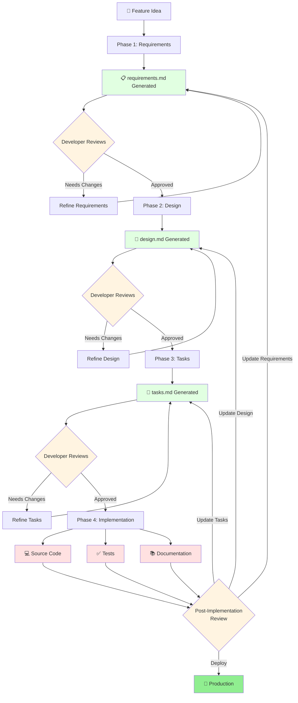
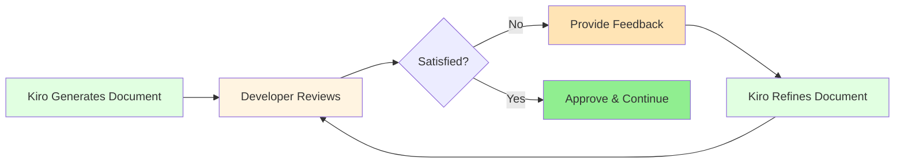
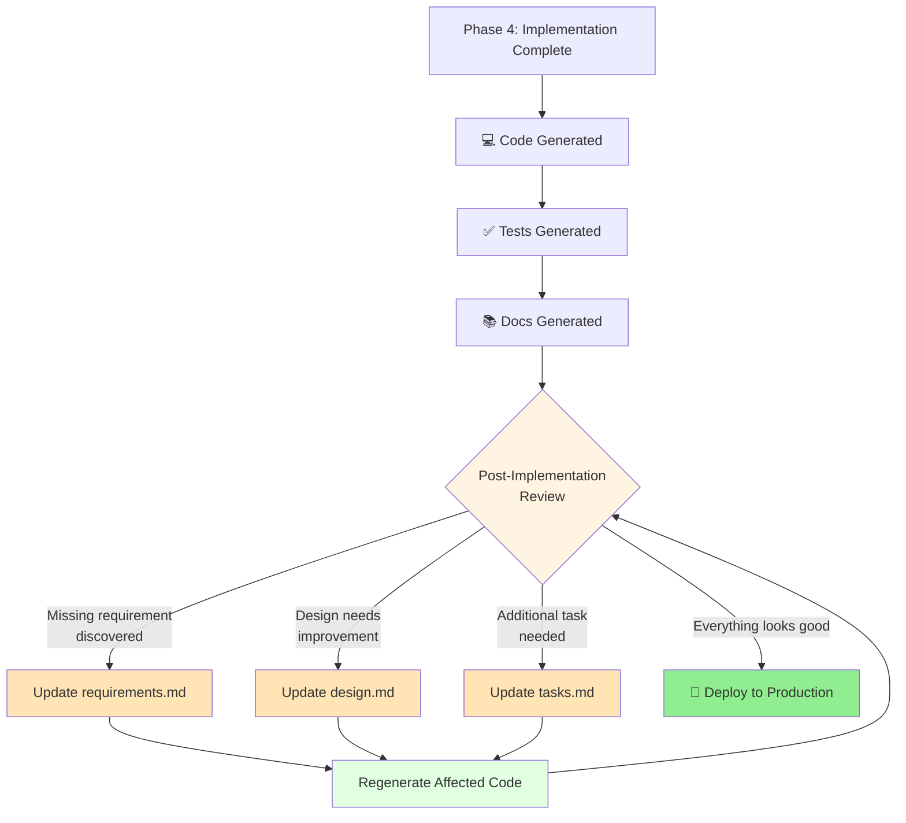
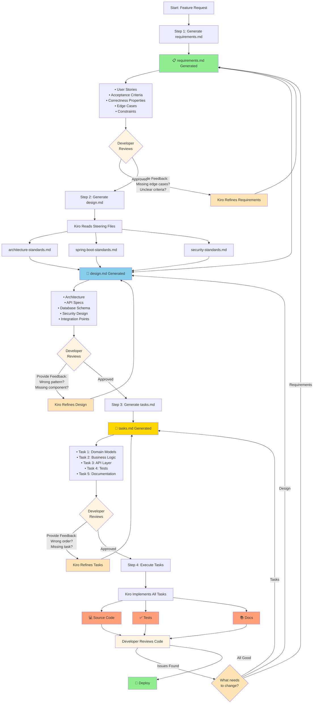
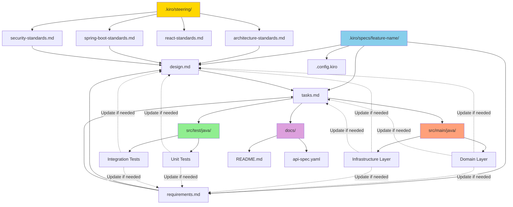

# Spec-Driven Development Workflow with File Structure

**Scope:** This document covers the Feature Spec workflow using the Requirements-First approach. For bugfix specs, Kiro uses a different workflow with bug condition methodology and `bugfix.md` instead of `requirements.md`.

## Complete Workflow Diagram



---

## Review and Refinement Process

### How Reviews Work

At each phase (Requirements, Design, Tasks), the developer has the opportunity to review and refine the generated documents before moving forward.

**IMPORTANT:** Even after Phase 4 (Implementation) is complete, you can still go back to any earlier phase to make updates. The workflow is flexible and iterative.



### What to Review at Each Phase

#### Phase 1: Requirements Review

**Questions to ask:**
- Are all user stories clear and complete?
- Do acceptance criteria cover all scenarios?
- Are edge cases identified?
- Are correctness properties testable?
- Are constraints realistic?

**Common feedback:**
- "Add edge case for empty input"
- "Clarify acceptance criteria for error handling"
- "Missing user story for admin users"
- "Add performance constraint"

**How to refine:**
```
Developer: "Add an edge case for when the user enters 
           an invalid email format"

Kiro: Updates requirements.md with new edge case

Developer: Reviews updated document → Approves
```

---

#### Phase 2: Design Review

**Questions to ask:**
- Does the architecture follow our standards?
- Are all API endpoints defined?
- Is the database schema normalized?
- Are security measures adequate?
- Are integration points clear?

**Common feedback:**
- "Use Hexagonal Architecture instead"
- "Add endpoint for bulk operations"
- "Missing index on user_id column"
- "Add rate limiting to API"

**How to refine:**
```
Developer: "Add an endpoint for GET /api/v1/users/{id}/profile"

Kiro: Updates design.md with new endpoint specification

Developer: Reviews updated document → Approves
```

---

#### Phase 3: Tasks Review

**Questions to ask:**
- Are tasks in the right order?
- Is any task missing?
- Are tasks too granular or too broad?
- Are dependencies between tasks clear?
- Can tasks be executed independently?

**Common feedback:**
- "Add task for database migration"
- "Split task 3 into two separate tasks"
- "Task 2 should come before task 1"
- "Add task for error logging"

**How to refine:**
```
Developer: "Add a task for creating database migration scripts 
           before implementing the repository"

Kiro: Updates tasks.md with new task in correct order

Developer: Reviews updated document → Approves
```

---

### Refinement Loop Example

```
┌─────────────────────────────────────────────────────────────┐
│ Iteration 1                                                 │
├─────────────────────────────────────────────────────────────┤
│ Kiro generates requirements.md                              │
│   • 3 user stories                                          │
│   • 5 acceptance criteria                                   │
│   • 2 edge cases                                            │
│                                                             │
│ Developer reviews:                                          │
│   ❌ "Missing edge case for concurrent logins"             │
│   ❌ "Add user story for password reset"                   │
└─────────────────────────────────────────────────────────────┘
                        ↓
┌─────────────────────────────────────────────────────────────┐
│ Iteration 2                                                 │
├─────────────────────────────────────────────────────────────┤
│ Kiro updates requirements.md                                │
│   • 4 user stories (added password reset)                   │
│   • 5 acceptance criteria                                   │
│   • 3 edge cases (added concurrent logins)                  │
│                                                             │
│ Developer reviews:                                          │
│   ✅ "Looks good!"                                          │
│   ✅ Approved - Move to design phase                        │
└─────────────────────────────────────────────────────────────┘
```

---

### Benefits of Review & Refinement

1. **Catch Issues Early**
   - Fix problems in requirements before they become code bugs
   - Validate design before implementation starts
   - Ensure tasks are complete before execution

2. **Maintain Quality**
   - Developer expertise guides the AI
   - Business knowledge is incorporated
   - Edge cases are not missed

3. **Build Confidence**
   - Developer understands what will be built
   - Stakeholders can review and approve
   - Team alignment before coding begins

4. **Reduce Rework**
   - Changes in requirements phase are quick
   - Changes in design phase are manageable
   - Changes in code phase are expensive (avoided!)

---

### Review Checklist

#### Requirements Review Checklist
- [ ] All user stories follow "As a... I want... So that..." format
- [ ] Acceptance criteria are specific and testable
- [ ] Edge cases cover error scenarios
- [ ] Correctness properties are clearly defined
- [ ] Constraints are realistic and measurable
- [ ] Dependencies on other services are identified

#### Design Review Checklist
- [ ] Architecture follows organizational standards
- [ ] All API endpoints are documented
- [ ] Database schema is normalized
- [ ] Security measures are adequate
- [ ] Error handling is comprehensive
- [ ] Integration points are clearly defined
- [ ] Performance considerations are addressed

#### Tasks Review Checklist
- [ ] Tasks are in logical order
- [ ] Dependencies between tasks are clear
- [ ] Each task is independently testable
- [ ] No tasks are missing
- [ ] Tasks are appropriately sized
- [ ] Sub-tasks are clearly defined

---

## Post-Implementation Feedback Loops

### You Can Always Go Back

After Phase 4 (Implementation) completes and code is generated, you might discover:
- Missing requirements during testing
- Design improvements needed
- Additional tasks required
- Edge cases not covered

**The workflow is flexible** - you can go back to any phase and update the spec files, then regenerate the affected code.



### Common Post-Implementation Scenarios

#### Scenario 1: Missing Requirement Discovered

```
Developer: "After testing, I realized we need to handle 
           the case where a user tries to login with 
           an expired account"

Action: Ask Kiro to update requirements.md
  ↓
Kiro reads relevant section and adds new edge case (targeted edit)
  ↓
Ask Kiro to update design.md (add account expiration check)
  ↓
Kiro reads new requirement and updates design (targeted edit)
  ↓
Ask Kiro to update tasks.md (add task for expiration validation)
  ↓
Kiro appends new tasks (targeted edit)
  ↓
Execute new tasks → Kiro generates only affected code
  ↓
Review and deploy

Credit Usage: ~1,500-2,000 tokens (vs 8,000+ for full regeneration)
```

#### Scenario 2: Design Improvement Needed

```
Developer: "The current design uses synchronous calls 
           to the authentication service. We should 
           make it asynchronous for better performance"

Action: Update design.md
  ↓
Kiro updates architecture to use async/await pattern
  ↓
Update tasks.md (modify implementation tasks)
  ↓
Regenerate affected code
  ↓
Review and deploy
```

#### Scenario 3: Additional Task Required

```
Developer: "We need to add database migration scripts 
           before deploying to production"

Action: Update tasks.md
  ↓
Kiro adds new task: "Create Flyway migration scripts"
  ↓
Execute new task
  ↓
Review and deploy
```

#### Scenario 4: Security Concern Found

```
Developer: "Code review revealed we're not rate-limiting 
           login attempts. This is a security risk"

Action: Update requirements.md (add security requirement)
  ↓
Update design.md (add rate limiting design)
  ↓
Update tasks.md (add rate limiting implementation task)
  ↓
Regenerate affected code
  ↓
Review and deploy
```

### How to Update After Implementation

**Important:** You don't manually edit the spec files. Kiro assists with targeted updates to minimize credit usage.

**Step 1: Identify What Needs to Change**
- Is it a missing requirement? → Ask Kiro to update requirements.md
- Is it a design issue? → Ask Kiro to update design.md
- Is it a missing task? → Ask Kiro to update tasks.md

**Step 2: Update the Spec File (Kiro-Assisted)**
```
Developer: "Add an edge case to requirements.md for expired accounts"

Kiro: 
  - Reads only the relevant section of requirements.md
  - Adds the new edge case using targeted edit
  - Credits used: ~100-200 tokens (not the entire file)
```

**Step 3: Propagate Changes (Kiro-Assisted)**
```
Developer: "Update design.md to handle expired accounts"

Kiro: 
  - Reads the new requirement (just added)
  - Reads only relevant sections of design.md
  - Adds expiration check logic using targeted edit
  - Credits used: ~200-300 tokens
```

**Step 4: Update Tasks (Kiro-Assisted)**
```
Developer: "Add tasks for expired account handling"

Kiro: 
  - Reads the new design section
  - Appends new tasks to tasks.md
  - Credits used: ~100-200 tokens
```

**Step 5: Regenerate Code (Incremental)**
```
Developer: "Execute the new tasks"

Kiro: 
  - Implements only the new tasks
  - Generates only affected code
  - Credits used: ~500-1500 tokens (depending on complexity)
```

**Step 6: Review and Deploy**
```
Developer: Reviews changes → Approves → Deploys
```

**Credit Efficiency:** Kiro uses targeted reads and edits, so you only pay for what changes, not for regenerating everything. Adding a new feature typically uses 80% fewer credits than regenerating from scratch.

### Benefits of Post-Implementation Updates

1. **Flexibility**
   - Not locked into initial decisions
   - Can adapt to new information
   - Iterative improvement

2. **Traceability**
   - All changes documented in spec files
   - Code always matches specs
   - Clear audit trail

3. **Consistency**
   - Specs stay synchronized with code
   - No "code drift" from documentation
   - Single source of truth

4. **Efficiency**
   - Only regenerate affected code
   - No need to rewrite everything
   - Targeted updates

### Post-Implementation Workflow Diagram

```
┌─────────────────────────────────────────────────────────────┐
│ Phase 4 Complete: Code, Tests, Docs Generated              │
└─────────────────────────────────────────────────────────────┘
                        ↓
┌─────────────────────────────────────────────────────────────┐
│ Developer Testing & Review                                  │
├─────────────────────────────────────────────────────────────┤
│ • Run tests                                                 │
│ • Code review                                               │
│ • Security review                                           │
│ • Performance testing                                       │
└─────────────────────────────────────────────────────────────┘
                        ↓
                   ┌────┴────┐
                   │ Issue?  │
                   └────┬────┘
                        │
        ┌───────────────┼───────────────┐
        │               │               │
        ↓               ↓               ↓
┌──────────────┐ ┌──────────────┐ ┌──────────────┐
│ Requirements │ │   Design     │ │    Tasks     │
│    Issue     │ │    Issue     │ │    Issue     │
└──────┬───────┘ └──────┬───────┘ └──────┬───────┘
       │                │                │
       ↓                ↓                ↓
┌──────────────┐ ┌──────────────┐ ┌──────────────┐
│   Update     │ │   Update     │ │   Update     │
│requirements  │ │  design.md   │ │  tasks.md    │
│    .md       │ │              │ │              │
└──────┬───────┘ └──────┬───────┘ └──────┬───────┘
       │                │                │
       └────────────────┼────────────────┘
                        ↓
                ┌───────────────┐
                │  Propagate    │
                │   Changes     │
                └───────┬───────┘
                        ↓
                ┌───────────────┐
                │  Regenerate   │
                │  Affected     │
                │     Code      │
                └───────┬───────┘
                        ↓
                ┌───────────────┐
                │    Review     │
                │   Changes     │
                └───────┬───────┘
                        ↓
                ┌───────────────┐
                │   Deploy to   │
                │  Production   │
                └───────────────┘
```

### Real Example: Adding Rate Limiting After Implementation

**Initial Implementation:**
- Login service deployed to production
- All tasks completed
- Code working as expected

**Issue Discovered:**
- Security team identifies missing rate limiting
- Brute force attacks are possible

**Update Process:**

**1. Update requirements.md**
```markdown
## Security Requirements (ADDED)

### Rate Limiting
- As a security admin, I want login attempts to be rate-limited 
  so that brute force attacks are prevented

### Acceptance Criteria
- [ ] Maximum 5 login attempts per IP address per minute
- [ ] Return 429 Too Many Requests when limit exceeded
- [ ] Rate limit resets after 1 minute
```

**2. Update design.md**
```markdown
## Security Design (UPDATED)

### Rate Limiting Implementation
- Use Redis for distributed rate limiting
- Key: `rate_limit:login:{ip_address}`
- TTL: 60 seconds
- Max attempts: 5

### API Response
- Status: 429 Too Many Requests
- Header: Retry-After: 60
- Body: { "error": "Too many login attempts. Try again in 60 seconds" }
```

**3. Update tasks.md**
```markdown
- [ ] 7. Add Rate Limiting (NEW)
  - [ ] 7.1 Add Redis dependency to pom.xml
  - [ ] 7.2 Configure Redis connection
  - [ ] 7.3 Create RateLimitService
  - [ ] 7.4 Add rate limiting to LoginController
  - [ ] 7.5 Write tests for rate limiting
```

**4. Execute New Tasks**
```
Developer: "Execute tasks 7.1 through 7.5"

Kiro: Implements rate limiting
  ↓
Generates:
  • Updated pom.xml
  • RedisConfig.java
  • RateLimitService.java
  • Updated LoginController.java
  • RateLimitServiceTest.java
```

**5. Review and Deploy**
```
Developer: Reviews changes → Tests → Approves → Deploys
```

**Result:**
- Spec files updated and synchronized
- Code implements new security requirement
- All changes documented and traceable
- Production system now protected against brute force attacks

---

## File Structure Overview

```
project-root/
├── .kiro/
│   ├── steering/                          # Organization Standards
│   │   ├── architecture-standards.md      # Hexagonal Architecture rules
│   │   ├── spring-boot-standards.md       # Spring Boot conventions
│   │   ├── react-standards.md             # React/Frontend conventions
│   │   └── security-standards.md          # Security requirements
│   │
│   └── specs/                             # Feature Specifications
│       ├── .config.kiro                   # Workflow configuration
│       ├── requirements.md                # What to build
│       ├── design.md                      # How to build it
│       └── tasks.md                       # Step-by-step plan
│
└── src/                                   # Generated Code
    ├── main/
    │   └── java/
    └── test/
        └── java/
```

**Note:** For projects with multiple features, you can organize specs into subdirectories:
```
.kiro/specs/
├── feature-1/
│   ├── .config.kiro
│   ├── requirements.md
│   ├── design.md
│   └── tasks.md
└── feature-2/
    ├── .config.kiro
    ├── requirements.md
    ├── design.md
    └── tasks.md
```

---

## Detailed Workflow: Requirements-First (Default)



---

## File Contents Breakdown

### 1. requirements.md

```
.kiro/specs/requirements.md
```

**Purpose:** Define WHAT to build

**Generated by:** Kiro (AI-assisted)

**Contains:**
```markdown
# Feature: {Feature Name}

## Overview
Brief description of the feature

## User Stories
- As a [user type], I want [goal] so that [benefit]
- As a [user type], I want [goal] so that [benefit]

## Acceptance Criteria
- [ ] Criterion 1
- [ ] Criterion 2
- [ ] Criterion 3

## Correctness Properties
1. Property 1: [What must always be true]
2. Property 2: [What must never happen]
3. Property 3: [Invariant that must hold]

## Edge Cases
- Edge case 1: [Description and expected behavior]
- Edge case 2: [Description and expected behavior]

## Constraints
- Technical constraints
- Business constraints
- Performance requirements

## Dependencies
- Service A
- Library B
```

**Example from your project:**
```
.kiro/specs/login-service/requirements.md
```

---

### 2. design.md

```
.kiro/specs/design.md
```

**Purpose:** Define HOW to build it

**Generated by:** Kiro (reads requirements.md + steering files)

**Contains:**
```markdown
# Design: {Feature Name}

## Architecture Overview
High-level architecture diagram and description

## Component Design

### Domain Layer
- Models: [List of domain entities]
- Ports: [List of interfaces/use cases]
- Services: [List of domain services]

### Infrastructure Layer
- Adapters In: [REST controllers]
- Adapters Out: [External integrations]
- Configuration: [Spring configs]

## API Specifications

### Endpoints
- POST /api/v1/resource
  - Request: [Schema]
  - Response: [Schema]
  - Status Codes: [200, 400, 401, 500]

### OpenAPI/Swagger
[Link to api-spec.yaml]

## Database Design

### Tables
- table_name
  - column1: type
  - column2: type

### Relationships
[ER diagram or description]

## Security Design
- Authentication: [Method]
- Authorization: [Method]
- Data Protection: [Encryption, validation]

## Integration Points
- Service A: [How to integrate]
- Service B: [How to integrate]

## Error Handling
- Error codes
- Error messages
- Exception hierarchy

## Testing Strategy
- Unit tests: [What to test]
- Integration tests: [What to test]
- Property-based tests: [What properties]
```

**Example from your project:**
```
.kiro/specs/login-service/design.md
```

---

### 3. tasks.md

```
.kiro/specs/tasks.md
```

**Purpose:** Step-by-step implementation plan

**Generated by:** Kiro (reads requirements.md + design.md)

**Contains:**
```markdown
# Implementation Tasks: {Feature Name}

## Task List

- [ ] 1. Create Domain Models
  - [ ] 1.1 Create User entity
  - [ ] 1.2 Create LoginRequest DTO
  - [ ] 1.3 Create LoginResponse DTO

- [ ] 2. Implement Business Logic
  - [ ] 2.1 Create LoginUseCase interface
  - [ ] 2.2 Implement LoginDomainService
  - [ ] 2.3 Add validation logic

- [ ] 3. Create API Layer
  - [ ] 3.1 Create LoginController
  - [ ] 3.2 Add OpenAPI annotations
  - [ ] 3.3 Implement request/response mapping

- [ ] 4. Add Error Handling
  - [ ] 4.1 Create custom exceptions
  - [ ] 4.2 Implement GlobalExceptionHandler
  - [ ] 4.3 Add error response DTOs

- [ ] 5. Write Tests
  - [ ] 5.1 Unit tests for domain service
  - [ ] 5.2 Integration tests for controller
  - [ ] 5.3 Property-based tests for validation

- [ ] 6. Documentation
  - [ ] 6.1 Update README.md
  - [ ] 6.2 Generate OpenAPI docs
  - [ ] 6.3 Add code comments

## Task Status Legend
- [ ] Not started
- [~] Queued
- [-] In progress
- [x] Completed
```

**Example from your project:**
```
.kiro/specs/login-service/tasks.md
```

---

### 4. Steering Files

#### architecture-standards.md

```
.kiro/steering/architecture-standards.md
```

**Purpose:** Enforce consistent architecture across all services

**Contains:**
```markdown
# Architecture Standards

## Mandatory Patterns
- All services MUST use Hexagonal Architecture
- Domain logic MUST be isolated from infrastructure
- All services MUST expose OpenAPI documentation

## Package Structure
```
com.banking.{service}/
  ├── domain/
  │   ├── model/
  │   ├── ports/
  │   └── service/
  └── infrastructure/
      ├── adapters/
      ├── config/
      └── security/
```

## Naming Conventions
- Services: {feature}-service
- Controllers: {Feature}Controller
- Use cases: {Action}UseCase
```

#### spring-boot-standards.md

```
.kiro/steering/spring-boot-standards.md
```

**Purpose:** Spring Boot specific conventions

**Contains:**
```markdown
# Spring Boot Standards

## Dependencies
- Use Spring Boot 3.x
- Use Java 17+
- Include spring-boot-starter-validation

## REST API Standards
- Base path: /api/v1/{resource}
- Use proper HTTP methods
- Return proper status codes
- Use @Valid for validation

## Configuration
- Use YAML for application.yml
- Externalize all configuration
- Use profiles: dev, test, prod
```

---

## Workflow Visualization with Files

### Default Workflow (Requirements → Design → Tasks → Implementation)

```
┌─────────────────────────────────────────────────────────────┐
│ Phase 1: Requirements                                       │
├─────────────────────────────────────────────────────────────┤
│                                                             │
│  Developer describes feature                                │
│           ↓                                                 │
│  Kiro asks clarifying questions                            │
│           ↓                                                 │
│  📋 requirements.md GENERATED                               │
│     • User stories                                          │
│     • Acceptance criteria                                   │
│     • Correctness properties                                │
│     • Edge cases                                            │
│           ↓                                                 │
│  👤 DEVELOPER REVIEWS                                       │
│     ├─ Missing edge cases? → Provide feedback              │
│     ├─ Unclear criteria? → Request clarification           │
│     ├─ Wrong scope? → Suggest changes                      │
│     └─ Looks good? → Approve                               │
│           ↓                                                 │
│  🔄 REFINEMENT LOOP (if needed)                            │
│     Developer provides feedback                             │
│           ↓                                                 │
│     Kiro updates requirements.md                            │
│           ↓                                                 │
│     Developer reviews again                                 │
│           ↓                                                 │
│  ✅ APPROVED - Move to next phase                          │
└─────────────────────────────────────────────────────────────┘
                        ↓
┌─────────────────────────────────────────────────────────────┐
│ Phase 2: Design                                             │
├─────────────────────────────────────────────────────────────┤
│                                                             │
│  Kiro reads:                                                │
│    • requirements.md (approved)                             │
│    • .kiro/steering/architecture-standards.md              │
│    • .kiro/steering/spring-boot-standards.md               │
│    • .kiro/steering/security-standards.md                  │
│           ↓                                                 │
│  🎨 design.md GENERATED                                     │
│     • Architecture (follows steering files)                 │
│     • API specs                                             │
│     • Database schema                                       │
│     • Security design                                       │
│           ↓                                                 │
│  👤 DEVELOPER REVIEWS                                       │
│     ├─ Wrong architecture pattern? → Provide feedback      │
│     ├─ Missing API endpoint? → Request addition            │
│     ├─ Security concerns? → Suggest improvements           │
│     └─ Looks good? → Approve                               │
│           ↓                                                 │
│  🔄 REFINEMENT LOOP (if needed)                            │
│     Developer provides feedback                             │
│           ↓                                                 │
│     Kiro updates design.md                                  │
│           ↓                                                 │
│     Developer reviews again                                 │
│           ↓                                                 │
│  ✅ APPROVED - Move to next phase                          │
└─────────────────────────────────────────────────────────────┘
                        ↓
┌─────────────────────────────────────────────────────────────┐
│ Phase 3: Tasks                                              │
├─────────────────────────────────────────────────────────────┤
│                                                             │
│  Kiro reads:                                                │
│    • requirements.md (approved)                             │
│    • design.md (approved)                                   │
│           ↓                                                 │
│  📝 tasks.md GENERATED                                      │
│     • Task 1: Domain models                                 │
│     • Task 2: Business logic                                │
│     • Task 3: API layer                                     │
│     • Task 4: Tests                                         │
│     • Task 5: Documentation                                 │
│           ↓                                                 │
│  👤 DEVELOPER REVIEWS                                       │
│     ├─ Wrong task order? → Provide feedback                │
│     ├─ Missing task? → Request addition                    │
│     ├─ Too granular/broad? → Suggest changes               │
│     └─ Looks good? → Approve                               │
│           ↓                                                 │
│  🔄 REFINEMENT LOOP (if needed)                            │
│     Developer provides feedback                             │
│           ↓                                                 │
│     Kiro updates tasks.md                                   │
│           ↓                                                 │
│     Developer reviews again                                 │
│           ↓                                                 │
│  ✅ APPROVED - Move to implementation                      │
└─────────────────────────────────────────────────────────────┘
                        ↓
┌─────────────────────────────────────────────────────────────┐
│ Phase 4: Implementation                                     │
├─────────────────────────────────────────────────────────────┤
│                                                             │
│  Developer: "execute all tasks"                             │
│           ↓                                                 │
│  Kiro reads:                                                │
│    • requirements.md (approved)                             │
│    • design.md (approved)                                   │
│    • tasks.md (approved)                                    │
│    • All steering files                                     │
│           ↓                                                 │
│  💻 SOURCE CODE GENERATED                                   │
│     src/main/java/com/banking/{service}/                   │
│       ├── domain/                                           │
│       │   ├── model/                                        │
│       │   ├── ports/                                        │
│       │   └── service/                                      │
│       └── infrastructure/                                   │
│           ├── adapters/                                     │
│           ├── config/                                       │
│           └── security/                                     │
│           ↓                                                 │
│  ✅ TESTS GENERATED                                         │
│     src/test/java/com/banking/{service}/                   │
│       ├── domain/service/                                   │
│       └── infrastructure/adapters/                          │
│           ↓                                                 │
│  📚 DOCUMENTATION GENERATED                                 │
│     • README.md                                             │
│     • docs/api-spec.yaml                                    │
│     • Inline code comments                                  │
│           ↓                                                 │
│  👤 DEVELOPER REVIEWS & TWEAKS                              │
│     ├─ Review generated code                                │
│     ├─ Run tests                                            │
│     ├─ Make minor adjustments if needed                     │
│     └─ Approve for deployment                               │
│           ↓                                                 │
│  🔄 POST-IMPLEMENTATION FEEDBACK (Optional)                 │
│     ├─ Issue found? → Update requirements.md               │
│     ├─ Design problem? → Update design.md                  │
│     ├─ Missing task? → Update tasks.md                     │
│     └─ All good? → Deploy to production                    │
└─────────────────────────────────────────────────────────────┘
```

---

## File Relationships Diagram



**Note:** Dotted lines show post-implementation feedback loops - you can update spec files even after code is generated.

---

## Real Example: Login Service

### File Structure
```
login-service/
├── .kiro/
│   ├── steering/                          # Shared standards
│   │   ├── architecture-standards.md
│   │   ├── spring-boot-standards.md
│   │   └── security-standards.md
│   │
│   └── specs/
│       └── login-feature/                 # This feature's spec
│           ├── .config.kiro
│           ├── requirements.md            # ✅ Created
│           ├── design.md                  # ✅ Created
│           └── tasks.md                   # ✅ Created
│
├── src/
│   ├── main/
│   │   ├── java/com/banking/loginservice/
│   │   │   ├── domain/                    # ✅ Generated
│   │   │   │   ├── model/
│   │   │   │   │   └── User.java
│   │   │   │   ├── ports/
│   │   │   │   │   └── LoginUseCase.java
│   │   │   │   └── service/
│   │   │   │       └── LoginDomainService.java
│   │   │   │
│   │   │   └── infrastructure/            # ✅ Generated
│   │   │       ├── adapters/
│   │   │       │   ├── in/
│   │   │       │   │   ├── LoginController.java
│   │   │       │   │   └── dto/
│   │   │       │   └── out/
│   │   │       ├── config/
│   │   │       └── security/
│   │   │
│   │   └── resources/
│   │       ├── application.yml
│   │       └── data.sql
│   │
│   └── test/                              # ✅ Generated
│       └── java/com/banking/loginservice/
│           ├── domain/service/
│           │   └── LoginDomainServiceTest.java
│           └── infrastructure/adapters/
│               └── in/
│                   └── LoginControllerTest.java
│
├── docs/                                  # ✅ Generated
│   └── api-spec.yaml
│
├── README.md                              # ✅ Generated
└── pom.xml
```

---

## Configuration File: .config.kiro

```
.kiro/specs/.config.kiro
```

**Purpose:** Store workflow metadata

**Contains:**
```yaml
specType: feature
workflowType: requirements-first
featureName: jwt-token-provider
```

**Fields:**
- `specType`: Either "feature" or "bugfix"
- `workflowType`: Either "requirements-first" or "design-first"
- `featureName`: Kebab-case name of the feature

**Note:** This document focuses on the Requirements-First workflow, which is the recommended default. Kiro also supports Design-First workflow where you start with technical design and derive requirements afterward.

---

## Summary: The Three Core Files

```
┌──────────────────────────────────────────────────────────┐
│                                                          │
│  📋 requirements.md                                      │
│  ├─ WHAT to build                                       │
│  ├─ User stories                                        │
│  ├─ Acceptance criteria                                 │
│  └─ Correctness properties                              │
│                                                          │
├──────────────────────────────────────────────────────────┤
│                                                          │
│  🎨 design.md                                            │
│  ├─ HOW to build it                                     │
│  ├─ Architecture (follows steering files)               │
│  ├─ API specifications                                  │
│  ├─ Database schema                                     │
│  └─ Security design                                     │
│                                                          │
├──────────────────────────────────────────────────────────┤
│                                                          │
│  📝 tasks.md                                             │
│  ├─ STEP-BY-STEP plan                                   │
│  ├─ Task 1: Domain models                               │
│  ├─ Task 2: Business logic                              │
│  ├─ Task 3: API layer                                   │
│  ├─ Task 4: Tests                                       │
│  └─ Task 5: Documentation                               │
│                                                          │
└──────────────────────────────────────────────────────────┘
                        ↓
                        ↓
                        ↓
┌──────────────────────────────────────────────────────────┐
│                                                          │
│  💻 Generated Code                                       │
│  ├─ Source files (follows design.md)                    │
│  ├─ Tests (validates requirements.md)                   │
│  └─ Documentation (explains everything)                 │
│                                                          │
└──────────────────────────────────────────────────────────┘
```

---

## Key Takeaways

1. **Three Core Spec Files:**
   - `requirements.md` - WHAT to build
   - `design.md` - HOW to build it
   - `tasks.md` - STEP-BY-STEP plan

2. **Steering Files Ensure Consistency:**
   - `architecture-standards.md` - Architecture patterns
   - `spring-boot-standards.md` - Framework conventions
   - `security-standards.md` - Security requirements

3. **All Files Are Traceable:**
   - Requirements → Design → Tasks → Code
   - Every line of code traces back to a requirement
   - Every design decision is documented

4. **Living Documentation:**
   - Spec files stay synchronized with code
   - Changes update both specs and implementation
   - Documentation never gets outdated

5. **Flexible and Iterative:**
   - Can go back to any phase even after implementation
   - Update requirements, design, or tasks post-deployment
   - Regenerate only affected code
   - Continuous improvement without losing traceability
