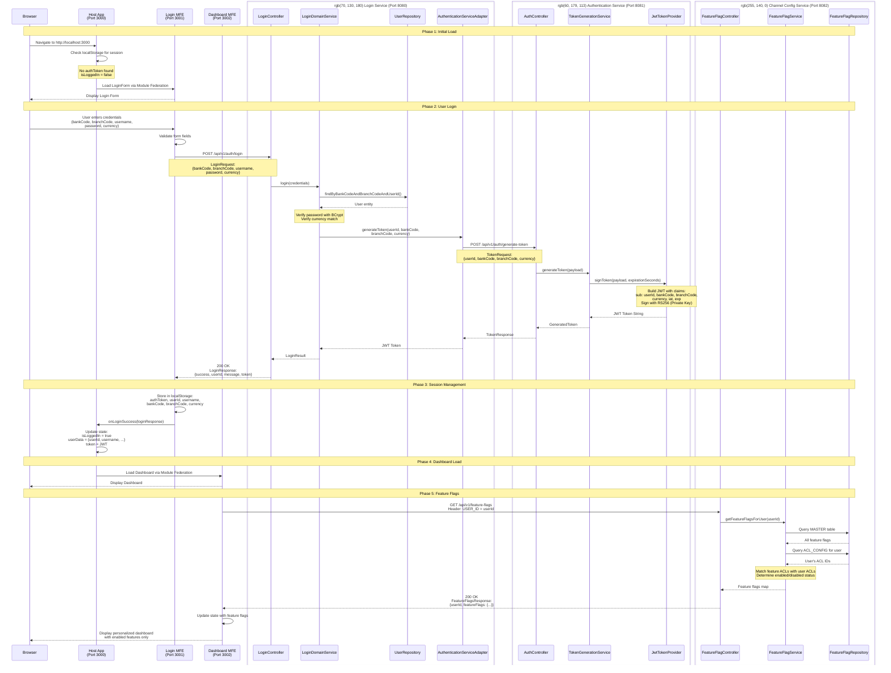

# Banking Prototype - Complete Service Interaction Flow

## Architecture Overview

This document describes the complete end-to-end flow of the banking platform, including:
- Micro-frontend architecture with Module Federation
- Microservices backend with JWT authentication
- Feature flags with ACL-based access control

## Complete Login and Dashboard Flow



## Service Architecture Overview

### Frontend Architecture (Micro-Frontends with Module Federation)

#### Host App (Port 3000)
- **Type**: React Application (Host/Shell)
- **Technology**: React 18, Webpack 5 Module Federation
- **Role**: Main orchestrator that loads and manages remote MFEs
- **Responsibilities**:
  - Session management (localStorage)
  - Authentication state management
  - Routing between Login and Dashboard
  - Loading remote modules dynamically
- **Module Federation Config**:
  - Consumes: `login_mfe/LoginForm`, `dashboard_mfe/Dashboard`
  - Shared: React, React-DOM (singleton)

#### Login MFE (Port 3001)
- **Type**: React Micro-Frontend (Remote)
- **Technology**: React 18, Webpack 5 Module Federation
- **Exposed Module**: `./LoginForm`
- **Features**: 
  - Form validation (client-side)
  - API integration with login-service
  - Standalone mode for testing
  - CORS enabled for cross-origin requests
- **Module Federation Config**:
  - Exposes: `./LoginForm` component
  - Shared: React, React-DOM (singleton)

#### Dashboard MFE (Port 3002)
- **Type**: React Micro-Frontend (Remote)
- **Technology**: React 18, Webpack 5 Module Federation
- **Exposed Module**: `./Dashboard`
- **Features**:
  - Feature flag integration
  - Personalized UI based on ACL
  - Account summary display
  - Standalone mode for testing
- **Module Federation Config**:
  - Exposes: `./Dashboard` component
  - Shared: React, React-DOM (singleton)

### Backend Architecture (Microservices)

#### Login Service (Port 8080)
- **Framework**: Spring Boot 3.4.1
- **Architecture**: Hexagonal (Ports & Adapters)
- **Database**: H2 in-memory (development)
- **Inbound Adapter**: `LoginController` - REST API endpoint
- **Domain Service**: `LoginDomainService` - Core business logic
- **Outbound Adapters**:
  - `UserRepository` - H2 database access
  - `AuthenticationServiceAdapter` - HTTP client to Authentication Service
- **Security**: BCrypt password hashing
- **API Endpoints**:
  - `POST /api/v1/auth/login` - User authentication

#### Authentication Service (Port 8081)
- **Framework**: Spring Boot 3.4.1
- **Architecture**: Hexagonal (Ports & Adapters)
- **Inbound Adapter**: `AuthController` - REST API endpoint
- **Domain Service**: `TokenGenerationService` - Token generation orchestration
- **Outbound Adapter**: `JwtTokenProvider` - JWT signing implementation
- **Security**: 
  - RSA-256 asymmetric encryption
  - Private key for signing
  - Public key for verification (JWKS endpoint)
- **API Endpoints**:
  - `POST /api/v1/auth/generate-token` - JWT generation
  - `GET /.well-known/jwks.json` - Public key endpoint

#### Channel Configurations Service (Port 8082)
- **Framework**: Spring Boot 3.4.1
- **Architecture**: Hexagonal (Ports & Adapters)
- **Database**: H2 in-memory (development)
- **Inbound Adapter**: `FeatureFlagController` - REST API endpoint
- **Domain Service**: `FeatureFlagService` - Feature flag logic with ACL
- **Outbound Adapter**: `FeatureFlagRepository` - H2 database access
- **Features**:
  - ACL-based feature access control
  - Public features (IS_ACL_ENABLED=false)
  - Private features (IS_ACL_ENABLED=true)
- **API Endpoints**:
  - `GET /api/v1/feature-flags` - Get user's feature flags (Header: USER_ID)
- **Database Schema**:
  - `MASTER` table: Feature flags with ACL configuration
  - `ACL_CONFIG` table: User-to-ACL mappings

### Technology Stack

#### Frontend
- **React 18.2.0** - UI library
- **Webpack 5** - Module bundler
- **Module Federation** - Micro-frontend orchestration
- **Babel** - JavaScript transpilation
- **CSS** - Styling

#### Backend
- **Spring Boot 3.4.1** - Framework
- **Spring Data JPA** - Database access
- **H2 Database** - In-memory database (development)
- **BCrypt** - Password hashing
- **JWT (jjwt 0.12.6)** - Token generation
- **RSA-256** - Asymmetric encryption
- **Springdoc OpenAPI 2.7.0** - API documentation

#### Architecture Patterns
- **Microservices** - Independent, scalable services
- **Micro-Frontends** - Independent, deployable UI components
- **Hexagonal Architecture** - Clean separation of concerns
- **Module Federation** - Runtime code sharing
- **ACL (Access Control List)** - Feature-level permissions

## Key Interactions

### Phase 1: Initial Application Load
1. **Browser → Host App**: User navigates to `http://localhost:3000`
2. **Host App**: Checks `localStorage` for existing session (authToken, userId, etc.)
3. **Host App → Login MFE**: No session found, loads LoginForm via Module Federation
4. **Login MFE → Browser**: Displays login form

### Phase 2: User Authentication
1. **Browser → Login MFE**: User enters credentials (bankCode, branchCode, username, password, currency)
2. **Login MFE**: Client-side validation
3. **Login MFE → Login Service**: HTTP POST to `/api/v1/auth/login`
4. **Login Service**: 
   - Queries H2 database for user
   - Verifies password using BCrypt
   - Validates currency match
5. **Login Service → Authentication Service**: HTTP POST to `/api/v1/auth/generate-token`
6. **Authentication Service**:
   - Loads RSA private key
   - Generates JWT with user claims
   - Signs token with RS256 algorithm
   - Returns JWT to login-service
7. **Login Service → Login MFE**: Returns success response with JWT token

### Phase 3: Session Management
1. **Login MFE**: Stores authentication data in `localStorage`:
   - `authToken`: JWT token
   - `userId`: User identifier
   - `username`: Username
   - `bankCode`: Bank code
   - `branchCode`: Branch code
   - `currency`: Currency
2. **Login MFE → Host App**: Calls `onLoginSuccess()` callback with user data
3. **Host App**: Updates React state:
   - `isLoggedIn = true`
   - `userData = { userId, username, bankCode, branchCode, currency }`
   - `token = JWT`
4. **Host App**: React re-renders, switches from LoginForm to Dashboard

### Phase 4: Dashboard Load
1. **Host App → Dashboard MFE**: Loads Dashboard component via Module Federation
2. **Dashboard MFE**: Component mounts with props (user, token, onLogout)
3. **Dashboard MFE → Browser**: Displays dashboard UI

### Phase 5: Feature Flags Retrieval
1. **Dashboard MFE → Channel Config Service**: HTTP GET to `/api/v1/feature-flags` with `USER_ID` header
2. **Channel Config Service**:
   - Queries `MASTER` table for all feature flags
   - Queries `ACL_CONFIG` table for user's ACL IDs
   - Matches feature flag ACL requirements with user's ACLs
   - Determines enabled/disabled status for each feature
3. **Channel Config Service → Dashboard MFE**: Returns feature flags response:
   ```json
   {
     "userId": "testuser",
     "featureFlags": {
       "isArchiveEnquiryEnabled": true,
       "isReportsEnabled": false
     }
   }
   ```
4. **Dashboard MFE**: Updates state with feature flags
5. **Dashboard MFE → Browser**: Displays personalized dashboard with only enabled features

## Error Handling

### Login Service Errors
- **InvalidEntityException**: Bank/branch/username combination not found (404)
- **InvalidCredentialsException**: Password verification failed (401)
- **CurrencyMismatchException**: Currency doesn't match user's currency (400)
- **Authentication Service Timeout**: Fallback mechanism or error response

### Authentication Service Errors
- **JWT Signing Errors**: Handled by GlobalExceptionHandler (500)
- **Invalid Token Request**: Missing required fields (400)
- **Key Loading Errors**: RSA key file not found or invalid (500)

### Channel Configurations Service Errors
- **User Not Found**: Returns empty feature flags or default configuration
- **Database Errors**: Handled by GlobalExceptionHandler (500)
- **Missing USER_ID Header**: Returns error response (400)

### Frontend Errors
- **Module Federation Load Failure**: ErrorBoundary catches and displays user-friendly message
- **API Call Failures**: Error states displayed in UI with retry options
- **Network Errors**: "Failed to fetch" messages with troubleshooting hints

## Security Considerations

### Password Security
- **BCrypt Hashing**: Passwords stored as BCrypt hashes (never plain text)
- **Hash Strength**: 10 rounds (configurable)
- **Example Hash**: `$2a$10$SEsCf0Ai/swlgONnmnS.7eBiLcg68dSHQj5aL2qelvQ4MO8zjI3yG`
- **Verification**: Constant-time comparison to prevent timing attacks

### Token Security
- **Algorithm**: RSA-256 (asymmetric encryption)
- **Private Key**: Only authentication-service has access
- **Public Key**: Available via JWKS endpoint for verification
- **Token Expiration**: 1 hour (configurable)
- **Claims**: userId, bankCode, branchCode, currency, iat, exp
- **Storage**: Client-side in localStorage (consider httpOnly cookies for production)

### CORS Security
- **Explicit Origins**: Each service allows specific origins only
- **Allowed Origins**: localhost:3000, 3001, 3002
- **Methods**: GET, POST, PUT, DELETE, OPTIONS
- **Headers**: Custom headers allowed (USER_ID, Authorization)
- **Credentials**: Enabled for cookie support

### ACL Security
- **Database-Level Control**: Feature access controlled at database level
- **Public Features**: `IS_ACL_ENABLED=false` - Available to all users
- **Private Features**: `IS_ACL_ENABLED=true` - Requires ACL match
- **User-ACL Mapping**: Many-to-many relationship (users can have multiple ACLs)
- **Feature-ACL Mapping**: One-to-one (each feature has one ACL requirement)

## Data Models

### User Entity (Login Service)
```sql
CREATE TABLE USERS (
  USER_ID VARCHAR(255) PRIMARY KEY,
  PASSWORD_HASH VARCHAR(255) NOT NULL,
  BANK_CODE VARCHAR(3) NOT NULL,
  BRANCH_CODE VARCHAR(4) NOT NULL,
  CURRENCY VARCHAR(3) NOT NULL
);
```

### Feature Flag Master (Channel Config Service)
```sql
CREATE TABLE MASTER (
  ID BIGINT PRIMARY KEY AUTO_INCREMENT,
  FEATURE_FLAG VARCHAR(255) NOT NULL,
  IS_ACL_ENABLED BOOLEAN NOT NULL,
  ACL_ID BIGINT
);
```

### ACL Configuration (Channel Config Service)
```sql
CREATE TABLE ACL_CONFIG (
  ID BIGINT PRIMARY KEY AUTO_INCREMENT,
  USER_ID VARCHAR(255) NOT NULL,
  ACL_ID BIGINT NOT NULL
);
```

### JWT Token Structure
```json
{
  "header": {
    "alg": "RS256",
    "typ": "JWT"
  },
  "payload": {
    "sub": "testuser",
    "bankCode": "101",
    "branchCode": "1119",
    "currency": "SGD",
    "iat": 1709388000,
    "exp": 1709391600
  },
  "signature": "RSASHA256(...)"
}
```

## Test Data

### Test Users (Login Service)
| User ID    | Password    | Bank Code | Branch Code | Currency |
|------------|-------------|-----------|-------------|----------|
| testuser   | password123 | 101       | 1119        | SGD      |
| 1119test1  | password123 | 101       | 1119        | SGD      |
| 1119test2  | password123 | 101       | 1119        | USD      |
| 1119test3  | password123 | 101       | 1119        | EUR      |

### Feature Flags (Channel Config Service)
| ID | Feature Flag            | IS_ACL_ENABLED | ACL_ID |
|----|-------------------------|----------------|--------|
| 1  | isArchiveEnquiryEnabled | true           | 1000   |
| 2  | isReportsEnabled        | true           | 1001   |

### User ACL Mappings
| User ID    | ACL IDs    | Features Enabled                    |
|------------|------------|-------------------------------------|
| testuser   | 1000       | Archive Enquiry only                |
| 1119test1  | 1000       | Archive Enquiry only                |
| 1119test2  | 1001       | Reports only                        |
| 1119test3  | 1000, 1001 | Both Archive Enquiry and Reports    |

## API Endpoints

### Login Service (Port 8080)
- `POST /api/v1/auth/login` - User authentication
  - Request: `{ bankCode, branchCode, username, password, currency }`
  - Response: `{ success, userId, message, token }`
- `GET /actuator/health` - Health check
- `GET /swagger-ui.html` - API documentation
- `GET /h2-console` - H2 database console

### Authentication Service (Port 8081)
- `POST /api/v1/auth/generate-token` - JWT generation
  - Request: `{ userId, bankCode, branchCode, currency }`
  - Response: `{ success, token, message }`
- `GET /.well-known/jwks.json` - Public key (JWKS)
- `GET /actuator/health` - Health check
- `GET /swagger-ui.html` - API documentation

### Channel Configurations Service (Port 8082)
- `GET /api/v1/feature-flags` - Get user's feature flags
  - Header: `USER_ID: <userId>`
  - Response: `{ userId, featureFlags: { ... } }`
- `GET /actuator/health` - Health check
- `GET /swagger-ui.html` - API documentation
- `GET /h2-console` - H2 database console

## Deployment Ports

| Service                          | Port | Type     | Technology           |
|----------------------------------|------|----------|----------------------|
| Host App                         | 3000 | Frontend | React + Module Fed   |
| Login MFE                        | 3001 | Frontend | React + Module Fed   |
| Dashboard MFE                    | 3002 | Frontend | React + Module Fed   |
| Login Service                    | 8080 | Backend  | Spring Boot          |
| Authentication Service           | 8081 | Backend  | Spring Boot          |
| Channel Configurations Service   | 8082 | Backend  | Spring Boot          |
| H2 TCP Server (Channel Config)   | 9092 | Database | H2 TCP               |

## Development Workflow

### Starting All Services
```bash
# Backend services
cd authentication-service && mvn spring-boot:run
cd login-service && mvn spring-boot:run
cd channel-configurations-service && mvn spring-boot:run

# Frontend services
cd login-mfe && npm start
cd dashboard-mfe && npm start
cd host-app && npm start
```

### Testing the Flow
1. Navigate to `http://localhost:3000`
2. Enter credentials: bankCode=101, branchCode=1119, username=testuser, password=password123, currency=SGD
3. Click Login
4. Verify Dashboard displays with "View Archived Images" button
5. Logout and test with different users to see different features

## Production Considerations

### Frontend
- Build optimized bundles: `npm run build`
- Deploy to CDN or static hosting
- Configure production URLs in webpack configs
- Enable HTTPS
- Implement proper error tracking (Sentry, etc.)

### Backend
- Replace H2 with PostgreSQL or MySQL
- Configure production database connection
- Enable HTTPS/TLS
- Implement proper logging (ELK stack, etc.)
- Set up monitoring (Prometheus, Grafana)
- Configure JWT expiration appropriately
- Rotate RSA keys periodically
- Implement rate limiting
- Add API gateway (Kong, AWS API Gateway)

### Security
- Use httpOnly cookies instead of localStorage for tokens
- Implement refresh token mechanism
- Add CSRF protection
- Enable security headers (HSTS, CSP, etc.)
- Implement proper session management
- Add audit logging
- Regular security audits

## Related Documentation

- `LOGIN-FLOW-EXPLAINED.md` - Detailed step-by-step login flow explanation
- `COMPLETE-FLOW.md` - Complete system architecture and flow
- `MODULE-FEDERATION-TROUBLESHOOTING.md` - Troubleshooting Module Federation issues
- `FEATURE-FLAGS-WORKING.md` - Feature flags implementation details
- `INTELLIJ-DATABASE-PLUGIN-SETUP.md` - H2 database access via IntelliJ
